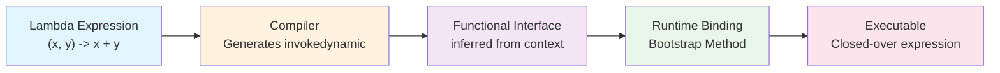
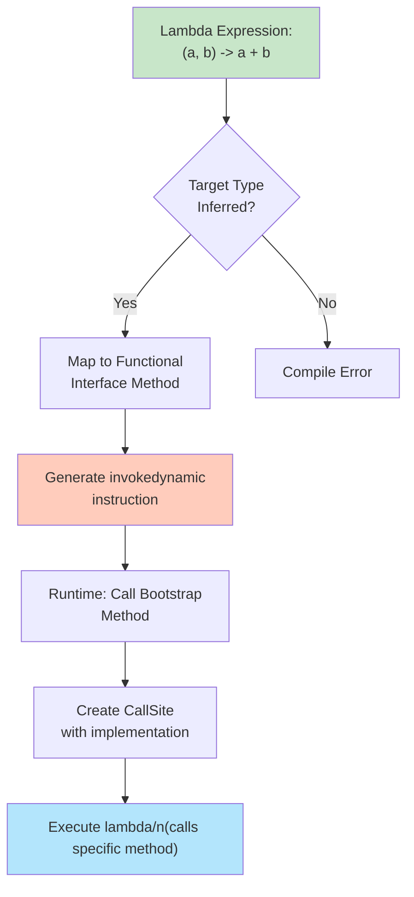

# Lambda Expressions - Comprehensive Guide

## 📚 Table of Contents
- [Learning Objectives](#learning-objectives)
- [Theory Checkpoints](#theory-checkpoints)
- [Run Steps](#run-steps)
- [Verification Steps](#verification-steps)
- [Expected Outcome](#expected-outcome)
- [Hands-on Lab](#hands-on-lab)
- [Introduction](#introduction)
- [What are Lambda Expressions?](#what-are-lambda-expressions)
- [Syntax Deep Dive](#syntax-deep-dive)
- [How Lambda Works Internally](#how-lambda-works-internally)
- [Types of Lambda Expressions](#types-of-lambda-expressions)
- [Lambda vs Anonymous Classes](#lambda-vs-anonymous-classes)
- [Best Practices](#best-practices)
- [Common Pitfalls](#common-pitfalls)
- [Quick Reference Card](#quick-reference-card)

---
## 🎯 Learning Objectives

## 📋 Prerequisites & Next Topics
After completing this module, you will:

- [ ] Understand what lambda expressions are and why they matter in Java 8
- [ ] Master lambda syntax variations (no params, single param, multiple params, block body)
- [ ] Learn how lambdas work internally (invokedynamic bytecode instruction)
- [ ] Apply lambdas effectively in real-world scenarios (filtering, mapping, iteration)
- [ ] Recognize when to use lambdas vs anonymous classes vs method references
- [ ] Avoid common lambda pitfalls (variable capture, checked exceptions, null safety)
- [ ] Write concise, readable, and maintainable functional code


## ✅ Theory Checkpoints

**Q1: What is the core purpose of lambda expressions?**

A: Lambda expressions enable functional programming in Java by providing concise, anonymous functions that can be passed as arguments or stored in variables. They implement functional interfaces by providing a shorter syntax than anonymous classes.

**Q2: What is an "effectively final" variable and why does it matter?**

A: An effectively final variable is one that is never modified after initialization. Lambdas must capture only effectively final variables because lambdas are stateless and don't have their own scope. This prevents unexpected behavior if variables were modified.

**Q3: How is a lambda expression different from an anonymous class under the hood?**

A: While conceptually similar, lambdas use the `invokedynamic` bytecode instruction, which is more efficient than anonymous classes. Lambdas don't create separate .class files and don't introduce new scopes (unlike anonymous classes).

**Q4: What's the gotcha with `this` reference in lambdas vs anonymous classes?**

A: In a lambda, `this` refers to the enclosing class, not the lambda itself (which has no scope). In an anonymous class, `this` refers to the anonymous class instance. This is a common source of confusion.

**Q5: When should you use a lambda vs a method reference?**

A: Use method references when you're simply delegating to an existing method (e.g., `System.out::println` instead of `s -> System.out.println(s)`). Use lambdas when you need to add logic or transformation.

---

## 🚀 Run Steps

### Compile and Run the Demo

**Step 1:** Navigate to the module directory
```bash
cd 01-LambdaExpressions
```

**Step 2:** Compile the Java file
```bash
javac LambdaExpressions.java
```

**Step 3:** Run the demo
```bash
java LambdaExpressions
```

### Alternative: Using IDE

If using an IDE (IntelliJ, Eclipse, VS Code):
1. Open `LambdaExpressions.java`
2. Click the "Run" button (or press `Shift+F10` in IntelliJ)
3. Output appears in the console

---

## ✔️ Verification Steps

**Expected behavior after running:**
1. The program should execute without compilation errors
2. Console output should display lambda expression examples
3. All 5 demo sections should produce output (lambdas with 0, 1, 2+ params, etc.)
4. No exceptions should be thrown

**Troubleshooting:**
- **Error: "class LambdaExpressions is public, should be declared in a file named LambdaExpressions.java"**
  - Solution: Ensure file name matches class name exactly
- **Error: "cannot find symbol" or "class not found"**
  - Solution: Ensure you're in the `01-LambdaExpressions` directory before compiling
- **No output appears**
  - Solution: Check that your Java version is 8 or higher (`java -version`)

---

## 📊 Expected Outcome

When you run `LambdaExpressions.java`, you should see output similar to:

```
=== LAMBDA EXPRESSIONS DEMO ===

--- Lambda with No Parameters ---
[Output from Runnable and Supplier demos]

--- Lambda with Single Parameter ---
[Output from Predicate and Function demos]

--- Lambda with Multiple Parameters ---
[Output from BiFunction and BinaryOperator demos]

--- Sorting with Lambda ---
[Sorted list output]

--- Stream with Lambda and map() ---
[Transformed stream output]
```

The specific output values depend on the data used in the demo, but the program should demonstrate:
- Basic lambda syntax
- Parameter variations
- Functional interface usage
- Integration with Collections and Streams

---

## 📚 Hands-on Lab

### Exercise 1: Guided — Write Your First Lambda [Beginner]

**Task:** Create a simple lambda that doubles numbers.

**Steps:**
1. Create a `Function<Integer, Integer>` lambda called `doubler`
2. The lambda should take an integer as input and return it multiplied by 2
3. Test it with: `System.out.println(doubler.apply(5)); // Should print: 10`

**Template:**
```java
Function<Integer, Integer> doubler = x -> x * 2;
// Test it
System.out.println(doubler.apply(5)); // Expected: 10
```

**Hint:** The syntax is: `Function<InputType, OutputType> name = input -> expression;`

---

### Exercise 2: Semi-Guided — Filter List with Predicate [Intermediate]

**Task:** Write a lambda that filters a list to keep only numbers greater than 5.

**Given:**
```java
List<Integer> numbers = Arrays.asList(3, 7, 2, 8, 1, 9, 4);
Predicate<Integer> isGreater = ???;

// Use it to filter
List<Integer> filtered = numbers.stream()
    .filter(isGreater)
    .collect(Collectors.toList());

System.out.println(filtered); // Expected: [7, 8, 9]
```

**Hint:** A Predicate returns a `boolean`. The signature is: `Predicate<T>` which means `T -> boolean`

**Your solution:**
```java
Predicate<Integer> isGreater = n -> n > 5;
```

---

### Exercise 3: Challenge — Custom Sorting with Lambda [Advanced]

**Task:** Sort a list of strings by length (shortest first), then alphabetically for same-length strings.

**Challenge Code:**
```java
List<String> words = Arrays.asList("apple", "cat", "dog", "banana", "bat");

// Write a custom Comparator lambda that sorts by length, then alphabetically
words.sort(???);

System.out.println(words);
// Expected output: [cat, dog, bat, apple, banana]
// (or [bat, cat, dog, apple, banana] for pure alphabetical within same length)
```

**Hint:** `Comparator<String>` requires a lambda: `(s1, s2) -> expression`
Return negative if s1 < s2, positive if s1 > s2, zero if equal.

**Solution:**
```java
words.sort((s1, s2) -> {
    int lengthCompare = Integer.compare(s1.length(), s2.length());
    return lengthCompare != 0 ? lengthCompare : s1.compareTo(s2);
});
```

---

## 🎨 Architecture Diagram

**Lambda Expression Flow:**



**Lambda Internals:**



---

## 🎯 Introduction

Lambda expressions are one of the most significant features introduced in Java 8. They enable **functional programming** in Java, making code more concise, readable, and maintainable. Lambda expressions essentially represent **anonymous functions** - functions without a name that can be passed around as if they were objects.

### Why Lambda Expressions Matter

**Before Java 8:**
```java
// Sorting a list required verbose anonymous class
Collections.sort(names, new Comparator<String>() {
    @Override
    public int compare(String a, String b) {
        return a.compareTo(b);
    }
});
```

**With Lambda Expressions:**
```java
// Same functionality, much cleaner
Collections.sort(names, (a, b) -> a.compareTo(b));
```

---

## 🔍 What are Lambda Expressions?

A **lambda expression** is a short block of code which:
- Takes in parameters
- Performs operations
- Returns a result (optional)

Think of it as a method that doesn't belong to any class - a **free-floating function**.

### Core Components

```
(parameters) -> { body }
     ↓           ↓      ↓
  Input    Arrow  Logic
```

**Detailed Breakdown:**

1. **Parameter List**: `(int a, int b)` or `(a, b)` or `a` (single param)
2. **Arrow Token**: `->` separates parameters from body
3. **Body**: Expression or statement block `{ return a + b; }`

---

## 📖 Syntax Deep Dive

### Complete Syntax Variations

```java
// 1. No parameters
() -> System.out.println("Hello")
() -> { System.out.println("Hello"); }

// 2. Single parameter (parentheses optional)
x -> x * x
(x) -> x * x
(int x) -> x * x

// 3. Multiple parameters
(x, y) -> x + y
(int x, int y) -> x + y
(String s1, String s2) -> s1.length() - s2.length()

// 4. Single expression (implicit return)
(x, y) -> x + y

// 5. Multiple statements (explicit return)
(x, y) -> {
    int sum = x + y;
    System.out.println("Sum: " + sum);
    return sum;
}

// 6. Type inference
BiFunction<Integer, Integer, Integer> add = (a, b) -> a + b;
// Compiler infers: a and b are Integer

// 7. Accessing outer variables (effectively final)
int multiplier = 2;
Function<Integer, Integer> multiply = x -> x * multiplier;
```

### Visual Syntax Guide

```
┌─────────────────────────────────────────────────────────┐
│                 LAMBDA EXPRESSION SYNTAX                │
├─────────────────────────────────────────────────────────┤
│                                                         │
│  ┌──────────────┐    ┌──┐    ┌──────────────────┐     │
│  │  Parameters  │ -> │->│ -> │      Body        │     │
│  └──────────────┘    └──┘    └──────────────────┘     │
│                                                         │
│  Examples:                                              │
│  ────────────                                           │
│  ()              ->    42                               │
│  x               ->    x * x                            │
│  (x, y)          ->    x + y                            │
│  (x, y)          ->    { return x + y; }                │
│  (String s)      ->    s.toUpperCase()                  │
│                                                         │
└─────────────────────────────────────────────────────────┘
```

---

## ⚙️ How Lambda Works Internally

### Functional Interface Requirement

Lambda expressions work with **functional interfaces** - interfaces with exactly one abstract method.

```java
@FunctionalInterface
interface Calculator {
    int calculate(int a, int b);  // Single abstract method
}

// Lambda implements this interface
Calculator add = (a, b) -> a + b;
Calculator multiply = (a, b) -> a * b;
```

### Behind the Scenes

When you write a lambda:
```java
Runnable r = () -> System.out.println("Hello");
```

Java creates an instance of an anonymous class implementing `Runnable`:
```java
// Conceptually similar to:
Runnable r = new Runnable() {
    @Override
    public void run() {
        System.out.println("Hello");
    }
};
```

**Key Difference**: Lambda uses `invokedynamic` bytecode instruction (more efficient than anonymous classes).

### Execution Flow

```
┌──────────────────────────────────────────────────────┐
│              LAMBDA EXECUTION FLOW                   │
├──────────────────────────────────────────────────────┤
│                                                      │
│  1. Lambda Expression Written                        │
│     (x, y) -> x + y                                  │
│              ↓                                       │
│  2. Compiler Generates                               │
│     - Functional interface target                    │
│     - invokedynamic instruction                      │
│              ↓                                       │
│  3. Runtime (First Call)                             │
│     - Bootstrap method creates implementation        │
│     - Creates CallSite                               │
│              ↓                                       │
│  4. Subsequent Calls                                 │
│     - Reuses generated implementation                │
│     - Fast execution                                 │
│                                                      │
└──────────────────────────────────────────────────────┘
```

---

## 📊 Types of Lambda Expressions

### 1. No Parameters

```java
// Runnable - no params, no return
Runnable task = () -> System.out.println("Task running");

// Supplier - no params, returns value
Supplier<String> greeting = () -> "Hello World";
Supplier<Double> random = () -> Math.random();
```

**Use Cases:**
- Background tasks
- Factory methods
- Lazy initialization
- Default value providers

---

### 2. Single Parameter

```java
// Predicate - single param, returns boolean
Predicate<String> isEmpty = s -> s.isEmpty();
Predicate<Integer> isEven = n -> n % 2 == 0;

// Function - single param, returns transformed value
Function<String, Integer> length = s -> s.length();
Function<Integer, Integer> square = n -> n * n;

// Consumer - single param, no return (side effect)
Consumer<String> print = s -> System.out.println(s);
Consumer<List<Integer>> addItem = list -> list.add(42);
```

**Use Cases:**
- Filtering collections
- Transforming data
- Validation
- Event handlers

---

### 3. Multiple Parameters

```java
// BiPredicate - two params, returns boolean
BiPredicate<String, Integer> longerThan = (s, len) -> s.length() > len;

// BiFunction - two params, returns result
BiFunction<Integer, Integer, Integer> add = (a, b) -> a + b;
BiFunction<String, String, String> concat = (s1, s2) -> s1 + s2;

// BiConsumer - two params, no return
BiConsumer<String, Integer> printNTimes = (str, n) -> {
    for (int i = 0; i < n; i++) {
        System.out.println(str);
    }
};

// BinaryOperator - two params of same type, returns same type
BinaryOperator<Integer> max = (a, b) -> a > b ? a : b;
```

**Use Cases:**
- Combining values
- Map operations
- Comparisons
- Reducers

---

### 4. Block Body vs Expression Body

```java
// Expression body (single expression)
Function<Integer, Integer> square = x -> x * x;
// Implicit return, no curly braces needed

// Block body (multiple statements)
Function<Integer, String> analyze = x -> {
    if (x > 0) {
        return "Positive: " + x;
    } else if (x < 0) {
        return "Negative: " + x;
    } else {
        return "Zero";
    }
    // Explicit return required
};
```

---

## 🆚 Lambda vs Anonymous Classes

### Comparison Table

| Aspect | Lambda Expression | Anonymous Class |
|--------|------------------|-----------------|
| **Syntax** | Concise: `x -> x * 2` | Verbose: Full class definition |
| **Scope** | No new scope (`this` refers to enclosing class) | New scope (`this` refers to anonymous class) |
| **Performance** | Uses `invokedynamic` (faster) | Creates new class file |
| **Limitations** | Only for functional interfaces | Can implement any interface |
| **State** | Stateless (captures variables) | Can have instance variables |
| **Compile** | No separate .class file | Generates ClassName$1.class |

### Example Comparison

```java
// Anonymous Class
ActionListener listener1 = new ActionListener() {
    @Override
    public void actionPerformed(ActionEvent e) {
        System.out.println("Button clicked");
    }
};

// Lambda Expression
ActionListener listener2 = e -> System.out.println("Button clicked");

// Space saved: ~90 characters
// Readability: Much improved
// Performance: Slightly better
```

### 'this' Reference Difference

```java
class LambdaDemo {
    private String name = "Outer";
    
    public void testAnonymous() {
        Runnable r = new Runnable() {
            private String name = "Inner";
            
            @Override
            public void run() {
                System.out.println(this.name); // Prints: Inner
            }
        };
    }
    
    public void testLambda() {
        String name = "Local";
        Runnable r = () -> {
            System.out.println(this.name); // Prints: Outer
            // 'this' refers to LambdaDemo, not the lambda
        };
    }
}
```

---

## ✅ Best Practices

### 1. Keep Lambdas Short and Focused

**❌ Bad:**
```java
list.forEach(item -> {
    if (item != null) {
        String processed = item.trim().toLowerCase();
        if (processed.startsWith("a")) {
            System.out.println("Found: " + processed);
            logger.log("Processing " + processed);
            database.save(processed);
        }
    }
});
```

**✅ Good:**
```java
list.stream()
    .filter(Objects::nonNull)
    .map(String::trim)
    .map(String::toLowerCase)
    .filter(s -> s.startsWith("a"))
    .forEach(this::processAndSave);

private void processAndSave(String item) {
    System.out.println("Found: " + item);
    logger.log("Processing " + item);
    database.save(item);
}
```

### 2. Prefer Method References When Possible

**❌ Less Clear:**
```java
list.forEach(s -> System.out.println(s));
list.stream().map(s -> s.toLowerCase());
list.stream().filter(s -> s.isEmpty());
```

**✅ More Clear:**
```java
list.forEach(System.out::println);
list.stream().map(String::toLowerCase);
list.stream().filter(String::isEmpty);
```

### 3. Use Type Inference

**❌ Redundant:**
```java
BiFunction<String, String, Integer> compare = 
    (String s1, String s2) -> s1.compareTo(s2);
```

**✅ Concise:**
```java
BiFunction<String, String, Integer> compare = 
    (s1, s2) -> s1.compareTo(s2);
```

### 4. Be Careful with Variable Capture

**❌ Dangerous:**
```java
List<Runnable> runnables = new ArrayList<>();
for (int i = 0; i < 5; i++) {
    runnables.add(() -> System.out.println(i)); // Compile error!
    // i must be final or effectively final
}
```

**✅ Safe:**
```java
List<Runnable> runnables = new ArrayList<>();
for (int i = 0; i < 5; i++) {
    final int index = i; // Effectively final
    runnables.add(() -> System.out.println(index));
}
```

### 5. Avoid Side Effects in Pure Functions

**❌ Side Effects:**
```java
List<Integer> results = new ArrayList<>();
stream.forEach(x -> results.add(x * 2)); // Modifies external state
```

**✅ Functional:**
```java
List<Integer> results = stream
    .map(x -> x * 2)
    .collect(Collectors.toList());
```

---

## ⚠️ Common Pitfalls

### 1. Modifying External Variables

```java
// ❌ Won't compile
int counter = 0;
list.forEach(item -> counter++); // Error: counter must be final

// ✅ Use reduction instead
int count = list.stream().mapToInt(item -> 1).sum();

// ✅ Or use mutable object wrapper (not recommended)
AtomicInteger counter = new AtomicInteger(0);
list.forEach(item -> counter.incrementAndGet());
```

### 2. Returning from Lambda

```java
// ❌ This doesn't work as expected
list.forEach(item -> {
    if (item.equals("target")) {
        return; // Only returns from lambda, not outer method
    }
    process(item);
});

// ✅ Use stream operations
list.stream()
    .filter(item -> !item.equals("target"))
    .forEach(this::process);
```

### 3. Exception Handling

```java
// ❌ Checked exceptions in lambda
list.forEach(file -> {
    Files.readAllLines(file); // Compile error: IOException not handled
});

// ✅ Wrap in unchecked exception or handle properly
list.forEach(file -> {
    try {
        Files.readAllLines(file);
    } catch (IOException e) {
        throw new UncheckedIOException(e);
    }
});
```

### 4. Null Safety

```java
// ❌ Can throw NullPointerException
Function<String, Integer> length = s -> s.length();
length.apply(null); // NPE!

// ✅ Handle nulls explicitly
Function<String, Integer> safeLength = s -> 
    s != null ? s.length() : 0;

// ✅ Or use Optional
Function<String, Optional<Integer>> optLength = s -> 
    Optional.ofNullable(s).map(String::length);
```

---

## 🎯 Quick Reference Card

### Lambda Syntax Cheat Sheet

```java
// BASIC FORMS
() -> expression                    // No parameters
param -> expression                 // Single parameter
(param) -> expression              // Single parameter with parentheses
(param1, param2) -> expression     // Multiple parameters
(Type param) -> expression         // Explicit type

// BLOCK BODY
(params) -> {                      // Multiple statements
    statement1;
    statement2;
    return value;
}

// COMMON FUNCTIONAL INTERFACES
Runnable           :  ()         ->  void
Supplier<T>        :  ()         ->  T
Consumer<T>        :  T          ->  void
Function<T,R>      :  T          ->  R
Predicate<T>       :  T          ->  boolean
BiFunction<T,U,R>  :  (T, U)     ->  R
BiPredicate<T,U>   :  (T, U)     ->  boolean
BiConsumer<T,U>    :  (T, U)     ->  void
UnaryOperator<T>   :  T          ->  T
BinaryOperator<T>  :  (T, T)     ->  T
```

### Common Use Cases Quick Guide

```java
// FILTERING
list.stream().filter(x -> x > 10)

// MAPPING/TRANSFORMING
list.stream().map(x -> x * 2)
list.stream().map(String::toUpperCase)

// SORTING
list.sort((a, b) -> a.compareTo(b))
list.sort(String::compareTo)

// ITERATION
list.forEach(x -> System.out.println(x))
list.forEach(System.out::println)

// GROUPING
map.forEach((k, v) -> process(k, v))

// REDUCING
list.stream().reduce(0, (a, b) -> a + b)

// CUSTOM OPERATIONS
list.removeIf(x -> x.isEmpty())
list.replaceAll(x -> x.toUpperCase())
```

### Performance Tips

```
┌────────────────────────────────────────────────────┐
│          LAMBDA PERFORMANCE TIPS                   │
├────────────────────────────────────────────────────┤
│                                                    │
│  ✓ Use method references when possible            │
│    - Clearer and potentially more optimized       │
│                                                    │
│  ✓ Avoid excessive object creation in lambdas     │
│    - Use primitives streams (IntStream, etc.)     │
│                                                    │
│  ✓ Be mindful of variable capture                 │
│    - Captured variables add overhead              │
│                                                    │
│  ✓ Prefer stateless lambdas                       │
│    - Easier to parallelize and optimize           │
│                                                    │
│  ✓ Consider lambda vs anonymous class             │
│    - Lambda: Better for simple cases              │
│    - Anonymous: When you need state/methods       │
│                                                    │
└────────────────────────────────────────────────────┘
```

---

## 🎨 Visual Learning Aids

### Lambda Expression Flow

```
┌─────────────────────────────────────────────────────────────┐
│                    LAMBDA EXPRESSION                        │
│                                                             │
│   Input Parameters  →  Processing  →  Output                │
│                                                             │
│   Example: Doubling numbers                                 │
│   ┌─────┐           ┌─────────┐         ┌──────┐          │
│   │  5  │  ─────→   │ x -> x*2│  ─────→ │  10  │          │
│   └─────┘           └─────────┘         └──────┘          │
│                                                             │
│   List<Integer> doubled = numbers.stream()                  │
│       .map(x -> x * 2)                                      │
│       .collect(Collectors.toList());                        │
│                                                             │
└─────────────────────────────────────────────────────────────┘
```

### Comparison: Traditional vs Lambda

```
TRADITIONAL APPROACH                   LAMBDA APPROACH
━━━━━━━━━━━━━━━━━━━━               ━━━━━━━━━━━━━━━━━
                                   
List<String> result =              List<String> result = 
    new ArrayList<>();                 names.stream()
for (String name : names) {               .filter(n -> n.startsWith("A"))
    if (name.startsWith("A")) {           .collect(Collectors.toList());
        result.add(name);          
    }                              Lines: 2
}                                  Readability: High
Lines: 5                           Maintainability: High
Readability: Medium                Testability: High
Maintainability: Medium            
Testability: Medium                
```

---

## 📚 Further Reading

- **Official Java Tutorials**: [Lambda Expressions](https://docs.oracle.com/javase/tutorial/java/javaOO/lambdaexpressions.html)
- **Java Language Specification**: JSR 335
- **Effective Java (3rd Edition)** by Joshua Bloch - Chapter on Lambdas

---

## 🏆 Mastery Checklist

- [ ] Understand lambda syntax variations
- [ ] Know when to use lambda vs anonymous class
- [ ] Can write lambdas with different parameter counts
- [ ] Understand variable capture and effectively final
- [ ] Know common functional interfaces
- [ ] Can use method references appropriately
- [ ] Understand lambda scope and 'this' reference
- [ ] Can avoid common pitfalls
- [ ] Know performance implications
- [ ] Can refactor traditional code to use lambdas

---

**Next Module**: [Functional Interfaces →](../02-FunctionalInterfaces/)

