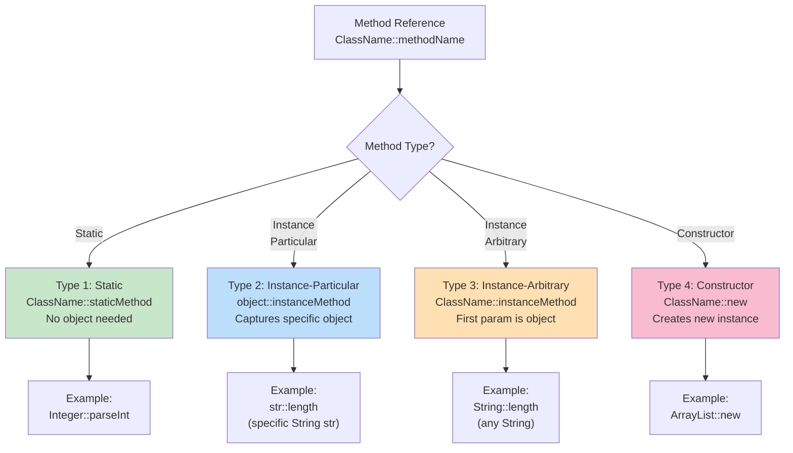
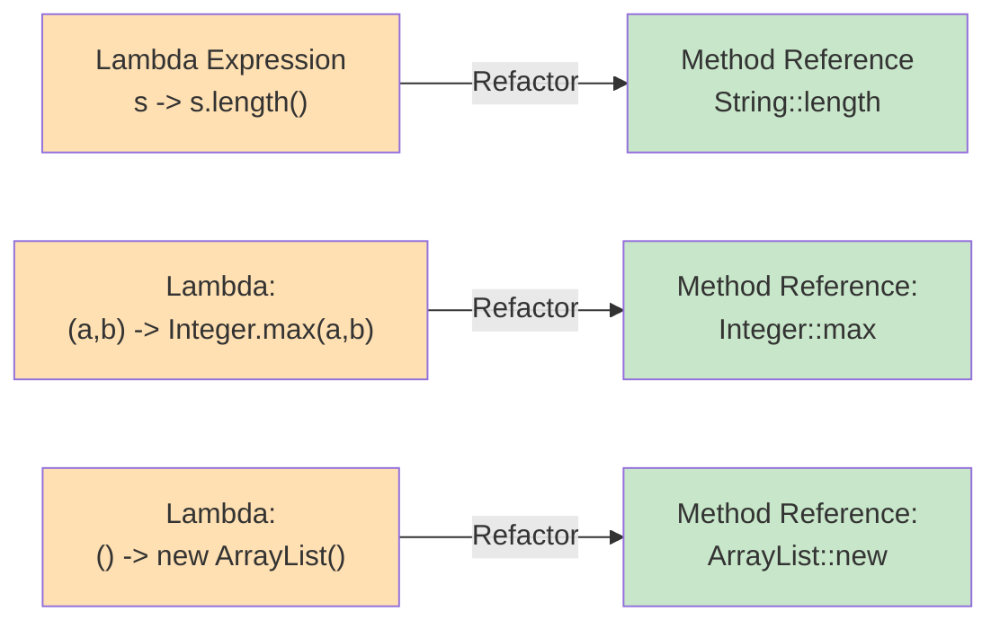

# Method References - Comprehensive Guide

## 📚 Table of Contents
- [Learning Objectives](#learning-objectives)
- [Theory Checkpoints](#theory-checkpoints)
- [Run Steps](#run-steps)
- [Verification Steps](#verification-steps)
- [Expected Outcome](#expected-outcome)
- [Hands-on Lab](#hands-on-lab)
- [Introduction](#introduction)
- [What are Method References?](#what-are-method-references)
- [The Four Types](#the-four-types)
- [Type 1: Static Method References](#type-1-static-method-references)
- [Type 2: Instance Method on Particular Object](#type-2-instance-method-on-particular-object)
- [Type 3: Instance Method on Arbitrary Object](#type-3-instance-method-on-arbitrary-object)
- [Type 4: Constructor References](#type-4-constructor-references)
- [When to Use Method References](#when-to-use-method-references)
- [Common Patterns](#common-patterns)
- [Quick Reference Card](#quick-reference-card)

---
## 🎯 Learning Objectives

## 📋 Prerequisites & Next Topics
After completing this module, you will:

- [ ] Recognize the correct syntax for each type: `ClassName::methodName`
- [ ] Identify which lambda can be replaced with a method reference
- [ ] Apply method references in practical scenarios (Stream operations, Collections)
- [ ] Understand the distinction between types carefully (especially Type 3)
- [ ] Write cleaner, more readable functional code using method references


## ✅ Theory Checkpoints

**Q1: What's the relationship between lambda expressions and method references?**

A: Method references are a special case of lambdas where the lambda simply delegates to an existing method. They provide more concise syntax when you're just calling a method without adding logic. `s -> System.out.println(s)` becomes `System.out::println`.

**Q2: What are the 4 types of method references?**

A: (1) Static: `ClassName::staticMethod`, (2) Instance on particular object: `object::instanceMethod`, (3) Instance on arbitrary object: `ClassName::instanceMethod`, (4) Constructor: `ClassName::new`.

**Q3: Why is Type 3 (instance method on arbitrary object) confusing?**

A: Type 3 looks like a static reference (`ClassName::method`) but uses an instance method. The first parameter becomes the object on which the method is called. Example: `String::length` is equivalent to `s -> s.length()`, where `s` is the first parameter.

**Q4: When should you NOT use a method reference?**

A: When your lambda includes logic beyond just calling a method. For example, if you need to transform the parameter or combine multiple operations, use a lambda instead: `s -> s.toLowerCase().trim()` can't be replaced with a simple method reference.

**Q5: What's the performance benefit of method references over lambdas?**

A: Method references can be recognized at compile time and directly reference an existing method, potentially avoiding the creation of a new function object on each invocation. In practice, JIT compilation makes the performance difference negligible, but method references are clearer about intent.

---

## 🚀 Run Steps

### Compile and Run the Demo

**Step 1:** Navigate to the module directory
```bash
cd 03-MethodReferences
```

**Step 2:** Compile the Java file
```bash
javac MethodReferences.java
```

**Step 3:** Run the demo
```bash
java MethodReferences
```

### Alternative: Using IDE

If using an IDE (IntelliJ, Eclipse, VS Code):
1. Open `MethodReferences.java`
2. Click the "Run" button (or press `Shift+F10` in IntelliJ)
3. Output appears in the console

---

## ✔️ Verification Steps

**Expected behavior after running:**
1. The program should execute without compilation errors
2. Console output should demonstrate all 4 types of method references
3. Output should show equivalence between lambda and method reference versions
4. All examples should run and produce results without exceptions
5. No NullPointerExceptions or "method not found" errors

**Troubleshooting:**
- **Error: "cannot find symbol" or invalid method reference**
  - Solution: Verify the method exists and is accessible (public)
- **Error: "incompatible types"**
  - Solution: Ensure parentheses around method reference: `(T t) -> Class::method` not `T -> Class::method`
- **No output appears**
  - Solution: Check that your Java version is 8 or higher (`java -version`)

---

## 📊 Expected Outcome

When you run `MethodReferences.java`, you should see output similar to:

```
=== METHOD REFERENCES DEMO ===

--- Type 1: Static Method References ---
[Output from Integer::parseInt and similar examples]

--- Type 2: Instance Method on Particular Object ---
[Output from specific object method references]

--- Type 3: Instance Method on Arbitrary Object ---
[Output from String::length and similar examples]

--- Type 4: Constructor References ---
[Output showing ArrayList::new and other constructors]

--- Real-World Examples ---
[Output from Stream operations using method references]

--- Comparison: Lambda vs Method Reference ---
[Side-by-side output showing equivalence]
```

The program should demonstrate:
- Clarity of method reference syntax vs lambdas
- All 4 types in practical use
- Integration with Streams and Collections
- Performance characteristics (if benchmarking)

---

## 📚 Hands-on Lab

### Exercise 1: Guided — Replace Lambda with Type 1 Method Reference [Beginner]

**Task:** Convert a lambda to a static method reference.

**Before (Lambda):**
```java
List<String> numbers = Arrays.asList("123", "456", "789");
List<Integer> ints = numbers.stream()
    .map(s -> Integer.parseInt(s))  // Lambda
    .collect(Collectors.toList());
```

**After (Method Reference):**
```java
List<String> numbers = Arrays.asList("123", "456", "789");
List<Integer> ints = numbers.stream()
    .map(Integer::parseInt)  // Type 1 - Static method reference
    .collect(Collectors.toList());
```

**Your Task:** 
Replace the lambda with the method reference:
```java
List<String> strings = Arrays.asList("HELLO", "WORLD");
List<Integer> lengths = strings.stream()
    .map(s -> s.length())  // Convert this to method reference
    .collect(Collectors.toList());
```

**Hint:** What method on String returns the length? How would you write it as Type 3?

---

### Exercise 2: Semi-Guided — Type 2 vs Type 3 Method References [Intermediate]

**Task:** Identify which type each method reference is.

**Given:**
```java
StringBuilder sb = new StringBuilder();

// Type 2: Particular object instance
Consumer<String> appendToSB = sb::append;  // Uses SPECIFIC StringBuilder
appendToSB.accept("Hello");  // Appends to OUR sb

// Type 3: Arbitrary object
Function<String, String> toUpper = String::toUpperCase;  // Uses ANY String
String result = toUpper.apply("hello");  // = "HELLO"

// YOUR TASK:
// Identify whether each should be Type 2 or Type 3:

PrintStream out = System.out;  // Specific object
Consumer<String> printer1 = out::println;  // Type 2 or 3?

Consumer<String> printer2 = System.out::println;  // Type 2 or 3?

Function<LocalDate, String> formatter = ???;  // Type 2 or 3?
DateTimeFormatter dtf = DateTimeFormatter.ofPattern("yyyy-MM-dd");
```

**Answers:**
```java
// printer1: Type 2 (uses SPECIFIC PrintStream object)
// printer2: Type 2 (uses SPECIFIC System.out)
// formatter: Type 2 (uses specific DateTimeFormatter instance)
```

---

### Exercise 3: Challenge — Constructor References in Stream Pipeline [Advanced]

**Task:** Use constructor references to create objects from data.

**Challenge Code:**
```java
List<String> names = Arrays.asList("Alice", "Bob", "Charlie");

// Create Person objects from strings
// Assume Person class has: Person(String name)
List<Person> people = names.stream()
    .map(???)  // Use constructor reference
    .collect(Collectors.toList());

// Alternative: Using Supplier with constructor reference
function<String, Person> personFactory = Person::new;
Person p = personFactory.apply("David");
```

**Solution:**
```java
List<Person> people = names.stream()
    .map(Person::new)  // Constructor reference (Type 4)
    .collect(Collectors.toList());
```

---

## 🎨 Architecture Diagram

**The 4 Types of Method References:**



**Lambda to Method Reference Transformation:**



---

## 🎯 Introduction

Method references are **shorthand notation for lambda expressions** that only call an existing method. They make code more readable and concise when the lambda simply delegates to an existing method.

### The Evolution

```java
// Traditional anonymous class (Java 7)
list.forEach(new Consumer<String>() {
    @Override
    public void accept(String s) {
        System.out.println(s);
    }
});

// Lambda expression (Java 8)
list.forEach(s -> System.out.println(s));

// Method reference (Java 8) - Even cleaner!
list.forEach(System.out::println);
```

### Why Method References?

```
┌──────────────────────────────────────────────────┐
│         METHOD REFERENCE BENEFITS                │
├──────────────────────────────────────────────────┤
│                                                  │
│  ✓ CONCISENESS                                   │
│    Shorter, cleaner code                         │
│                                                  │
│  ✓ READABILITY                                   │
│    Clearer intent - "use this method"            │
│                                                  │
│  ✓ REUSABILITY                                   │
│    Reference existing methods directly           │
│                                                  │
│  ✓ COMPILE-TIME CHECKING                         │
│    Method existence validated at compile time    │
│                                                  │
└──────────────────────────────────────────────────┘
```

---

## 🔍 What are Method References?

A method reference is a compact, easy-to-read lambda expression for a method that already has a name.

### Syntax

```
ClassName::methodName
```

### Lambda vs Method Reference

```
┌────────────────────────────────────────────────────────────┐
│              LAMBDA vs METHOD REFERENCE                    │
├────────────────────────────────────────────────────────────┤
│                                                            │
│  Lambda:           x -> System.out.println(x)              │
│  Method Reference: System.out::println                     │
│                                                            │
│  Lambda:           x -> x.toString()                       │
│  Method Reference: Object::toString                        │
│                                                            │
│  Lambda:           x -> Integer.parseInt(x)                │
│  Method Reference: Integer::parseInt                       │
│                                                            │
│  Lambda:           () -> new ArrayList<>()                 │
│  Method Reference: ArrayList::new                          │
│                                                            │
└────────────────────────────────────────────────────────────┘
```

---

## 🎨 The Four Types

```
┌───────────────────────────────────────────────────────────┐
│           THE 4 TYPES OF METHOD REFERENCES                │
├───────────────────────────────────────────────────────────┤
│                                                           │
│  Type 1: Static Method                                    │
│          ClassName::staticMethod                          │
│          Example: Integer::parseInt                       │
│                                                           │
│  Type 2: Instance Method on Particular Object             │
│          object::instanceMethod                           │
│          Example: str::length                             │
│                                                           │
│  Type 3: Instance Method on Arbitrary Object of Type      │
│          ClassName::instanceMethod                        │
│          Example: String::length                          │
│                                                           │
│  Type 4: Constructor Reference                            │
│          ClassName::new                                   │
│          Example: ArrayList::new                          │
│                                                           │
└───────────────────────────────────────────────────────────┘
```

---

## 📌 Type 1: Static Method References

### Syntax

```
ClassName::staticMethodName
```

### How It Works

```
┌────────────────────────────────────────────────────┐
│         STATIC METHOD REFERENCE                    │
├────────────────────────────────────────────────────┤
│                                                    │
│  Lambda:       x -> ClassName.staticMethod(x)      │
│                                                    │
│  Reference:    ClassName::staticMethod             │
│                                                    │
│  Flow:                                             │
│  ┌─────┐      ┌──────────────────┐     ┌─────┐   │
│  │Input│ ───→ │Static Method Call│ ──→ │Result│   │
│  └─────┘      └──────────────────┘     └─────┘   │
│                                                    │
└────────────────────────────────────────────────────┘
```

### Examples

```java
// Parsing
Function<String, Integer> parser = Integer::parseInt;
// Equivalent to: s -> Integer.parseInt(s)

int result = parser.apply("123"); // 123

// Math operations
Function<Double, Double> sqrt = Math::sqrt;
// Equivalent to: d -> Math.sqrt(d)

BinaryOperator<Integer> max = Math::max;
// Equivalent to: (a, b) -> Math.max(a, b)

// String formatting
BiFunction<String, Object[], String> formatter = String::format;
// Equivalent to: (format, args) -> String.format(format, args)

// Comparison
Comparator<Integer> comparator = Integer::compare;
// Equivalent to: (a, b) -> Integer.compare(a, b)
```

### Common Use Cases

```java
// Stream operations with static methods
List<String> numbers = Arrays.asList("1", "2", "3", "4");

// Parsing strings to integers
List<Integer> integers = numbers.stream()
    .map(Integer::parseInt)
    .collect(Collectors.toList());

// Finding max value
Optional<Integer> max = integers.stream()
    .reduce(Math::max);

// Sorting with comparator
List<Person> people = getPeople();
people.sort(Comparator.comparing(Person::getAge)
                      .thenComparing(Person::getName));
```

---

## 📍 Type 2: Instance Method on Particular Object

### Syntax

```
objectReference::instanceMethodName
```

### How It Works

```
┌────────────────────────────────────────────────────┐
│    INSTANCE METHOD ON PARTICULAR OBJECT            │
├────────────────────────────────────────────────────┤
│                                                    │
│  Lambda:       x -> obj.instanceMethod(x)          │
│                                                    │
│  Reference:    obj::instanceMethod                 │
│                                                    │
│  Flow:                                             │
│  ┌─────┐      ┌────────┐      ┌─────┐            │
│  │Input│ ───→ │Specific│ ───→ │Result│            │
│  └─────┘      │Object's│      └─────┘            │
│               │ Method │                           │
│               └────────┘                           │
│                                                    │
└────────────────────────────────────────────────────┘
```

### Examples

```java
// Using a specific string object
String prefix = "Hello ";
Function<String, String> greeter = prefix::concat;
// Equivalent to: s -> prefix.concat(s)

String result = greeter.apply("World"); // "Hello World"

// Using PrintStream object
PrintStream out = System.out;
Consumer<String> printer = out::println;
// Equivalent to: s -> out.println(s)

printer.accept("Test"); // Prints: Test

// Using a specific list
List<String> list = new ArrayList<>();
Consumer<String> adder = list::add;
// Equivalent to: s -> list.add(s)

adder.accept("Item"); // Adds "Item" to list

// Using StringBuilder
StringBuilder sb = new StringBuilder();
Consumer<String> appender = sb::append;
// Equivalent to: s -> sb.append(s)

Stream.of("a", "b", "c").forEach(sb::append);
System.out.println(sb); // "abc"
```

### Common Use Cases

```java
// Validation with existing validator
EmailValidator validator = new EmailValidator();
Predicate<String> isValidEmail = validator::validate;
// Calls validator.validate(email) on the specific validator instance

// Formatting with specific formatter
DateTimeFormatter formatter = DateTimeFormatter.ofPattern("yyyy-MM-dd");
Function<LocalDate, String> dateFormatter = formatter::format;
// Uses the specific formatter instance

// Database operations
UserRepository repository = new UserRepository();
Consumer<User> saveUser = repository::save;
Function<Long, Optional<User>> findUser = repository::findById;

// Configuration
AppConfig config = new AppConfig();
Supplier<String> getDbUrl = config::getDatabaseUrl;
Predicate<User> hasPermission = config::checkPermission;
```

### Key Point: Captured Variable

```java
// The object reference is CAPTURED when the method reference is created

String prefix1 = "Hello ";
Function<String, String> greeter1 = prefix1::concat;

String prefix2 = "Hi ";
Function<String, String> greeter2 = prefix2::concat;

System.out.println(greeter1.apply("World")); // "Hello World"
System.out.println(greeter2.apply("World")); // "Hi World"

// Each method reference captured its specific object
```

---

## 🔷 Type 3: Instance Method on Arbitrary Object

**This is the MOST CONFUSING type but also the MOST POWERFUL!**

### Syntax

```
ClassName::instanceMethodName
```

### How It Works

```
┌─────────────────────────────────────────────────────┐
│  INSTANCE METHOD ON ARBITRARY OBJECT OF TYPE        │
├─────────────────────────────────────────────────────┤
│                                                     │
│  Lambda:       x -> x.instanceMethod()              │
│                                                     │
│  Reference:    ClassName::instanceMethod            │
│                                                     │
│  Flow:                                              │
│  ┌─────────┐      ┌────────────┐      ┌─────┐     │
│  │Instance │ ───→ │Call method │ ───→ │Result│     │
│  │  (any)  │      │ on that    │      └─────┘     │
│  └─────────┘      │ instance   │                   │
│                   └────────────┘                   │
│                                                     │
│  The FIRST parameter becomes the object            │
│  on which the method is called!                    │
│                                                     │
└─────────────────────────────────────────────────────┘
```

### The Key Difference

```java
// TYPE 2: Specific object
String str = "hello";
Supplier<Integer> length1 = str::length;
// () -> str.length()
// Always uses the SAME string "hello"

// TYPE 3: Any object of that type
Function<String, Integer> length2 = String::length;
// s -> s.length()
// Works with ANY string passed to it
```

### Examples

```java
// Zero-argument instance method
Function<String, Integer> length = String::length;
// Equivalent to: s -> s.length()

int len = length.apply("Hello"); // 5

Function<String, String> upper = String::toUpperCase;
// Equivalent to: s -> s.toUpperCase()

// One-argument instance method
BiFunction<String, String, Boolean> startsWith = String::startsWith;
// Equivalent to: (str, prefix) -> str.startsWith(prefix)

boolean result = startsWith.apply("Hello", "He"); // true

BiFunction<String, String, String> concat = String::concat;
// Equivalent to: (s1, s2) -> s1.concat(s2)

// Comparison methods
BiFunction<String, String, Integer> compare = String::compareTo;
// Equivalent to: (s1, s2) -> s1.compareTo(s2)
```

### Visual Breakdown

```
Example: String::length

┌───────────────────────────────────────────────────┐
│                                                   │
│  Method Reference: String::length                 │
│                                                   │
│  Functional Interface: Function<String, Integer>  │
│                                                   │
│  Lambda Equivalent: s -> s.length()               │
│                                                   │
│  Usage Flow:                                      │
│                                                   │
│    Input String                                   │
│         ↓                                         │
│    "Hello" ──→ [Call .length() on it] ──→ 5      │
│         ↓                                         │
│    "World" ──→ [Call .length() on it] ──→ 5      │
│         ↓                                         │
│    "Java"  ──→ [Call .length() on it] ──→ 4      │
│                                                   │
│  The method is called ON whatever String is       │
│  passed as the parameter                          │
│                                                   │
└───────────────────────────────────────────────────┘
```

### Common Use Cases

```java
// Sorting
List<String> names = Arrays.asList("Charlie", "Alice", "Bob");
names.sort(String::compareToIgnoreCase);
// Equivalent to: (s1, s2) -> s1.compareToIgnoreCase(s2)

// Mapping
List<String> words = Arrays.asList("hello", "world");
List<Integer> lengths = words.stream()
    .map(String::length)  // Call length() on each string
    .collect(Collectors.toList());

List<String> upperWords = words.stream()
    .map(String::toUpperCase)  // Call toUpperCase() on each string
    .collect(Collectors.toList());

// Filtering
List<String> nonEmpty = words.stream()
    .filter(String::isEmpty)  // Call isEmpty() on each string
    .collect(Collectors.toList());

// Method with parameters
List<String> filtered = words.stream()
    .filter(s -> s.startsWith("h"))
    .collect(Collectors.toList());
// Can be written as a method reference if we extract it

// Extracting properties
List<Person> people = getPeople();
List<String> names = people.stream()
    .map(Person::getName)  // Call getName() on each Person
    .collect(Collectors.toList());

List<Integer> ages = people.stream()
    .map(Person::getAge)   // Call getAge() on each Person
    .collect(Collectors.toList());
```

### Type 2 vs Type 3 Comparison

```
┌──────────────────────────────────────────────────────────┐
│              TYPE 2 vs TYPE 3 COMPARISON                 │
├──────────────────────────────────────────────────────────┤
│                                                          │
│  TYPE 2: obj::method                                     │
│  ───────────────────────                                 │
│  • Specific object                                       │
│  • Object determined when reference created              │
│  • Method called on THAT specific object always          │
│                                                          │
│  Example:                                                │
│    String str = "hello";                                 │
│    Supplier<Integer> len = str::length;                  │
│    len.get() → always returns 5 (length of "hello")      │
│                                                          │
│  TYPE 3: ClassName::method                               │
│  ──────────────────────────────                          │
│  • Any object of that type                               │
│  • Object determined when method reference is CALLED     │
│  • Method called on whatever object is passed            │
│                                                          │
│  Example:                                                │
│    Function<String, Integer> len = String::length;       │
│    len.apply("hello") → 5                                │
│    len.apply("world") → 5                                │
│    len.apply("java")  → 4                                │
│                                                          │
└──────────────────────────────────────────────────────────┘
```

---

## 🏗️ Type 4: Constructor References

### Syntax

```
ClassName::new
```

### How It Works

```
┌────────────────────────────────────────────────────┐
│         CONSTRUCTOR REFERENCE                      │
├────────────────────────────────────────────────────┤
│                                                    │
│  Lambda:       x -> new ClassName(x)               │
│                                                    │
│  Reference:    ClassName::new                      │
│                                                    │
│  Flow:                                             │
│  ┌──────────┐    ┌────────────┐    ┌─────────┐   │
│  │Parameters│ ──→│Constructor │ ──→│New Object│   │
│  └──────────┘    └────────────┘    └─────────┘   │
│                                                    │
└────────────────────────────────────────────────────┘
```

### Zero-Argument Constructor

```java
// Supplier - no arguments
Supplier<ArrayList<String>> listFactory = ArrayList::new;
// Equivalent to: () -> new ArrayList<>()

ArrayList<String> list1 = listFactory.get();
ArrayList<String> list2 = listFactory.get();
// Each call creates a NEW instance

// Other examples
Supplier<StringBuilder> sbFactory = StringBuilder::new;
Supplier<HashMap<String, Integer>> mapFactory = HashMap::new;
Supplier<Person> personFactory = Person::new;
```

### One-Argument Constructor

```java
// Function - one argument
Function<String, Person> personCreator = Person::new;
// Equivalent to: name -> new Person(name)
// Assumes Person has constructor: Person(String name)

Person p = personCreator.apply("Alice");

// Integer from String
Function<String, Integer> intCreator = Integer::new;
// Equivalent to: s -> new Integer(s)

// ArrayList with initial capacity
Function<Integer, ArrayList<String>> listCreator = ArrayList::new;
// Equivalent to: capacity -> new ArrayList<>(capacity)
```

### Two-Argument Constructor

```java
// BiFunction - two arguments
BiFunction<String, Integer, Person> personCreator = Person::new;
// Equivalent to: (name, age) -> new Person(name, age)
// Assumes Person has constructor: Person(String name, int age)

Person p = personCreator.apply("Alice", 30);

// Other examples
BiFunction<Integer, Integer, Point> pointCreator = Point::new;
// (x, y) -> new Point(x, y)
```

### Array Constructor References

```java
// Array constructor reference
IntFunction<String[]> arrayCreator = String[]::new;
// Equivalent to: size -> new String[size]

String[] array = arrayCreator.apply(10); // Creates String array of size 10

// In streams
List<String> list = Arrays.asList("a", "b", "c");
String[] array = list.stream()
    .toArray(String[]::new);
// Without method reference: .toArray(size -> new String[size])
```

### Common Use Cases

```java
// Factory pattern
Supplier<User> userFactory = User::new;
User user1 = userFactory.get();
User user2 = userFactory.get();

// Stream collectors
List<Person> people = getPeople();
Set<Person> personSet = people.stream()
    .collect(Collectors.toCollection(HashSet::new));

// Mapping to new objects
List<String> names = Arrays.asList("Alice", "Bob", "Charlie");
List<Person> persons = names.stream()
    .map(Person::new)  // Create Person from each name
    .collect(Collectors.toList());

// Creating from multiple fields
List<PersonDTO> dtos = getPersonDTOs();
List<Person> persons = dtos.stream()
    .map(dto -> new Person(dto.getName(), dto.getAge()))
    // If Person has constructor Person(String, int):
    // Can't use constructor reference directly here
    // Unless you have a BiFunction context
    .collect(Collectors.toList());

// Parallel stream with constructor
Stream<String> stream = Stream.generate(() -> "item")
    .limit(100);
List<String> list = stream.collect(Collectors.toCollection(ArrayList::new));
```

### Constructor Overloading

```java
// Java determines which constructor based on the functional interface

class Person {
    Person() { }
    Person(String name) { }
    Person(String name, int age) { }
}

Supplier<Person> factory1 = Person::new;          // Calls Person()
Function<String, Person> factory2 = Person::new;  // Calls Person(String)
BiFunction<String, Integer, Person> factory3 = Person::new; // Calls Person(String, int)
```

---

## ⚖️ When to Use Method References

### Use Method References When:

```
┌───────────────────────────────────────────────────┐
│         USE METHOD REFERENCE WHEN:                │
├───────────────────────────────────────────────────┤
│                                                   │
│  ✓ Lambda only calls an existing method          │
│    s -> System.out.println(s)                     │
│    → System.out::println                          │
│                                                   │
│  ✓ Parameters are passed directly to method      │
│    x -> Math.sqrt(x)                              │
│    → Math::sqrt                                   │
│                                                   │
│  ✓ Improves readability                           │
│    list.forEach(System.out::println)              │
│    vs list.forEach(x -> System.out.println(x))    │
│                                                   │
└───────────────────────────────────────────────────┘
```

### Use Lambda When:

```
┌───────────────────────────────────────────────────┐
│            USE LAMBDA WHEN:                       │
├───────────────────────────────────────────────────┤
│                                                   │
│  ✓ Additional logic needed                        │
│    x -> x * 2 + 1                                 │
│                                                   │
│  ✓ Parameters are transformed before passing      │
│    s -> Integer.parseInt(s.trim())                │
│                                                   │
│  ✓ Multiple statements                            │
│    x -> {                                         │
│        System.out.println(x);                     │
│        return x * 2;                              │
│    }                                              │
│                                                   │
│  ✓ Method reference would be confusing            │
│    Sometimes explicit is better than implicit     │
│                                                   │
└───────────────────────────────────────────────────┘
```

### Examples

```java
// ✅ GOOD - Simple delegation
list.forEach(System.out::println);
names.stream().map(String::toUpperCase);
numbers.stream().filter(n -> n > 0);  // Lambda is clearer here

// ❌ CANNOT use method reference - requires transformation
list.stream().map(s -> s.trim().toUpperCase());  // Must use lambda

// ✅ CAN use method reference - direct delegation
list.stream()
    .map(String::trim)
    .map(String::toUpperCase);

// ❌ CANNOT use method reference - multiple operations
list.stream().map(s -> {
    System.out.println("Processing: " + s);
    return s.toUpperCase();
});

// ✅ GOOD - Constructor reference
Stream.generate(ArrayList::new).limit(10);

// ✅ GOOD - Method reference with multiple parameters
BiFunction<String, String, Boolean> eq = String::equals;
// Clearer than: (s1, s2) -> s1.equals(s2)
```

---

## 🎯 Common Patterns

### Pattern 1: Stream Operations

```java
List<String> names = Arrays.asList("Alice", "Bob", "Charlie");

// Map transformations
names.stream()
    .map(String::toUpperCase)
    .map(String::trim)
    .map(String::length)
    .collect(Collectors.toList());

// Filtering
names.stream()
    .filter(String::isEmpty)
    .collect(Collectors.toList());

// Sorting
names.stream()
    .sorted(String::compareToIgnoreCase)
    .collect(Collectors.toList());

// forEach
names.forEach(System.out::println);
```

### Pattern 2: Comparator Building

```java
List<Person> people = getPeople();

// Sort by single property
people.sort(Comparator.comparing(Person::getAge));

// Sort by multiple properties
people.sort(Comparator.comparing(Person::getLastName)
                      .thenComparing(Person::getFirstName)
                      .thenComparing(Person::getAge));

// Reverse order
people.sort(Comparator.comparing(Person::getAge).reversed());

// Null-safe comparison
people.sort(Comparator.comparing(Person::getName, 
                                Comparator.nullsLast(String::compareTo)));
```

### Pattern 3: Collectors

```java
List<Person> people = getPeople();

// Grouping
Map<Integer, List<Person>> byAge = people.stream()
    .collect(Collectors.groupingBy(Person::getAge));

Map<String, List<Person>> byCity = people.stream()
    .collect(Collectors.groupingBy(Person::getCity));

// Mapping then collecting
List<String> names = people.stream()
    .map(Person::getName)
    .collect(Collectors.toList());

Set<Integer> ages = people.stream()
    .map(Person::getAge)
    .collect(Collectors.toCollection(TreeSet::new));

// Partitioning
Map<Boolean, List<Person>> adults = people.stream()
    .collect(Collectors.partitioningBy(p -> p.getAge() >= 18));
// Can't use method reference here - needs lambda
```

### Pattern 4: Optional Operations

```java
Optional<String> opt = Optional.of("hello");

// Mapping
Optional<Integer> length = opt.map(String::length);
Optional<String> upper = opt.map(String::toUpperCase);

// FlatMapping
Optional<String> trimmed = opt.map(String::trim);

// Filtering
Optional<String> nonEmpty = opt.filter(s -> !s.isEmpty());

// If present
opt.ifPresent(System.out::println);

// Or else get
String value = opt.orElseGet(String::new);
```

### Pattern 5: Method Chaining

```java
// Builder pattern with method references
Person person = Person.builder()
    .with(Person.Builder::setName, "Alice")
    .with(Person.Builder::setAge, 30)
    .with(Person.Builder::setCity, "NYC")
    .build();

// Transformation pipeline
String result = Optional.of("  hello world  ")
    .map(String::trim)
    .map(String::toUpperCase)
    .map(s -> s.replace(" ", "_"))
    .orElse("");
```

---

## 🎯 Quick Reference Card

### The Four Types Summary

```
┌──────────────────────────────────────────────────────────┐
│        METHOD REFERENCE QUICK REFERENCE                  │
├──────────┬───────────────────┬──────────────────────────┤
│  Type    │  Syntax           │  Lambda Equivalent       │
├──────────┼───────────────────┼──────────────────────────┤
│          │                   │                          │
│  Type 1  │ Class::static     │ x -> Class.static(x)     │
│          │                   │                          │
│  Type 2  │ obj::instance     │ x -> obj.instance(x)     │
│          │                   │                          │
│  Type 3  │ Class::instance   │ x -> x.instance()        │
│          │                   │                          │
│  Type 4  │ Class::new        │ x -> new Class(x)        │
│          │                   │                          │
└──────────┴───────────────────┴──────────────────────────┘
```

### Common Examples

```java
// TYPE 1: Static Methods
Integer::parseInt           // String -> Integer
Math::sqrt                  // Double -> Double
Math::max                   // (Integer, Integer) -> Integer
Collections::sort           // List -> void

// TYPE 2: Instance Method on Specific Object
System.out::println         // Object -> void
"prefix"::concat            // String -> String
list::add                   // Object -> boolean
sb::append                  // String -> StringBuilder

// TYPE 3: Instance Method on Any Object
String::length              // String -> Integer
String::toUpperCase         // String -> String
String::compareTo           // (String, String) -> int
Person::getName             // Person -> String

// TYPE 4: Constructors
ArrayList::new              // () -> ArrayList
Person::new                 // String -> Person
String[]::new               // int -> String[]
```

### Decision Tree

```
Need a method reference?
│
├─ Calling static method?
│  └─ YES → Type 1: ClassName::staticMethod
│
├─ Calling method on specific object?
│  └─ YES → Type 2: obj::method
│
├─ Calling instance method on any object of type?
│  └─ YES → Type 3: ClassName::instanceMethod
│
└─ Creating new instance?
   └─ YES → Type 4: ClassName::new
```

---

## 🏆 Mastery Checklist

- [ ] Understand all 4 types of method references
- [ ] Know when to use method reference vs lambda
- [ ] Can identify Type 2 vs Type 3 differences
- [ ] Comfortable with constructor references
- [ ] Can use method references in streams
- [ ] Can build comparators with method references
- [ ] Understand array constructor references
- [ ] Know limitations of method references
- [ ] Can chain method references effectively
- [ ] Prefer method references when they improve readability

---

**Previous Module**: [← Functional Interfaces](../02-FunctionalInterfaces/)  
**Next Module**: [Streams API →](../04-StreamsAPI/)

