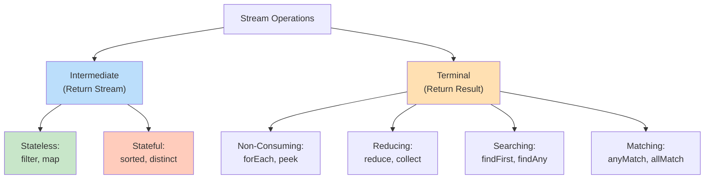

# Streams API - Comprehensive Guide

## 📚 Table of Contents
- [Learning Objectives](#learning-objectives)
- [Theory Checkpoints](#theory-checkpoints)
- [Run Steps](#run-steps)
- [Verification Steps](#verification-steps)
- [Expected Outcome](#expected-outcome)
- [Hands-on Lab](#hands-on-lab)
- [Introduction](#introduction)
- [What is a Stream?](#what-is-a-stream)
- [Stream Pipeline Architecture](#stream-pipeline-architecture)
- [Creating Streams](#creating-streams)
- [Intermediate Operations](#intermediate-operations)
- [Terminal Operations](#terminal-operations)
- [Stream Operation Categories](#stream-operation-categories)
- [Advanced Patterns](#advanced-patterns)
- [Performance Considerations](#performance-considerations)
- [Quick Reference Card](#quick-reference-card)

---

## 🎯 Learning Objectives

After completing this module, you will:

- [ ] Understand what Streams are and how they differ from collections
- [ ] Master stream pipeline architecture (source → intermediate → terminal)
- [ ] Learn lazy evaluation and distinguish intermediate vs terminal operations
- [ ] Apply common stream operations: filter, map, flatMap, sorted, distinct
- [ ] Understand terminal operations and their return types
- [ ] Recognize stateful vs stateless operations
- [ ] Write efficient, readable functional stream pipelines
- [ ] Understand short-circuiting and its performance benefits

---

## ✅ Theory Checkpoints

**Q1: What's the fundamental difference between a Collection and a Stream?**

A: Collections are data structures that store data in memory. Streams are pipelines that process data on-demand without storing it. Streams are lazy (operations don't execute until a terminal operation is called).

**Q2: Why are Streams called "lazy"?**

A: Intermediate operations (filter, map, sorted) don't execute immediately. They're only executed when a terminal operation (forEach, collect, reduce) is invoked. This allows for optimization (short-circuiting, filtering early).

**Q3: What's the difference between intermediate and terminal operations?**

A: Intermediate operations return a Stream, allowing chaining; they're lazy. Terminal operations return a result (not a Stream) and trigger execution of the pipeline (for example: collect, forEach, reduce, count).

**Q4: What does "stateless" vs "stateful" mean for stream operations?**

A: Stateless ops (filter, map) don't depend on other elements. Stateful ops (sorted, distinct) need to see all/multiple elements. Stateful operations can't be parallelized as easily.

**Q5: What's the gotcha with mutating shared state inside stream operations?**

A: Stream operations should be non-interfering (not modify the source collection). Using lambda side effects to modify collections during stream processing is dangerous, especially with parallel streams. Use collect() instead.

---

## 🚀 Run Steps

### Compile and Run the Demo

**Step 1:** Navigate to the module directory
```bash
cd 04-StreamsAPI
```

**Step 2:** Compile the Java file
```bash
javac StreamsAPI.java
```

**Step 3:** Run the demo
```bash
java StreamsAPI
```

### Alternative: Using IDE

If using an IDE (IntelliJ, Eclipse, VS Code):
1. Open `StreamsAPI.java`
2. Click the "Run" button (or press `Shift+F10` in IntelliJ)
3. Output appears in the console

---

## ✅ Verification Steps

**Expected behavior after running:**
1. Program compiles without errors
2. Output demonstrates various stream operations
3. All operation categories show output (filter, map, sorting, collecting)
4. No exceptions thrown
5. Output is clearly labeled for each demo section

**Troubleshooting:**
- **Error: "Stream closed" or "cannot reuse stream"**
  - Solution: Remember that streams can only be traversed once. Create a new stream if needed.
- **No output for some operations**
  - Solution: Verify terminal operation exists (forEach, collect, etc.). Intermediate ops alone won't produce output.
- **Error: "method not found" for stream operations**
  - Solution: Ensure Java 8+ is being used (`java -version`)

---

## 📊 Expected Outcome

When you run `StreamsAPI.java`, you should see output organized by operation category:

```
=== STREAMS API DEMO ===

--- Creating Streams ---
[Various ways to create streams from collections and arrays]

--- Intermediate Operations ---
[Output from filter, map, distinct, sorted operations]

--- Terminal Operations ---
[Output from collect, forEach, reduce, count operations]

--- Stream Pipeline Examples ---
[Complex pipelines combining multiple operations]

--- Special Stream Types ---
[IntStream, LongStream, DoubleStream examples]
```

Key characteristics:
- Clear section headers
- Demonstrates lazy evaluation
- Shows both sequential and potential parallel processing
- No errors or exceptions

---

## 📚 Hands-on Lab

### Exercise 1: Guided — Create Your First Stream Pipeline [Beginner]

**Task:** Filter and transform a list of numbers using streams.

**Given:**
```java
List<Integer> numbers = Arrays.asList(1, 2, 3, 4, 5, 6, 7, 8, 9, 10);

// Task: Keep only even numbers and double them
List<Integer> result = numbers.stream()
    .filter(n -> n % 2 == 0)      // Keep evens
    .map(n -> n * 2)              // Double each
    .collect(Collectors.toList());

System.out.println(result);
// Expected: [4, 8, 12, 16, 20]
```

**Your Task:** Write the code to filter numbers greater than 5 and convert to uppercase string representation:
```java
List<String> strings = Arrays.asList("apple", "kiwi", "banana", "grape", "fig");
// Filter to length > 4 and uppercase
List<String> result = strings.stream()
    .filter(???)     // When length > 4
    .map(???)        // Convert to uppercase
    .collect(Collectors.toList());
// Expected: [APPLE, BANANA, GRAPE]
```

**Hint:** `s.length() > 4` and `String::toUpperCase`

---

### Exercise 2: Semi-Guided — Reduce and Collect Operations [Intermediate]

**Task:** Group and count elements in a stream.

**Given:**
```java
List<String> words = Arrays.asList("cat", "dog", "cat", "bird", "dog", "dog");

// Count occurrences of each word
Map<String, Long> counts = words.stream()
    .collect(Collectors.groupingBy(
        Function.identity(),      // Group by the word itself
        Collectors.counting()     // Count in each group
    ));

System.out.println(counts);
// Expected: {cat=2, dog=3, bird=1}
```

**Your Task:** Find the sum of all numbers in a list using reduce():
```java
List<Integer> nums = Arrays.asList(1, 2, 3, 4, 5);

int sum = nums.stream()
    .reduce(0, (a, b) -> a + b);  // What does this do?

System.out.println(sum);
// Expected: 15
```

**Hint:** `reduce(initialValue, combiner)`

---

### Exercise 3: Challenge — Complex Pipeline with Intermediate Operations [Advanced]

**Task:** Build a complex stream pipeline with multiple transformations.

**Challenge Code:**
```java
List<Person> people = getPeople(); // List of Person objects with name and age

// Find people over 18, sort by name, collect first 5 names
List<String> result = people.stream()
    .filter(p -> p.getAge() > 18)  // Keep adults
    .sorted(Comparator.comparing(Person::getName))  // Sort by name
    .limit(5)  // Keep first 5
    .map(Person::getName)  // Extract names
    .collect(Collectors.toList());
```

**Your Challenge:** Build a pipeline that:
1. Filters numbers >= 5
2. Removes duplicates
3. Multiplies each by 2
4. Stops after 3 elements
5. Collects to list

```java
List<Integer> data = Arrays.asList(3, 5, 5, 7, 7, 7, 2, 8);

List<Integer> result = data.stream()
    .filter(???)      // >= 5
    .distinct()       // Remove duplicates
    .map(n -> n * 2)  // Double
    .limit(???)       // First N elements
    .collect(Collectors.toList());
// Expected: [10, 14, 14] or similar pattern
```

---

## 🎨 Architecture Diagram

**Stream Pipeline Processing:**

```mermaid
graph LR
    A["Source:<br/>Collection/Array"] --> B["Intermediate Ops<br/>(Lazy)"]
    B --> C["filter"|"map"|"sorted"]
    C --> D["More Intermediate<br/>(Optional)"]
    D --> E["Terminal Op<br/>(Triggers Execution)"]
    E --> F["Result"]
    
    style A fill:#c8e6c9
    style B fill:#fff9c4
    style C fill:#fff9c4
    style D fill:#fff9c4
    style E fill:#ffccbc
    style F fill:#b3e5fc
```

**Stream Operation Categories:**



---

## 🎯 Introduction

The **Streams API** is one of the most powerful features introduced in Java 8. It provides a functional approach to processing collections of data with operations like filtering, mapping, and reducing.

### Before and After Streams

```java
// ❌ BEFORE (Java 7) - Imperative approach
List<String> names = new ArrayList<>();
for (Person person : people) {
    if (person.getAge() > 18) {
        names.add(person.getName().toUpperCase());
    }
}
Collections.sort(names);
for (String name : names) {
    System.out.println(name);
}

// ✅ AFTER (Java 8) - Declarative approach with Streams
people.stream()
    .filter(p -> p.getAge() > 18)
    .map(Person::getName)
    .map(String::toUpperCase)
    .sorted()
    .forEach(System.out::println);
```

### Why Streams?

```
┌──────────────────────────────────────────────────┐
│           STREAMS API BENEFITS                   │
├──────────────────────────────────────────────────┤
│                                                  │
│  ✓ DECLARATIVE                                   │
│    Focus on WHAT, not HOW                        │
│                                                  │
│  ✓ COMPOSABLE                                    │
│    Chain operations easily                       │
│                                                  │
│  ✓ LAZY EVALUATION                               │
│    Operations only execute when needed           │
│                                                  │
│  ✓ PARALLEL PROCESSING                           │
│    Easy parallelization with .parallelStream()   │
│                                                  │
│  ✓ READABLE                                      │
│    Code reads like English                       │
│                                                  │
└──────────────────────────────────────────────────┘
```

---

## 🔍 What is a Stream?

A **Stream** is a sequence of elements supporting sequential and parallel aggregate operations.

### Key Characteristics

```
┌────────────────────────────────────────────────────┐
│         STREAM CHARACTERISTICS                     │
├────────────────────────────────────────────────────┤
│                                                    │
│  1. NOT A DATA STRUCTURE                           │
│     Streams don't store data                       │
│     They operate on data from a source             │
│                                                    │
│  2. FUNCTIONAL IN NATURE                           │
│     Operations produce a result                    │
│     Don't modify the source                        │
│                                                    │
│  3. LAZY                                           │
│     Intermediate operations are lazy               │
│     Executed only when terminal operation called   │
│                                                    │
│  4. CONSUMABLE                                     │
│     Can only be traversed once                     │
│     Like an iterator                               │
│                                                    │
│  5. UNBOUNDED                                      │
│     Can be infinite (use with caution!)            │
│                                                    │
└────────────────────────────────────────────────────┘
```

### Stream vs Collection

```
┌──────────────────────────────────────────────────────┐
│        COLLECTION vs STREAM                          │
├──────────────────┬───────────────────────────────────┤
│  Collection      │  Stream                           │
├──────────────────┼───────────────────────────────────┤
│  Data structure  │  Abstraction for processing       │
│  Stores data     │  Computes on demand               │
│  Eager           │  Lazy                             │
│  External loop   │  Internal iteration               │
│  Reusable        │  One-time use                     │
│  Finite          │  Can be infinite                  │
└──────────────────┴───────────────────────────────────┘
```

---

## 🏗️ Stream Pipeline Architecture

A stream pipeline consists of three parts:

```
┌──────────────────────────────────────────────────────────┐
│              STREAM PIPELINE                             │
├──────────────────────────────────────────────────────────┤
│                                                          │
│  ┌──────────┐    ┌─────────────┐    ┌──────────────┐   │
│  │          │    │             │    │              │   │
│  │  SOURCE  │───▶│INTERMEDIATE │───▶│  TERMINAL    │   │
│  │          │    │ OPERATIONS  │    │  OPERATION   │   │
│  │          │    │  (0 or more)│    │   (exactly 1)│   │
│  └──────────┘    └─────────────┘    └──────────────┘   │
│                                                          │
│  Examples:       Examples:          Examples:           │
│  • Collection    • filter()         • collect()         │
│  • Array         • map()            • forEach()         │
│  • Generator     • sorted()         • reduce()          │
│  • I/O channel   • distinct()       • count()           │
│                  • limit()          • findFirst()       │
│                  • skip()           • anyMatch()        │
│                                                          │
└──────────────────────────────────────────────────────────┘
```

### Execution Flow

```
┌─────────────────────────────────────────────────────────┐
│           STREAM EXECUTION FLOW                         │
├─────────────────────────────────────────────────────────┤
│                                                         │
│  List<String> result = people.stream()                  │
│      .filter(p -> p.getAge() > 18)  ← Intermediate      │
│      .map(Person::getName)          ← Intermediate      │
│      .sorted()                      ← Intermediate      │
│      .collect(Collectors.toList()); ← Terminal          │
│                                                         │
│  Execution Steps:                                       │
│  ─────────────────                                      │
│                                                         │
│  1. Create stream from people                           │
│                                                         │
│  2. Define pipeline (intermediate operations)           │
│     - filter, map, sorted are LAZY                      │
│     - Nothing happens yet!                              │
│                                                         │
│  3. Execute terminal operation (collect)                │
│     - NOW the pipeline executes                         │
│     - Data flows through all operations                 │
│     - Result is produced                                │
│                                                         │
└─────────────────────────────────────────────────────────┘
```

---

## 🌊 Creating Streams

### From Collections

```java
// List
List<String> list = Arrays.asList("a", "b", "c");
Stream<String> streamFromList = list.stream();

Set<Integer> set = new HashSet<>(Arrays.asList(1, 2, 3));
Stream<Integer> streamFromSet = set.stream();
## 📋 Prerequisites & Next Topics

// Map (entries, keys, values)
Stream<Integer> values = map.values().stream();
```

### From Arrays

```java
// Using Arrays.stream()
Stream<String> streamFromArray = Arrays.stream(array);

// Primitive arrays
int[] intArray = {1, 2, 3, 4, 5};
IntStream intStream = Arrays.stream(intArray);

// Using Stream.of()
Stream<String> stream = Stream.of("a", "b", "c");
Stream<Integer> numbers = Stream.of(1, 2, 3, 4, 5);
```

### From Values

```java
// Stream.of() with varargs
Stream<String> stream = Stream.of("a", "b", "c");

// Empty stream
Stream<String> empty = Stream.empty();

// Single element
Stream<String> single = Stream.of("single");
```

### Infinite Streams

```java
// Stream.iterate() - infinite stream with seed and function
Stream<Integer> infiniteStream = Stream.iterate(0, n -> n + 2);
// 0, 2, 4, 6, 8, 10, ...

// With limit
Stream<Integer> first10Even = Stream.iterate(0, n -> n + 2)
                                    .limit(10);

// Stream.generate() - infinite stream with Supplier
Stream<Double> randomStream = Stream.generate(Math::random);
Stream<String> helloStream = Stream.generate(() -> "Hello");

// With limit
Stream<Double> first5Random = Stream.generate(Math::random)
                                    .limit(5);
```

### From Ranges (Primitive Streams)

```java
// IntStream
IntStream range = IntStream.range(1, 5);        // 1, 2, 3, 4 (exclusive)
IntStream rangeClosed = IntStream.rangeClosed(1, 5);  // 1, 2, 3, 4, 5 (inclusive)

// LongStream
LongStream longRange = LongStream.range(1L, 1000000L);

// Convert to object stream
Stream<Integer> integerStream = IntStream.range(1, 10).boxed();
```

### From Files

```java
// Read lines from file
try (Stream<String> lines = Files.lines(Paths.get("file.txt"))) {
    lines.forEach(System.out::println);
}

// List files in directory
try (Stream<Path> paths = Files.list(Paths.get("."))) {
    paths.filter(Files::isRegularFile)
         .forEach(System.out::println);
}

// Walk directory tree
try (Stream<Path> paths = Files.walk(Paths.get("."))) {
    paths.filter(Files::isRegularFile)
         .filter(p -> p.toString().endsWith(".java"))
         .forEach(System.out::println);
}
```

### Stream Builder

```java
Stream.Builder<String> builder = Stream.builder();
builder.add("a");
builder.add("b");
builder.add("c");
Stream<String> stream = builder.build();
```

---

## ⚙️ Intermediate Operations

Intermediate operations return a new stream and are **lazy** (executed only when terminal operation is called).

### Visual Representation

```
┌─────────────────────────────────────────────────────┐
│        INTERMEDIATE OPERATIONS                      │
├─────────────────────────────────────────────────────┤
│                                                     │
│  Stream → [Intermediate Op] → Stream                │
│                                                     │
│  Characteristics:                                   │
│  • Return Stream<T>                                 │
│  • Lazy (not executed immediately)                  │
│  • Can be chained                                   │
│  • Stateless or stateful                            │
│                                                     │
└─────────────────────────────────────────────────────┘
```

### 1. filter() - Select Elements

**Purpose:** Keep elements that match a predicate

```java
// Signature
Stream<T> filter(Predicate<? super T> predicate)

// Examples
List<Integer> numbers = Arrays.asList(1, 2, 3, 4, 5, 6, 7, 8, 9, 10);

// Filter even numbers
List<Integer> evens = numbers.stream()
    .filter(n -> n % 2 == 0)
    .collect(Collectors.toList());
// Result: [2, 4, 6, 8, 10]

// Filter by multiple conditions
List<Integer> result = numbers.stream()
    .filter(n -> n > 3)
    .filter(n -> n < 8)
    .filter(n -> n % 2 == 0)
    .collect(Collectors.toList());
// Result: [4, 6]

// Filter objects
List<Person> adults = people.stream()
    .filter(p -> p.getAge() >= 18)
    .collect(Collectors.toList());

// Filter with method reference
List<String> nonEmpty = strings.stream()
    .filter(s -> !s.isEmpty())
    .collect(Collectors.toList());
```

### 2. map() - Transform Elements

**Purpose:** Transform each element to another value

```java
// Signature
<R> Stream<R> map(Function<? super T, ? extends R> mapper)

// Examples
List<String> words = Arrays.asList("hello", "world", "java");

// Transform to lengths
List<Integer> lengths = words.stream()
    .map(String::length)
    .collect(Collectors.toList());
// Result: [5, 5, 4]

// Transform to uppercase
List<String> upper = words.stream()
    .map(String::toUpperCase)
    .collect(Collectors.toList());
// Result: ["HELLO", "WORLD", "JAVA"]

// Extract property
List<String> names = people.stream()
    .map(Person::getName)
    .collect(Collectors.toList());

// Chain transformations
List<Integer> result = words.stream()
    .map(String::trim)
    .map(String::toUpperCase)
    .map(String::length)
    .collect(Collectors.toList());

// Type conversion
List<String> numbers = Arrays.asList("1", "2", "3");
List<Integer> integers = numbers.stream()
    .map(Integer::parseInt)
    .collect(Collectors.toList());
```

### 3. flatMap() - Flatten Nested Structures

**Purpose:** Transform each element to a stream and flatten all streams into one

```java
// Signature
<R> Stream<R> flatMap(Function<? super T, ? extends Stream<? extends R>> mapper)

// Visual representation
/*
  map:     [[a,b], [c,d]] → Stream<List<String>>
  flatMap: [[a,b], [c,d]] → [a, b, c, d]
*/

// Examples
List<List<Integer>> nestedList = Arrays.asList(
    Arrays.asList(1, 2),
    Arrays.asList(3, 4),
    Arrays.asList(5, 6)
);

List<Integer> flat = nestedList.stream()
    .flatMap(List::stream)
    .collect(Collectors.toList());
// Result: [1, 2, 3, 4, 5, 6]

// Split strings into words
List<String> sentences = Arrays.asList("Hello World", "Java Streams");
List<String> words = sentences.stream()
    .flatMap(sentence -> Arrays.stream(sentence.split(" ")))
    .collect(Collectors.toList());
// Result: ["Hello", "World", "Java", "Streams"]

// Get all books from all authors
List<String> allBooks = authors.stream()
    .flatMap(author -> author.getBooks().stream())
    .map(Book::getTitle)
    .collect(Collectors.toList());

// Flatten Optional
List<Optional<String>> optionals = Arrays.asList(
    Optional.of("a"),
    Optional.empty(),
    Optional.of("b")
);
List<String> values = optionals.stream()
    .flatMap(Optional::stream)  // Java 9+
    .collect(Collectors.toList());
// Result: ["a", "b"]
```

### 4. distinct() - Remove Duplicates

```java
// Examples
List<Integer> numbers = Arrays.asList(1, 2, 2, 3, 3, 3, 4, 5, 5);
List<Integer> unique = numbers.stream()
    .distinct()
    .collect(Collectors.toList());
// Result: [1, 2, 3, 4, 5]

// Works with objects (uses equals())
List<Person> uniquePeople = people.stream()
    .distinct()  // Based on Person.equals()
    .collect(Collectors.toList());

// Get unique names
List<String> uniqueNames = people.stream()
    .map(Person::getName)
    .distinct()
    .collect(Collectors.toList());
```

### 5. sorted() - Sort Elements

```java
// Natural order
List<Integer> sorted = numbers.stream()
    .sorted()
    .collect(Collectors.toList());

// Custom comparator
List<String> sortedWords = words.stream()
    .sorted(Comparator.comparing(String::length))
    .collect(Collectors.toList());

// Reverse order
List<Integer> reversed = numbers.stream()
    .sorted(Comparator.reverseOrder())
    .collect(Collectors.toList());

// Multiple comparators
List<Person> sorted = people.stream()
    .sorted(Comparator.comparing(Person::getLastName)
                      .thenComparing(Person::getFirstName)
                      .thenComparing(Person::getAge))
    .collect(Collectors.toList());
```

### 6. limit() - Take First N Elements

```java
List<Integer> first5 = numbers.stream()
    .limit(5)
    .collect(Collectors.toList());

// With infinite stream
List<Integer> first10Even = Stream.iterate(0, n -> n + 2)
    .limit(10)
    .collect(Collectors.toList());
// Result: [0, 2, 4, 6, 8, 10, 12, 14, 16, 18]
```

### 7. skip() - Skip First N Elements

```java
List<Integer> skipFirst5 = numbers.stream()
    .skip(5)
    .collect(Collectors.toList());

// Pagination
List<Product> page2 = products.stream()
    .skip(20)   // Skip first page (20 items)
    .limit(20)  // Take next 20 items
    .collect(Collectors.toList());
```

### 8. peek() - Debug/Side Effects

**Purpose:** Perform an action on each element without changing it (useful for debugging)

```java
List<Integer> result = numbers.stream()
    .peek(n -> System.out.println("Original: " + n))
    .map(n -> n * 2)
    .peek(n -> System.out.println("After map: " + n))
    .filter(n -> n > 10)
    .peek(n -> System.out.println("After filter: " + n))
    .collect(Collectors.toList());

// Modify state (not recommended, but possible)
List<Person> people = getpeople();
people.stream()
    .peek(p -> p.setProcessed(true))  // Side effect
    .collect(Collectors.toList());
```

---

## 🎯 Terminal Operations

Terminal operations trigger stream execution and produce a result or side-effect. **Stream cannot be used after terminal operation.**

### Visual Representation

```
┌─────────────────────────────────────────────────────┐
│         TERMINAL OPERATIONS                         │
├─────────────────────────────────────────────────────┤
│                                                     │
│  Stream → [Terminal Op] → Result (not a Stream)     │
│                                                     │
│  Characteristics:                                   │
│  • Trigger pipeline execution                       │
│  • Return non-Stream result                         │
│  • Stream cannot be reused after                    │
│  • Short-circuit (some operations)                  │
│                                                     │
└─────────────────────────────────────────────────────┘
```

### 1. collect() - Collect to Collection

```java
// To List
List<String> list = stream.collect(Collectors.toList());

// To Set
Set<String> set = stream.collect(Collectors.toSet());

// To specific implementation
ArrayList<String> arrayList = stream.collect(Collectors.toCollection(ArrayList::new));
TreeSet<String> treeSet = stream.collect(Collectors.toCollection(TreeSet::new));

// To Map
Map<Integer, String> map = people.stream()
    .collect(Collectors.toMap(
        Person::getId,      // Key mapper
        Person::getName     // Value mapper
    ));

// Grouping
Map<Integer, List<Person>> byAge = people.stream()
    .collect(Collectors.groupingBy(Person::getAge));

// Partitioning (boolean key)
Map<Boolean, List<Person>> adults = people.stream()
    .collect(Collectors.partitioningBy(p -> p.getAge() >= 18));

// Joining strings
String result = words.stream()
    .collect(Collectors.joining(", "));
// Result: "a, b, c"

String withPrefixSuffix = words.stream()
    .collect(Collectors.joining(", ", "[", "]"));
// Result: "[a, b, c]"
```

### 2. forEach() - Perform Action on Each Element

```java
stream.forEach(System.out::println);

people.forEach(person -> {
    System.out.println(person.getName());
    // Perform side effects
});

// forEachOrdered - maintains order (important for parallel streams)
stream.parallel()
      .forEachOrdered(System.out::println);
```

### 3. reduce() - Combine Elements

```java
// Signature
Optional<T> reduce(BinaryOperator<T> accumulator)
T reduce(T identity, BinaryOperator<T> accumulator)

// Sum
int sum = numbers.stream()
    .reduce(0, (a, b) -> a + b);
// Or using Integer::sum
int sum = numbers.stream()
    .reduce(0, Integer::sum);

// Product
int product = numbers.stream()
    .reduce(1, (a, b) -> a * b);

// Max
Optional<Integer> max = numbers.stream()
    .reduce(Integer::max);

// Min
Optional<Integer> min = numbers.stream()
    .reduce(Integer::min);

// Concatenation
String concatenated = words.stream()
    .reduce("", (a, b) -> a + b);
// Or using String::concat
String result = words.stream()
    .reduce("", String::concat);
```

### 4. count() - Count Elements

```java
long count = stream.count();

long adultsCount = people.stream()
    .filter(p -> p.getAge() >= 18)
    .count();
```

### 5. anyMatch(), allMatch(), noneMatch() - Test Elements

```java
// anyMatch - at least one matches
boolean hasAdult = people.stream()
    .anyMatch(p -> p.getAge() >= 18);

// allMatch - all match
boolean allAdults = people.stream()
    .allMatch(p -> p.getAge() >= 18);

// noneMatch - none match
boolean noMinors = people.stream()
    .noneMatch(p -> p.getAge() < 18);
```

### 6. findFirst(), findAny() - Find Element

```java
// findFirst - first element (order matters)
Optional<String> first = words.stream()
    .findFirst();

Optional<Person> firstAdult = people.stream()
    .filter(p -> p.getAge() >= 18)
    .findFirst();

// findAny - any element (useful in parallel streams)
Optional<String> any = words.parallelStream()
    .findAny();
```

### 7. min(), max() - Find Min/Max

```java
Optional<Integer> min = numbers.stream()
    .min(Integer::compareTo);

Optional<Integer> max = numbers.stream()
    .max(Integer::compareTo);

Optional<Person> youngest = people.stream()
    .min(Comparator.comparing(Person::getAge));

Optional<Person> oldest = people.stream()
    .max(Comparator.comparing(Person::getAge));
```

### 8. toArray() - Convert to Array

```java
// Object array
Object[] array = stream.toArray();

// Typed array
String[] stringArray = stream.toArray(String[]::new);

Integer[] intArray = numbers.stream()
    .toArray(Integer[]::new);
```

---

## 📊 Stream Operation Categories

```
┌──────────────────────────────────────────────────────────┐
│        STREAM OPERATIONS CLASSIFICATION                  │
├──────────────────────────────────────────────────────────┤
│                                                          │
│  INTERMEDIATE (return Stream)                            │
│  ──────────────────────────────                          │
│                                                          │
│  Stateless:                                              │
│    filter, map, flatMap, peek                            │
│    • Don't need to know about other elements             │
│    • Process each element independently                  │
│                                                          │
│  Stateful:                                               │
│    distinct, sorted, limit, skip                         │
│    • Need to know about other elements                   │
│    • May need to process entire stream                   │
│                                                          │
│  TERMINAL (return result)                                │
│  ────────────────────────                                │
│                                                          │
│  Short-circuiting:                                       │
│    anyMatch, allMatch, noneMatch, findFirst, findAny     │
│    • May not process entire stream                       │
│    • Return as soon as result is determined              │
│                                                          │
│  Non-short-circuiting:                                   │
│    forEach, collect, reduce, count, min, max             │
│    • Process entire stream                               │
│    • Return final result                                 │
│                                                          │
└──────────────────────────────────────────────────────────┘
```

---

## 🎯 Quick Reference Card

### Stream Pipeline Template

```java
source.stream()
    .filter(...)        // Keep matching elements
    .map(...)           // Transform elements
    .sorted(...)        // Sort elements
    .limit(...)         // Take first N
    .collect(...);      // Collect result
```

### Common Patterns

```java
// Filter and collect
List<T> filtered = list.stream()
    .filter(predicate)
    .collect(Collectors.toList());

// Transform and collect
List<R> transformed = list.stream()
    .map(function)
    .collect(Collectors.toList());

// Count matching
long count = list.stream()
    .filter(predicate)
    .count();

// Find first matching
Optional<T> first = list.stream()
    .filter(predicate)
    .findFirst();

// Check if any match
boolean exists = list.stream()
    .anyMatch(predicate);

// Sum numbers
int sum = numbers.stream()
    .reduce(0, Integer::sum);

// Group by property
Map<K, List<V>> grouped = list.stream()
    .collect(Collectors.groupingBy(classifier));
```

---

**Previous Module**: [← Method References](../03-MethodReferences/)  
**Next Module**: [Optional Class →](../05-OptionalClass/)

