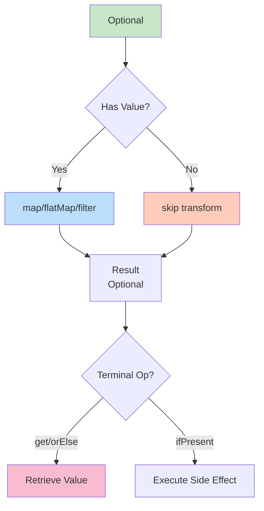
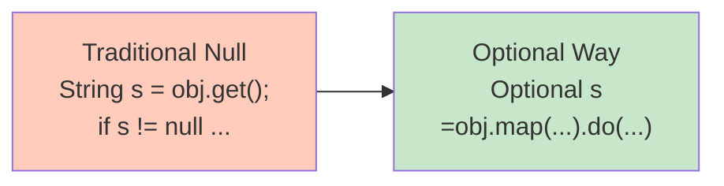

# Optional Class - Comprehensive Guide

## 📚 Table of Contents
- [Learning Objectives](#learning-objectives)
- [Theory Checkpoints](#theory-checkpoints)
- [Run Steps](#run-steps)
- [Verification Steps](#verification-steps)
- [Expected Outcome](#expected-outcome)
- [Hands-on Lab](#hands-on-lab)
- [Introduction](#introduction)
- [The Null Problem](#the-null-problem)
- [What is Optional?](#what-is-optional)
- [Creating Optional Objects](#creating-optional-objects)
- [Checking for Values](#checking-for-values)
- [Retrieving Values](#retrieving-values)
- [Transforming Values](#transforming-values)
- [Filtering Values](#filtering-values)
- [Best Practices](#best-practices)
- [Anti-Patterns](#anti-patterns)
- [Quick Reference Card](#quick-reference-card)

---
## 🎯 Learning Objectives

## 📋 Prerequisites & Next Topics
After completing this module, you will:

- [ ] Master Optional creation methods: of(), ofNullable(), empty()
- [ ] Learn to check for values safely without NPE risk
- [ ] Apply transformation operations: map(), flatMap(), filter()
- [ ] Understand the difference between get() and orElse() patterns
- [ ] Recognize and avoid Optional anti-patterns
- [ ] Write expressive, null-safe code using Optional

---

## ✅ Theory Checkpoints

**Q1: Why is Optional preferred over checking `if (x != null)`?**

A: Optional makes nullability explicit in the type signature. It forces the caller to handle the absent case. With null checks, it's easy to forget a check and get NullPointerException.

**Q2: What's the difference between Optional.of() and Optional.ofNullable()?**

A: `of(value)` throws NPE if value is null (use when you know it's not null). `ofNullable(value)` returns empty Optional if value is null. Use ofNullable when uncertain.

**Q3: When is it appropriate to use Optional.get()?**

A: Only after confirming with isPresent() or when certain a value exists. Better alternatives: use orElse(), orElseGet(), orElseThrow(), or ifPresent() to avoid forgetting the check.

**Q4: How is map() different from flatMap() on Optional?**

A: map() transforms the value inside Optional (T -> R). flatMap() is for when your transformation returns Optional (T -> Optional<R>). flatMap() flattens nested Optionals.

**Q5: What's the biggest Optional anti-pattern?**

A: Using Optional as a field type or method parameter. Optional is designed as a return type only. For fields/parameters, use null or default values. Also avoid: empty().get(), Optional inside collections.

---

## 🚀 Run Steps

### Compile and Run the Demo

**Step 1:** Navigate to the module directory
```bash
cd 05-OptionalClass
```

**Step 2:** Compile the Java file
```bash
javac OptionalClass.java
```

**Step 3:** Run the demo
```bash
java OptionalClass
```

### Alternative: Using IDE

If using an IDE (IntelliJ, Eclipse, VS Code):
1. Open `OptionalClass.java`
2. Click the "Run" button (or press `Shift+F10` in IntelliJ)
3. Output appears in the console

---

## ✅ Verification Steps

**Expected behavior after running:**
1. Program compiles without errors
2. Output demonstrates Optional creation methods
3. Shows comparison between old null-checking and Optional approaches
4. All transformation operations produce output
5. No NullPointerExceptions (this is the whole point!)

**Troubleshooting:**
- **Error: "NoSuchElementException" when calling get()**
  - Solution: Always check isPresent() first or use orElse()
- **Output shows NPE**
  - Solution: Verify you're using ofNullable() for potentially null values
- **Method not found errors**
  - Solution: Ensure Java 8+ is being used

---

## 📊 Expected Outcome

When you run `OptionalClass.java`, you should see output like:

```
=== OPTIONAL CLASS DEMO ===

--- Creating Optionals ---
[Output from of(), ofNullable(), empty()]

--- Checking for Values ---
[Output from isPresent(), ifPresent()]

--- Getting Values ---
[Output from get(), orElse(), orElseGet()]

--- Transforming Values ---
[Output from map(), flatMap(), filter()]

--- Real-World Examples ---
[Output showing null-safe code patterns]

--- Comparison: Old vs Optional ---
[Side-by-side comparison of null checking]
```

Key points:
- Clear demonstrations of each Optional operation
- No NullPointerExceptions
- Shows practical patterns for null-safety

---

## 📚 Hands-on Lab

### Exercise 1: Guided — Create Optional Objects Safely [Beginner]

**Task:** Create Optional objects using different methods.

**Given:**
```java
// DO NOT do this:
Optional<String> opt1 = Optional.of(null);  // NPE!

// DO this instead:
Optional<String> opt1 = Optional.ofNullable(null);  // Empty Optional
Optional<String> opt2 = Optional.of("value");       // Non-empty
Optional<String> opt3 = Optional.empty();           // Empty
```

**Your Task:** Given a method that might return null:
```java
public String findUser(String id) {
    // ... might return null
    return id.isEmpty() ? null : "User: " + id;
}

// Wrap result in Optional
Optional<String> user = Optional.???(findUser("123"));
Optional<String> noUser = Optional.???(findUser(""));

System.out.println(user);   // Optional[User: 123]
System.out.println(noUser); // Optional.empty
```

**Hint:** Use `ofNullable()` to safely wrap values that might be null.

---

### Exercise 2: Semi-Guided — Transform with map() and flatMap() [Intermediate]

**Task:** Use Optional.map() to transform values.

**Given:**
```java
public Optional<Integer> stringToInt(String s) {
    try {
        return Optional.of(Integer.parseInt(s));
    } catch (NumberFormatException e) {
        return Optional.empty();
    }
}

Optional<String> str = Optional.of("42");

// Transform string to int
Optional<Integer> num = str.flatMap(this::stringToInt);

System.out.println(num);  // Optional[42]
```

**Your Task:** Transform name to uppercase using map():
```java
Optional<String> name = Optional.of("alice");

Optional<String> upper = name.map(???);

System.out.println(upper);  // Optional[ALICE]
```

**Hint:** Use `String::toUpperCase` or `s -> s.toUpperCase()`

---

### Exercise 3: Challenge — Complex Optional Chain [Advanced]

**Task:** Build a complex chain of Optional operations.

**Challenge Code:**
```java
public class Person {
    private String name;
    private Optional<String> email;
    
    public Person(String name, String email) {
        this.name = name;
        this.email = Optional.ofNullable(email);
    }
    public Optional<String> getEmail() { return email; }
}

// Find a person, get their email, validate it has @sign
Person person = new Person("Alice", "alice@example.com");

Optional<String> validEmail = Optional.of(person)
    .flatMap(Person::getEmail)              // Extract email
    .filter(e -> e.contains("@"))           // Validate
    .map(String::toLowerCase);              // Normalize

system.out.println(validEmail);  // Optional[alice@example.com]

// Now make person with no email
Person noEmail = new Person("Bob", null);
Optional<String> result = Optional.of(noEmail)
    .flatMap(Person::getEmail)
    .filter(e -> e.contains("@"))
    .map(String::toLowerCase)
    .or(() -> Optional.of("no-email@default.com"));  // Fallback

System.out.println(result);  // Optional[no-email@default.com]
```

**Your Challenge:** Write similar code that:
1. Creates an Optional<String> user ID
2. Filters for length > 3
3. Maps to uppercase
4. Provides default if empty

---

## 🎨 Architecture Diagram

**Optional Operations Flow:**



**Null Safety Progression:**



---

## 🎯 Introduction

`Optional<T>` is a container object that may or may not contain a non-null value. It's designed to help **eliminate NullPointerExceptions** and make code more expressive about the presence or absence of values.

### The Billion Dollar Mistake

> "I call it my billion-dollar mistake. It was the invention of the null reference in 1965."
> — Tony Hoare (inventor of null reference)

```
┌──────────────────────────────────────────────────┐
│         WHY OPTIONAL?                            │
├──────────────────────────────────────────────────┤
│                                                  │
│  BEFORE: Uncertainty about null                  │
│  ────────────────────────────                    │
│  String name = person.getName();                 │
│  // Is name null? Do I need to check?            │
│  // Developer must remember to check             │
│                                                  │
│  AFTER: Explicit about possible absence          │
│  ────────────────────────────────────            │
│  Optional<String> name = person.getName();       │
│  // Clearly communicates: might not have value   │
│  // Compiler forces handling of absence          │
│                                                  │
└──────────────────────────────────────────────────┘
```

---

## 💥 The Null Problem

### Traditional Null Handling

```java
// ❌ The Null Nightmare
public String getPersonCarInsurance(Person person) {
    if (person != null) {
        Car car = person.getCar();
        if (car != null) {
            Insurance insurance = car.getInsurance();
            if (insurance != null) {
                return insurance.getName();
            }
        }
    }
    return "Unknown";
}

// Problems:
// 1. Deep nesting (pyramid of doom)
// 2. Multiple null checks
// 3. Easy to forget a check
// 4. Intent not clear
```

### With Optional

```java
// ✅ The Optional Way
public String getPersonCarInsurance(Person person) {
    return Optional.ofNullable(person)
        .flatMap(Person::getCar)
        .flatMap(Car::getInsurance)
        .map(Insurance::getName)
        .orElse("Unknown");
}

// Benefits:
// 1. Flat structure
// 2. Chain of operations
// 3. Intent is clear
// 4. No NullPointerException
```

---

## 🔍 What is Optional?

### Structure

```
┌────────────────────────────────────────────────┐
│              OPTIONAL<T>                       │
├────────────────────────────────────────────────┤
│                                                │
│  ┌─────────────────┐                          │
│  │   Container     │                          │
│  ├─────────────────┤                          │
│  │                 │                          │
│  │  Empty          │   or   │  Value: T  │    │
│  │  (no value)     │        │            │    │
│  │                 │        │            │    │
│  └─────────────────┘        └────────────┘    │
│                                                │
└────────────────────────────────────────────────┘
```

### Key Characteristics

```
┌────────────────────────────────────────────────┐
│      OPTIONAL CHARACTERISTICS                  │
├────────────────────────────────────────────────┤
│                                                │
│  ✓ VALUE-BASED CLASS                           │
│    Immutable container                         │
│                                                │
│  ✓ NO NULL INSIDE                              │
│    Optional itself can't contain null          │
│    (but can be empty)                          │
│                                                │
│  ✓ STREAM-LIKE API                             │
│    map, flatMap, filter operations             │
│                                                │
│  ✓ EXPLICIT ABSENCE                            │
│    Makes "no value" explicit in type system    │
│                                                │
└────────────────────────────────────────────────┘
```

---

## 🏗️ Creating Optional Objects

### 1. Optional.of() - Non-null Value

```java
// For values that are DEFINITELY not null
String name = "John";
Optional<String> opt = Optional.of(name);

// ❌ Throws NullPointerException if null
Optional<String> bad = Optional.of(null);  // NPE!
```

### 2. Optional.ofNullable() - Possibly Null Value

```java
// For values that MIGHT be null
String name = getName();  // Could be null
Optional<String> opt = Optional.ofNullable(name);

// If name is null → Optional.empty()
// If name is not null → Optional with value
```

### 3. Optional.empty() - Empty Optional

```java
// Explicitly create empty Optional
Optional<String> empty = Optional.empty();
```

### Decision Tree

```
┌─────────────────────────────────────────────────┐
│      WHICH FACTORY METHOD TO USE?               │
├─────────────────────────────────────────────────┤
│                                                 │
│  Value is NEVER null?                           │
│    → Optional.of(value)                         │
│                                                 │
│  Value MIGHT be null?                           │
│    → Optional.ofNullable(value)                 │
│                                                 │
│  No value to wrap?                              │
│    → Optional.empty()                           │
│                                                 │
└─────────────────────────────────────────────────┘
```

### Examples

```java
// From method return value (might be null)
Optional<User> user = Optional.ofNullable(findUser(id));

// From collection lookup (might not exist)
Optional<String> value = Optional.ofNullable(map.get(key));

// Constant empty
public static final Optional<String> NO_VALUE = Optional.empty();

// From computation
Optional<Integer> result = compute() > 0 
    ? Optional.of(compute()) 
    : Optional.empty();
```

---

## 🔎 Checking for Values

### isPresent() - Check if Value Exists

```java
Optional<String> opt = Optional.of("Hello");

if (opt.isPresent()) {
    String value = opt.get();
    System.out.println(value);
}

// ⚠️ This is NOT the recommended way!
// Better alternatives below
```

### isEmpty() - Check if Empty (Java 11+)

```java
Optional<String> opt = Optional.empty();

if (opt.isEmpty()) {
    System.out.println("No value");
}
```

### ⚠️ Anti-Pattern Alert

```java
// ❌ DON'T DO THIS - defeats the purpose of Optional
if (opt.isPresent()) {
    doSomething(opt.get());
} else {
    handleAbsence();
}

// ✅ DO THIS instead
opt.ifPresentOrElse(
    value -> doSomething(value),
    () -> handleAbsence()
);
```

---

## 📤 Retrieving Values

### Decision Flow

```
┌─────────────────────────────────────────────────────┐
│         HOW TO RETRIEVE VALUE?                      │
├─────────────────────────────────────────────────────┤
│                                                     │
│  Have a default value?                              │
│    → orElse(defaultValue)                           │
│                                                     │
│  Default value is expensive to compute?             │
│    → orElseGet(supplier)                            │
│                                                     │
│  Absence is exceptional?                            │
│    → orElseThrow() or orElseThrow(exceptionSupplier)│
│                                                     │
│  Want to perform action if present?                 │
│    → ifPresent(consumer)                            │
│                                                     │
│  Want to handle both cases?                         │
│    → ifPresentOrElse(consumer, runnable)            │
│                                                     │
└─────────────────────────────────────────────────────┘
```

### 1. get() - Raw Value (⚠️ Use Carefully)

```java
Optional<String> opt = Optional.of("Hello");
String value = opt.get();  // "Hello"

// ❌ DANGER: Throws NoSuchElementException if empty
Optional<String> empty = Optional.empty();
String value = empty.get();  // NoSuchElementException!

// Only use if you're ABSOLUTELY sure value is present
```

### 2. orElse() - Default Value

```java
// Provide default value
Optional<String> opt = Optional.empty();
String value = opt.orElse("Default");  // "Default"

// With value present
Optional<String> opt2 = Optional.of("Hello");
String value2 = opt2.orElse("Default");  // "Hello"

// Common usage
String name = Optional.ofNullable(user.getName())
                      .orElse("Anonymous");

// ⚠️ Note: default value is ALWAYS evaluated!
String value = opt.orElse(expensiveComputation());
// expensiveComputation() runs even if opt has value
```

### 3. orElseGet() - Lazy Default with Supplier

```java
// Default computed only if needed
String value = opt.orElseGet(() -> "Default");

// Expensive computation only if needed
String value = opt.orElseGet(() -> {
    // This only runs if opt is empty
    return fetchDefaultFromDatabase();
});

// Practical example
String config = Optional.ofNullable(System.getProperty("app.name"))
                        .orElseGet(() -> loadDefaultConfig());
```

### 4. orElseThrow() - Throw Exception if Empty

```java
// Throw NoSuchElementException (Java 10+)
String value = opt.orElseThrow();

// Custom exception
String value = opt.orElseThrow(() -> new IllegalStateException("Value missing"));

// Practical example
User user = userRepository.findById(id)
    .orElseThrow(() -> new UserNotFoundException("User " + id + " not found"));
```

### 5. ifPresent() - Consume Value if Present

```java
// Perform action only if value exists
opt.ifPresent(value -> System.out.println(value));

// Method reference
opt.ifPresent(System.out::println);

// Multiple statements
opt.ifPresent(value -> {
    validate(value);
    process(value);
    save(value);
});

// Practical example
Optional.ofNullable(user.getEmail())
        .ifPresent(email -> sendNotification(email));
```

### 6. ifPresentOrElse() - Handle Both Cases (Java 9+)

```java
// Execute different actions based on presence
opt.ifPresentOrElse(
    value -> System.out.println("Found: " + value),
    () -> System.out.println("Not found")
);

// Practical example
userRepository.findById(id)
    .ifPresentOrElse(
        user -> updateUser(user),
        () -> createUser(id)
    );
```

---

## 🔄 Transforming Values

### 1. map() - Transform Value

```java
// Signature
<U> Optional<U> map(Function<? super T, ? extends U> mapper)

// Basic transformation
Optional<String> name = Optional.of("john");
Optional<String> upper = name.map(String::toUpperCase);
// Result: Optional["JOHN"]

// Extract property
Optional<Person> person = Optional.of(new Person("Alice", 30));
Optional<String> personName = person.map(Person::getName);
// Result: Optional["Alice"]

Optional<Integer> age = person.map(Person::getAge);
// Result: Optional[30]

// Chain transformations
Optional<Integer> nameLength = Optional.of("Hello")
    .map(String::trim)
    .map(String::toUpperCase)
    .map(String::length);
// Result: Optional[5]

// If Optional is empty, map doesn't execute
Optional<String> empty = Optional.empty();
Optional<Integer> result = empty.map(String::length);
// Result: Optional.empty()
```

### 2. flatMap() - Transform to Optional

```java
// Signature
<U> Optional<U> flatMap(Function<? super T, Optional<U>> mapper)

// Problem that flatMap solves:
class Person {
    Optional<Car> getCar() { ... }
}
class Car {
    Optional<Insurance> getInsurance() { ... }
}

// ❌ Without flatMap - nested Optionals
Optional<Person> person = Optional.of(new Person());
Optional<Optional<Car>> nestedCar = person.map(Person::getCar);
// This gives us Optional<Optional<Car>> - not what we want!

// ✅ With flatMap - flattened
Optional<Car> car = person.flatMap(Person::getCar);
// This gives us Optional<Car> - perfect!

// Chaining flatMap
Optional<String> insuranceName = Optional.of(person)
    .flatMap(Person::getCar)
    .flatMap(Car::getInsurance)
    .map(Insurance::getName);

// Visual representation
/*
  map:     Optional<Person> → Optional<Optional<Car>>
  flatMap: Optional<Person> → Optional<Car>
*/

// Practical example
public Optional<String> getCarInsuranceName(Optional<Person> person) {
    return person
        .flatMap(Person::getCar)
        .flatMap(Car::getInsurance)
        .map(Insurance::getName);
}
```

### map() vs flatMap()

```
┌──────────────────────────────────────────────────────┐
│           map() vs flatMap()                         │
├──────────────────────────────────────────────────────┤
│                                                      │
│  map:                                                │
│    Input:  Optional<T>                               │
│    Mapper: T → R                                     │
│    Output: Optional<R>                               │
│                                                      │
│    Use when: Mapper returns plain value             │
│                                                      │
│  flatMap:                                            │
│    Input:  Optional<T>                               │
│    Mapper: T → Optional<R>                           │
│    Output: Optional<R> (flattened!)                  │
│                                                      │
│    Use when: Mapper returns Optional                │
│                                                      │
└──────────────────────────────────────────────────────┘
```

---

## 🔽 Filtering Values

### filter() - Conditionally Keep Value

```java
// Signature
Optional<T> filter(Predicate<? super T> predicate)

// Keep value if it matches predicate
Optional<Integer> number = Optional.of(42);
Optional<Integer> even = number.filter(n -> n % 2 == 0);
// Result: Optional[42]

Optional<Integer> odd = number.filter(n -> n % 2 != 0);
// Result: Optional.empty()

// Practical examples
// Filter by age
Optional<Person> adult = Optional.of(person)
    .filter(p -> p.getAge() >= 18);

// Filter by length
Optional<String> longName = Optional.of("John")
    .filter(name -> name.length() > 5);
// Result: Optional.empty()

// Validation
Optional<String> validEmail = Optional.of(email)
    .filter(e -> e.contains("@"))
    .filter(e -> e.contains("."));

// Combining map and filter
Optional<String> result = Optional.of("  hello  ")
    .map(String::trim)
    .filter(s -> s.length() > 3)
    .map(String::toUpperCase);
// Result: Optional["HELLO"]
```

### Filter Flow

```
┌─────────────────────────────────────────────────┐
│         FILTER BEHAVIOR                         │
├─────────────────────────────────────────────────┤
│                                                 │
│  Optional.of(42).filter(n -> n % 2 == 0)        │
│       ↓                                         │
│  Value: 42, Predicate: true                     │
│       ↓                                         │
│  Result: Optional[42]  ✓                        │
│                                                 │
│  Optional.of(42).filter(n -> n % 2 != 0)        │
│       ↓                                         │
│  Value: 42, Predicate: false                    │
│       ↓                                         │
│  Result: Optional.empty()  ✗                    │
│                                                 │
│  Optional.empty().filter(n -> n % 2 == 0)       │
│       ↓                                         │
│  No value to test                               │
│       ↓                                         │
│  Result: Optional.empty()                       │
│                                                 │
└─────────────────────────────────────────────────┘
```

---

## ✅ Best Practices

### 1. Never Assign null to Optional

```java
// ❌ BAD
Optional<String> opt = null;

// ✅ GOOD
Optional<String> opt = Optional.empty();
```

### 2. Use Optional for Return Types, Not Fields

```java
// ❌ BAD - Optional as field
class Person {
    private Optional<String> name;  // Don't do this
}

// ✅ GOOD - Regular field, Optional return
class Person {
    private String name;
    
    public Optional<String> getName() {
        return Optional.ofNullable(name);
    }
}
```

### 3. Don't Use Optional for Method Parameters

```java
// ❌ BAD
public void setName(Optional<String> name) {
    this.name = name.orElse("Unknown");
}

// ✅ GOOD - Use method overloading
public void setName(String name) {
    this.name = name;
}

public void setName() {
    this.name = "Unknown";
}
```

### 4. Don't Call get() Without Checking

```java
// ❌ BAD
Optional<String> opt = getOptional();
String value = opt.get();  // Might throw exception

// ✅ GOOD
String value = opt.orElse("default");
// or
String value = opt.orElseThrow(() -> new IllegalStateException("Missing value"));
```

### 5. Prefer orElseGet() for Expensive Defaults

```java
// ❌ LESS EFFICIENT
String value = opt.orElse(expensiveOperation());
// expensiveOperation() always executes

// ✅ MORE EFFICIENT
String value = opt.orElseGet(() -> expensiveOperation());
// expensiveOperation() only if opt is empty
```

### 6. Use Stream with Optional (Java 9+)

```java
// Convert Optional to Stream
Optional<String> opt = Optional.of("Hello");
Stream<String> stream = opt.stream();

// Practical use case
List<String> result = people.stream()
    .map(Person::getEmail)          // Stream<Optional<String>>
    .flatMap(Optional::stream)       // Stream<String>
    .collect(Collectors.toList());
```

---

## ❌ Anti-Patterns

### 1. Optional.of() with Nullable Value

```java
// ❌ WRONG - can throw NPE
String name = getName();  // might be null
Optional<String> opt = Optional.of(name);  // NPE if name is null!

// ✅ CORRECT
Optional<String> opt = Optional.ofNullable(name);
```

### 2. isPresent() + get() Pattern

```java
// ❌ BAD - defeats purpose of Optional
if (opt.isPresent()) {
    String value = opt.get();
    System.out.println(value);
}

// ✅ GOOD
opt.ifPresent(System.out::println);
```

### 3. Using Optional Like Null Check

```java
// ❌ BAD - just using Optional as fancy null
Optional<String> opt = Optional.ofNullable(name);
if (opt.isPresent()) {
    return opt.get().toUpperCase();
} else {
    return "DEFAULT";
}

// ✅ GOOD - functional style
return Optional.ofNullable(name)
    .map(String::toUpperCase)
    .orElse("DEFAULT");
```

### 4. Optional in Collections

```java
// ❌ BAD - Optional inside collection
List<Optional<String>> list = new ArrayList<>();

// ✅ GOOD - Just use the values
List<String> list = new ArrayList<>();
// Use null or empty list to represent absence
```

---

## 🎯 Quick Reference Card

### Creation

```java
Optional.of(value)              // Non-null value
Optional.ofNullable(value)      // Possibly null value
Optional.empty()                // Empty optional
```

### Checking

```java
opt.isPresent()                 // Has value?
opt.isEmpty()                   // Is empty? (Java 11+)
```

### Retrieval

```java
opt.get()                       // Get value (throws if empty)
opt.orElse(default)             // Value or default
opt.orElseGet(supplier)         // Value or compute default
opt.orElseThrow()               // Value or throw
opt.orElseThrow(supplier)       // Value or throw custom
```

### Transformation

```java
opt.map(function)               // Transform value
opt.flatMap(function)           // Transform to Optional
opt.filter(predicate)           // Filter value
```

### Actions

```java
opt.ifPresent(consumer)         // If has value
opt.ifPresentOrElse(c, r)       // Handle both cases (Java 9+)
```

### Common Patterns

```java
// Simple default
String name = opt.orElse("Unknown");

// Transformation chain
String result = opt
    .map(String::trim)
    .map(String::toUpperCase)
    .orElse("DEFAULT");

// Nested optionals
String insurance = person
    .flatMap(Person::getCar)
    .flatMap(Car::getInsurance)
    .map(Insurance::getName)
    .orElse("Unknown");

// Conditional action
opt.filter(s -> s.length() > 5)
   .ifPresent(System.out::println);
```

---

**Previous Module**: [← Streams API](../04-StreamsAPI/)  
**Next Module**: [Default and Static Methods →](../06-DefaultStaticMethods/)

