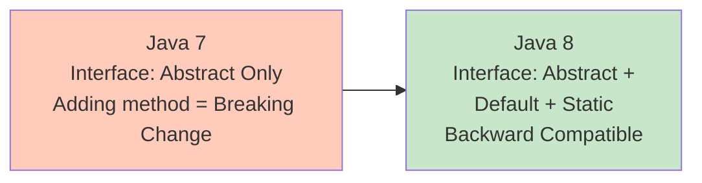
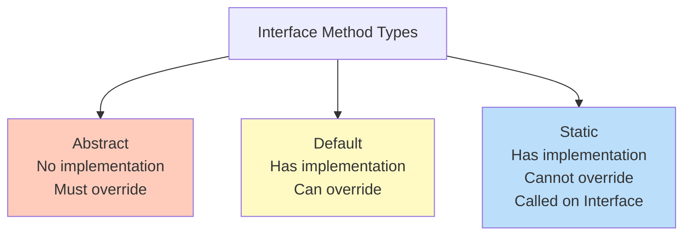

# Default and Static Methods in Interfaces - Comprehensive Guide

## 📚 Table of Contents
- [Learning Objectives](#learning-objectives)
- [Theory Checkpoints](#theory-checkpoints)
- [Run Steps](#run-steps)
- [Verification Steps](#verification-steps)
- [Expected Outcome](#expected-outcome)
- [Hands-on Lab](#hands-on-lab)
- [Introduction](#introduction)
- [Default Methods](#default-methods)
- [Static Methods in Interfaces](#static-methods-in-interfaces)
- [Multiple Inheritance Resolution](#multiple-inheritance-resolution)
- [Real-World Use Cases](#real-world-use-cases)
- [Best Practices](#best-practices)
- [Quick Reference Card](#quick-reference-card)

---
## 🎯 Learning Objectives

## 📋 Prerequisites & Next Topics
After completing this module, you will:

- [ ] Master default method syntax and when to use them
- [ ] Distinguish between default methods and static methods in interfaces
- [ ] Understand interface hierarchy and method resolution order
- [ ] Recognize multiple inheritance diamond problems and how Java solves them
- [ ] Apply default/static methods effectively in real-world APIs


## ✅ Theory Checkpoints

**Q1: Why couldn't interfaces have method implementations before Java 8?**

A: Adding a new method to an interface would force all implementing classes to provide an implementation, breaking existing code. Default methods allow interfaces to provide implementations while remaining backward compatible.

**Q2: What's the difference between a default method and a static method in interfaces?**

A: Default methods are instance methods (called on objects), can access instance data, and can be overridden. Static methods are class-level, cannot be overridden, and are called on the interface itself (e.g., `Interface.staticMethod()`).

**Q3: What happens when two interfaces have default methods with the same signature?**

A: This is the "diamond problem." The implementing class MUST override the method to resolve the ambiguity. The compiler will force you to provide an implementation.

**Q4: Can you call a default method from a static method in the same interface?**

A: No. Static methods can only access static context. Default methods operate on instances. You'd need an instance object to call a default method from static context.

**Q5: When should you use default vs static vs abstract methods in an interface?**

A: Abstract when contract is required. Default for optional behavior with reasonable implementation. Static for utility functions related to the interface (like `List.of()`).

---

## 🚀 Run Steps

### Compile and Run the Demo

**Step 1:** Navigate to the module directory
```bash
cd 06-DefaultStaticMethods
```

**Step 2:** Compile the Java file
```bash
javac DefaultAndStaticMethods.java
```

**Step 3:** Run the demo
```bash
java DefaultAndStaticMethods
```

### Alternative: Using IDE

If using an IDE (IntelliJ, Eclipse, VS Code):
1. Open `DefaultAndStaticMethods.java`
2. Click the "Run" button (or press `Shift+F10` in IntelliJ)
3. Output appears in the console

---

## ✅ Verification Steps

**Expected behavior after running:**
1. Program compiles without errors
2. Output demonstrates default method usage
3. Output shows static method calls
4. Output demonstrates method overriding
5. Multiple inheritance (diamond) cases handled properly

**Troubleshooting:**
- **Error: "The type MyClass must implement the inherited abstract method"**
  - Solution: You have conflicting default methods. Override in your class.
- **Error: "static methods cannot override static methods"**
  - Solution: Static methods hide, not override. This is expected behavior.
- **No output for some sections**
  - Solution: Check that your interface methods are being called correctly

---

## 📊 Expected Outcome

When you run `DefaultAndStaticMethods.java`, you should see output like:

```
=== DEFAULT AND STATIC METHODS DEMO ===

--- Default Method Examples ---
[Output from basic default methods]

--- Static Method Examples ---
[Output from interface static methods]

--- Method Overriding ---
[Output showing overridden default methods]

--- Multiple Inheritance ---
[Output showing diamond problem resolution]

--- Real-World Use Cases ---
[Output from common default/static method patterns]
```

Key characteristics:
- Clear method resolution
- Proper inheritance behavior
- No compilation errors
- Default and static methods work as expected

---

## 📚 Hands-on Lab

### Exercise 1: Guided — Add Default Method to Existing Interface [Beginner]

**Task:** Create a simple interface with a default method.

**Setup:**
```java
interface Vehicle {
    // Abstract method - must be implemented
    void start();
    
    // Default method - has implementation
    default void honk() {
        System.out.println("Beep! Beep!");
    }
}

class Car implements Vehicle {
    @Override
    public void start() {
        System.out.println("Car engine starts");
    }
    // No need to implement honk() - uses default
}

Vehicle car = new Car();
car.start();  // Output: Car engine starts
car.honk();   // Output: Beep! Beep!
```

**Your Task:** Create a similar interface with 2 default methods:
```java
interface Animal {
    String getName();
    
    default void sleep() {
        ???  // Print that animal is sleeping
    }
    
    default void eat() {
        ???  // Print that animal is eating
    }
}
```

---

### Exercise 2: Semi-Guided — Static Methods in Interfaces [Intermediate]

**Task:** Create and use a static method in an interface.

**Given:**
```java
interface Calculator {
    // Static method in interface (from Java 8+)
    static int add(int a, int b) {
        return a + b;
    }
    
    // Call it on the interface, not on instance
    Calculator.add(5, 3);  // Result: 8
}
```

**Your Task:** Add static methods to a List utility interface:
```java
public interface ListUtils {
    static <T> int countOccurrences(List<T> list, T element) {
        return (int) list.stream()
            .filter(e -> e.equals(element))
            .count();
    }
    
    // Your task: Add another static method that reverses a list
    static <T> List<T> reverse(List<T> list) {
        ???  // Reverse the list and return
    }
}

// Usage
List<Integer> nums = Arrays.asList(1, 2, 3, 4);
List<Integer> reversed = ListUtils.reverse(nums);
// Expected: [4, 3, 2, 1]
```

---

### Exercise 3: Challenge — Handle Diamond Problem [Advanced]

**Task:** Resolve multiple inheritance of default methods.

**Challenge Code:**
```java
interface A {
    default void greet() {
        System.out.println("Hello from A");
    }
}

interface B {
    default void greet() {
        System.out.println("Hello from B");
    }
}

// This class implements both A and B
// COMPILATION ERROR: Both A and B have default greet() method
class C implements A, B {
    // ❌ MUST override greet() to resolve conflict
    @Override
    public void greet() {
        // Option 1: Choose one
        A.super.greet();  // Call A's version
        // Option 2: Choose other
        B.super.greet();  // Call B's version
        // Option 3: Custom
        System.out.println("Hello from C");
    }
}
```

**Your Challenge:** Create two interfaces with conflicting default somethingMethods and resolve in implementation class:

---

## 🎨 Architecture Diagram

**Interface Evolution (Why Default/Static Methods):**



**Default vs Static Methods:**



---

## 🎯 Introduction

Java 8 introduced two groundbreaking features for interfaces: **default methods** and **static methods**. These additions allow interfaces to provide method implementations while maintaining backward compatibility.

### The Problem They Solve

```
┌────────────────────────────────────────────────────┐
│         BEFORE JAVA 8 - THE PROBLEM                │
├────────────────────────────────────────────────────┤
│                                                    │
│  interface MyInterface {                           │
│      void existingMethod();                        │
│      // Want to add: void newMethod();             │
│      // ❌ Can't! Would break all implementations  │
│  }                                                 │
│                                                    │
│  class MyClass implements MyInterface {            │
│      public void existingMethod() { ... }          │
│      // ❌ Would need to implement newMethod()     │
│      // Breaking change for all implementers!      │
│  }                                                 │
│                                                    │
└────────────────────────────────────────────────────┘

┌────────────────────────────────────────────────────┐
│         JAVA 8 SOLUTION - DEFAULT METHODS          │
├────────────────────────────────────────────────────┤
│                                                    │
│  interface MyInterface {                           │
│      void existingMethod();                        │
│                                                    │
│      default void newMethod() {                    │
│          // ✓ Provide default implementation       │
│          System.out.println("Default behavior");   │
│      }                                             │
│  }                                                 │
│                                                    │
│  class MyClass implements MyInterface {            │
│      public void existingMethod() { ... }          │
│      // ✓ No need to implement newMethod()        │
│      // Uses default implementation automatically  │
│  }                                                 │
│                                                    │
└────────────────────────────────────────────────────┘
```

---

## 🔧 Default Methods

### Syntax

```java
interface MyInterface {
    // Abstract method (traditional)
    void abstractMethod();
    
    // Default method (Java 8+)
    default void defaultMethod() {
        System.out.println("Default implementation");
    }
}
```

### Basic Example

```java
interface Vehicle {
    // Abstract methods
    void start();
    void stop();
    
    // Default method
    default void honk() {
        System.out.println("Beep beep!");
    }
    
    default void displayInfo() {
        System.out.println("This is a vehicle");
    }
}

class Car implements Vehicle {
    @Override
    public void start() {
        System.out.println("Car starting...");
    }
    
    @Override
    public void stop() {
        System.out.println("Car stopping...");
    }
    
    // honk() and displayInfo() inherited automatically
}

// Usage
Car car = new Car();
car.start();        // Car starting...
car.honk();         // Beep beep! (from default method)
car.displayInfo();  // This is a vehicle
```

### Overriding Default Methods

```java
class Truck implements Vehicle {
    @Override
    public void start() {
        System.out.println("Truck starting...");
    }
    
    @Override
    public void stop() {
        System.out.println("Truck stopping...");
    }
    
    // Override default method
    @Override
    public void honk() {
        System.out.println("LOUD TRUCK HORN!");
    }
    
    // Use inherited displayInfo() as-is
}

// Usage
Truck truck = new Truck();
truck.honk();  // LOUD TRUCK HORN! (overridden)
```

### Real-World Example: Collection API

```java
// Java 8 added default methods to existing interfaces!
// Example: List interface

List<String> list = Arrays.asList("a", "b", "c");

// forEach() is a default method added in Java 8
list.forEach(System.out::println);

// sort() is a default method
list.sort(Comparator.naturalOrder());

// replaceAll() is a default method
list.replaceAll(String::toUpperCase);
```

### Default Methods Can Call Other Methods

```java
interface Logger {
    // Abstract method - must be implemented
    String getLoggerName();
    
    // Default methods can use abstract methods
    default void log(String message) {
        System.out.println("[" + getLoggerName() + "] " + message);
    }
    
    default void info(String message) {
        log("INFO: " + message);
    }
    
    default void error(String message) {
        log("ERROR: " + message);
    }
}

class FileLogger implements Logger {
    @Override
    public String getLoggerName() {
        return "FileLogger";
    }
}

// Usage
Logger logger = new FileLogger();
logger.info("Application started");
// Output: [FileLogger] INFO: Application started
```

---

## 📊 Static Methods in Interfaces

### Syntax

```java
interface MyInterface {
    // Static method
    static void staticMethod() {
        System.out.println("Static method in interface");
    }
}

// Called on interface, not instance
MyInterface.staticMethod();
```

### Characteristics

```
┌────────────────────────────────────────────────────┐
│      STATIC METHODS IN INTERFACES                  │
├────────────────────────────────────────────────────┤
│                                                    │
│  ✓ Called on interface name (not instance)        │
│  ✓ Cannot be overridden                            │
│  ✓ Not inherited by implementing classes           │
│  ✓ Can access only other static members            │
│  ✓ Good for utility/helper methods                 │
│                                                    │
└────────────────────────────────────────────────────┘
```

### Basic Example

```java
interface MathUtils {
    static int add(int a, int b) {
        return a + b;
    }
    
    static int multiply(int a, int b) {
        return a * b;
    }
    
    static double average(int... numbers) {
        return Arrays.stream(numbers)
                     .average()
                     .orElse(0.0);
    }
}

// Usage - called on interface
int sum = MathUtils.add(5, 3);           // 8
int product = MathUtils.multiply(4, 7);  // 28
double avg = MathUtils.average(1, 2, 3, 4, 5);  // 3.0

// ❌ Cannot call on instance
class MyClass implements MathUtils { }
MyClass obj = new MyClass();
// obj.add(1, 2);  // Compilation error!
```

### Real-World Example: Comparator

```java
// Comparator interface has many static methods
interface Comparator<T> {
    // Static factory methods
    static <T extends Comparable<T>> Comparator<T> naturalOrder() {
        return (c1, c2) -> c1.compareTo(c2);
    }
    
    static <T extends Comparable<T>> Comparator<T> reverseOrder() {
        return Collections.reverseOrder();
    }
    
    static <T> Comparator<T> comparing(
            Function<T, Comparable> keyExtractor) {
        // ...
    }
}

// Usage
List<String> names = Arrays.asList("Charlie", "Alice", "Bob");
names.sort(Comparator.naturalOrder());
// Result: [Alice, Bob, Charlie]

List<Person> people = getPeople();
people.sort(Comparator.comparing(Person::getAge));
```

### Helper/Factory Pattern

```java
interface DatabaseConnection {
    void connect();
    void disconnect();
    
    // Static factory methods
    static DatabaseConnection createMySQLConnection(String url) {
        return new MySQLConnection(url);
    }
    
    static DatabaseConnection createPostgresConnection(String url) {
        return new PostgresConnection(url);
    }
    
    // Static utility
    static boolean isValidUrl(String url) {
        return url != null && url.startsWith("jdbc:");
    }
}

// Usage
if (DatabaseConnection.isValidUrl(url)) {
    DatabaseConnection conn = DatabaseConnection.createMySQLConnection(url);
    conn.connect();
}
```

---

## 🔀 Multiple Inheritance Resolution

### The Diamond Problem

```java
interface A {
    default void doSomething() {
        System.out.println("A");
    }
}

interface B {
    default void doSomething() {
        System.out.println("B");
    }
}

// ❌ Compilation error - which doSomething() to use?
class C implements A, B {
    // Must override to resolve conflict
}
```

### Resolution Rules

```
┌──────────────────────────────────────────────────────┐
│      CONFLICT RESOLUTION RULES                       │
├──────────────────────────────────────────────────────┤
│                                                      │
│  Rule 1: Class wins over interface                   │
│    If a class has a method, it wins over any        │
│    default method from interfaces                    │
│                                                      │
│  Rule 2: Sub-interface wins                          │
│    More specific interface wins over general one     │
│                                                      │
│  Rule 3: Explicit override required                  │
│    If rules 1 and 2 don't apply, must override      │
│    explicitly to resolve conflict                    │
│                                                      │
└──────────────────────────────────────────────────────┘
```

### Rule 1: Class Wins

```java
interface MyInterface {
    default void method() {
        System.out.println("Interface");
    }
}

class ParentClass {
    public void method() {
        System.out.println("Parent Class");
    }
}

class ChildClass extends ParentClass implements MyInterface {
    // No need to override - ParentClass.method() wins
}

// Usage
ChildClass obj = new ChildClass();
obj.method();  // Output: Parent Class
```

### Rule 2: Sub-interface Wins

```java
interface A {
    default void doSomething() {
        System.out.println("A");
    }
}

interface B extends A {
    default void doSomething() {
        System.out.println("B");
    }
}

class C implements B {
    // B.doSomething() wins (more specific)
}

// Usage
C obj = new C();
obj.doSomething();  // Output: B
```

### Rule 3: Explicit Override

```java
interface A {
    default void doSomething() {
        System.out.println("A");
    }
}

interface B {
    default void doSomething() {
        System.out.println("B");
    }
}

class C implements A, B {
    @Override
    public void doSomething() {
        // Choose one explicitly
        A.super.doSomething();  // Call A's version
        // or
        B.super.doSomething();  // Call B's version
        // or provide own implementation
    }
}
```

### Calling Specific Default Implementation

```java
interface A {
    default void doSomething() {
        System.out.println("A");
    }
}

interface B {
    default void doSomething() {
        System.out.println("B");
    }
}

class C implements A, B {
    @Override
    public void doSomething() {
        // Call A's implementation
        A.super.doSomething();
        
        // Call B's implementation
        B.super.doSomething();
        
        // Add own logic
        System.out.println("C");
    }
}

// Usage
C obj = new C();
obj.doSomething();
// Output:
// A
// B
// C
```

---

## 🌍 Real-World Use Cases

### 1. API Evolution (Backward Compatibility)

```java
// Version 1.0 - Original interface
interface PaymentProcessor {
    void processPayment(double amount);
}

// Version 2.0 - Added new feature WITHOUT breaking existing code
interface PaymentProcessor {
    void processPayment(double amount);
    
    // New feature with default implementation
    default void processRefund(double amount) {
        System.out.println("Processing refund: " + amount);
        // Default implementation
    }
    
    default void validatePayment(double amount) {
        if (amount <= 0) {
            throw new IllegalArgumentException("Invalid amount");
        }
    }
}

// Old implementations still work!
class CreditCardProcessor implements PaymentProcessor {
    @Override
    public void processPayment(double amount) {
        // Original implementation
    }
    // Gets processRefund() and validatePayment() for free!
}
```

### 2. Mixin Pattern

```java
// Add functionality through interfaces
interface Loggable {
    default void log(String message) {
        System.out.println("[" + getClass().getSimpleName() + "] " + message);
    }
}

interface Auditable {
    default void audit(String action) {
        System.out.println("AUDIT: " + action + " at " + LocalDateTime.now());
    }
}

// Mix in multiple behaviors
class UserService implements Loggable, Auditable {
    public void createUser(String name) {
        log("Creating user: " + name);
        audit("CREATE_USER");
        // ... actual creation logic
    }
}
```

### 3. Strategy Pattern Enhancement

```java
interface SortingStrategy {
    void sort(List<Integer> list);
    
    // Common pre-processing
    default void preProcess(List<Integer> list) {
        System.out.println("Validating list...");
        if (list == null || list.isEmpty()) {
            throw new IllegalArgumentException("Empty list");
        }
    }
    
    // Common post-processing
    default void postProcess(List<Integer> list) {
        System.out.println("Sorting completed. Size: " + list.size());
    }
}

class QuickSort implements SortingStrategy {
    @Override
    public void sort(List<Integer> list) {
        preProcess(list);
        // Quick sort implementation
        postProcess(list);
    }
}
```

### 4. Builder Pattern with Validation

```java
interface Validator {
    default void validateEmail(String email) {
        if (!email.contains("@")) {
            throw new IllegalArgumentException("Invalid email");
        }
    }
    
    default void validateAge(int age) {
        if (age < 0 || age > 150) {
            throw new IllegalArgumentException("Invalid age");
        }
    }
}

class UserBuilder implements Validator {
    private String email;
    private int age;
    
    public UserBuilder setEmail(String email) {
        validateEmail(email);  // Use default validation
        this.email = email;
        return this;
    }
    
    public UserBuilder setAge(int age) {
        validateAge(age);  // Use default validation
        this.age = age;
        return this;
    }
    
    public User build() {
        return new User(email, age);
    }
}
```

---

## ✅ Best Practices

### Default Methods

```
┌────────────────────────────────────────────────────┐
│      DEFAULT METHODS BEST PRACTICES                │
├────────────────────────────────────────────────────┤
│                                                    │
│  ✓ Use for backward compatibility                 │
│  ✓ Provide convenient default behavior             │
│  ✓ Can call abstract methods                       │
│  ✓ Document behavior clearly                       │
│  ✓ Keep simple - complex logic in classes          │
│                                                    │
│  ✗ Don't use for state management                  │
│  ✗ Avoid complex implementations                   │
│  ✗ Don't replace abstract classes entirely         │
│                                                    │
└────────────────────────────────────────────────────┘
```

### Static Methods

```
┌────────────────────────────────────────────────────┐
│      STATIC METHODS BEST PRACTICES                 │
├────────────────────────────────────────────────────┤
│                                                    │
│  ✓ Use for utility functions                       │
│  ✓ Factory methods                                 │
│  ✓ Helper/validation methods                       │
│  ✓ Group related functionality                     │
│                                                    │
│  ✗ Don't access instance state                     │
│  ✗ Avoid complex business logic                    │
│                                                    │
└────────────────────────────────────────────────────┘
```

---

## 🎯 Quick Reference Card

### Default Methods

```java
// Definition
interface MyInterface {
    default void method() {
        // implementation
    }
}

// Inheritance
class MyClass implements MyInterface {
    // Automatically gets method()
}

// Override
class MyClass implements MyInterface {
    @Override
    public void method() {
        // custom implementation
    }
}

// Call super
class MyClass implements MyInterface {
    @Override
    public void method() {
        MyInterface.super.method();  // Call default
        // additional logic
    }
}
```

### Static Methods

```java
// Definition
interface MyInterface {
    static void method() {
        // implementation
    }
}

// Usage
MyInterface.method();  // Called on interface

// NOT inherited
class MyClass implements MyInterface {
    // Cannot access method() as instance method
}
```

### Multiple Inheritance

```java
// Conflict resolution
interface A {
    default void method() { }
}

interface B {
    default void method() { }
}

class C implements A, B {
    @Override
    public void method() {
        A.super.method();  // Call A's version
        // or B.super.method();  // Call B's version
    }
}
```

---

**Previous Module**: [← Optional Class](../05-OptionalClass/)  
**Next Module**: [Date Time API →](../07-DateTimeAPI/)

