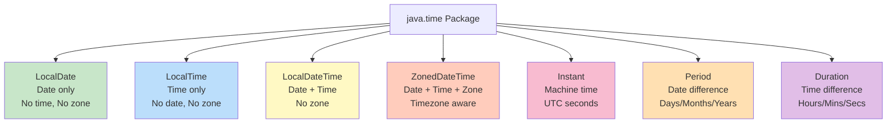
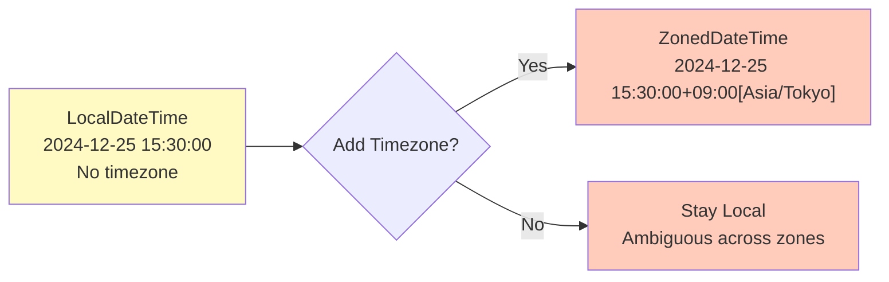

# Date Time API (java.time) - Comprehensive Guide

## 📚 Table of Contents
- [Learning Objectives](#learning-objectives)
- [Theory Checkpoints](#theory-checkpoints)
- [Run Steps](#run-steps)
- [Verification Steps](#verification-steps)
- [Expected Outcome](#expected-outcome)
- [Hands-on Lab](#hands-on-lab)
- [Introduction](#introduction)
- [Problems with Old Date API](#problems-with-old-date-api)
- [Core Classes Overview](#core-classes-overview)
- [LocalDate - Dates Without Time](#localdate---dates-without-time)
- [LocalTime - Times Without Date](#localtime---times-without-date)
- [LocalDateTime - Date and Time](#localdatetime---date-and-time)
- [ZonedDateTime - With Time Zones](#zoneddatetime---with-time-zones)
- [Period and Duration](#period-and-duration)
- [Formatting and Parsing](#formatting-and-parsing)
- [Quick Reference Card](#quick-reference-card)

---

## 🎯 Learning Objectives

After completing this module, you will:

- [ ] Understand why the old Date API was problematic (mutable, thread-unsafe, confusing)
- [ ] Master the 5 core classes: LocalDate, LocalTime, LocalDateTime, ZonedDateTime, Instant
- [ ] Distinguish between LocalDateTime (timezone-agnostic) and ZonedDateTime (timezone-aware)
- [ ] Perform date/time operations: adding days, checking ranges, finding
- [ ] Understand Period (date-based) vs Duration (time-based) for differences
- [ ] Format and parse dates using DateTimeFormatter
- [ ] Apply timezone handling correctly for global applications
- [ ] Use java.time effectively in production code

---

## ✅ Theory Checkpoints

**Q1: Why is LocalDateTime preferred over the old Date class?**

A: LocalDateTime is immutable (thread-safe), clear about what it represents, and has a sensible API. The old Date class was mutable, confusing (getMonth() returns 0-11), and represented both local time AND UTC differently than expected.

**Q2: When would you use LocalDateTime vs ZonedDateTime?**

A: LocalDateTime for times without timezone context (alarms, appointments). ZonedDateTime when timezone matters (distributed systems, scheduling across regions). ZonedDateTime handles DayLight Saving Time automatically.

**Q3: What's the difference between Period and Duration?**

A: Period represents date-based differences (X days, months, years). Duration represents time-based differences (hours, minutes, seconds, nanoseconds). Period for dates, Duration for time.

**Q4: Why was getMonth() returning 0-11 problematic in old Date API?**

A: It's unintuitive. January = 0, December = 11. Easy mistake to make "month + 1" confusion. New API returns Month enum (JANUARY is JANUARY, not 0).

**Q5: How does ZonedDateTime handle Daylight Saving Time?**

A: Automatically. When you create or manipulate ZonedDateTime, it accounts for DST rules of that zone. When converting between zones, it correctly adjusts. This was error-prone in old APIs.

---

## 🚀 Run Steps

### Compile and Run the Demo

**Step 1:** Navigate to the module directory
```bash
cd 07-DateTimeAPI
```

**Step 2:** Compile the Java file
```bash
javac DateTimeAPI.java
```

**Step 3:** Run the demo
```bash
java DateTimeAPI
```

### Alternative: Using IDE

If using an IDE (IntelliJ, Eclipse, VS Code):
1. Open `DateTimeAPI.java`
2. Click the "Run" button (or press `Shift+F10` in IntelliJ)
3. Output appears in the console

---

## ✅ Verification Steps

**Expected behavior after running:**
1. Program compiles without errors
2. Output displays current date, time, and datetime
3. Date/time arithmetic operations show results
4. Formatting examples display readable date strings
5. Timezone handling works properly
6. No exceptions for valid date operations

**Troubleshooting:**
- **Error: "Package java.time not found"**
  - Solution: Ensure Java 8+ is being used. java.time was added in Java 8.
- **Timezone-related errors**
  - Solution: Verify system timezone is set correctly. Use `ZoneId.of("UTC")` for explicit zones.
- **No output for formatting**
  - Solution: Check DateTimeFormatter syntax is correct

---

## 📊 Expected Outcome

When you run `DateTimeAPI.java`, you should see output organized by date/time type:

```
=== DATE TIME API DEMO ===

--- LocalDate Examples ---
[Current date, date arithmetic, comparisons]

--- LocalTime Examples ---
[Current time, time operations]

--- LocalDateTime Examples ---
[Combined date and time]

--- ZonedDateTime Examples ---
[Multiple timezones, DST handling]

--- Period and Duration ---
[Date/time differences]

--- Formatting and Parsing ---
[Custom date/time formats]

--- Practical Examples ---
[Real-world usage patterns]
```

Key characteristics:
- Clear, readable date/time representations
- All operations execute without errors
- Timezone handling works correctly
- Formatted output is user-friendly

---

## 📚 Hands-on Lab

### Exercise 1: Guided — Create and Manipulate Dates [Beginner]

**Task:** Work with LocalDate for basic date operations.

**Given:**
```java
// Create dates
LocalDate today = LocalDate.now();
LocalDate birthday = LocalDate.of(1990, 5, 15);

// Add days
LocalDate nextWeek = today.plusDays(7);

// Compare
if (today.isBefore(nextWeek)) {
    System.out.println("Today is before next week");
}

// Get components
int year = today.getYear();
Month month = today.getMonth();
int day = today.getDayOfMonth();
```

**Your Task:** Create a date 100 days from now and print it:
```java
LocalDate today = LocalDate.now();
LocalDate future = today.???;

System.out.println(future);
// Expected: Date 100 days from now
```

**Hint:** Use `plusDays()` method

---

### Exercise 2: Semi-Guided — Work with Timezones [Intermediate]

**Task:** Create ZonedDateTime in different timezones.

**Given:**
```java
ZoneId tokyo = ZoneId.of("Asia/Tokyo");
ZoneId london = ZoneId.of("Europe/London");

LocalDateTime dateTime = LocalDateTime.now();

// Create zoned versions
ZonedDateTime tokyoTime = dateTime.atZone(tokyo);
ZonedDateTime londonTime = dateTime.atZone(london);

System.out.println(tokyoTime);
System.out.println(londonTime);
```

**Your Task:** Create current time in New York timezone and print it:
```java
ZoneId newyork = ZoneId.of("???");
ZonedDateTime nyTime = LocalDateTime.now().atZone(???);

System.out.println(nyTime);
// Expected: Current time in New York with timezone
```

**Hint:** `"America/New_York"` and use `atZone()`

---

### Exercise 3: Challenge — Calculate Age from Birthday [Advanced]

**Task:** Calculate exact age from a birthday using Period.

**Challenge Code:**
```java
LocalDate birthday = LocalDate.of(1990, 5, 15);
LocalDate today = LocalDate.now();

Period age = Period.between(birthday, today);

System.out.println(age.getYears() + " years, " +
                    age.getMonths() + " months, " +
                    age.getDays() + " days old");
// Expected: X years, Y months, Z days old
```

**Your Challenge:** Create a program that:
1. Defines a birthday
2. Calculates age using Period
3. Determines if birthday is coming up this year
4. Calculates days until next birthday

```java
LocalDate birthday = LocalDate.of(1995, 12, 25);
LocalDate today = LocalDate.now();

// Current age
Period age = Period.between(birthday, today);
int years = age.getYears();

// Next birthday this year
LocalDate nextBirthday = birthday.withYear(today.getYear());
if (nextBirthday.isBefore(today)) {
    nextBirthday = nextBirthday.plusYears(1);
}

// Days until
Long daysUntil = ChronoUnit.DAYS.between(today, nextBirthday);

System.out.println("Age: " + years);
System.out.println("Days until birthday: " + daysUntil);
```

---

## 🎨 Architecture Diagram

**java.time Package Structure:**



**LocalDateTime vs ZonedDateTime:**



---

## 🎯 Introduction

Java 8 introduced a completely **new Date and Time API** (`java.time` package) to replace the problematic `java.util.Date` and `java.util.Calendar` classes.

### Why New API?

```
┌──────────────────────────────────────────────────┐
│     BENEFITS OF NEW DATE-TIME API                │
├──────────────────────────────────────────────────┤
│                                                  │
│  ✓ IMMUTABLE                                     │
│    Thread-safe, no side effects                  │
│                                                  │
│  ✓ CLEAR & EXPRESSIVE                            │
│    LocalDate, LocalTime, LocalDateTime...        │
│                                                  │
│  ✓ COMPREHENSIVE                                 │
│    Everything you need is included               │
│                                                  │
│  ✓ TIMEZONE AWARE                                │
│    Proper timezone support                       │
│                                                  │
│  ✓ ISO-8601 COMPLIANT                            │
│    Follows international standard                │
│                                                  │
└──────────────────────────────────────────────────┘
```

---

## 💔 Problems with Old Date API

### java.util.Date Issues

```java
// ❌ OLD WAY - java.util.Date
Date date = new Date();

// Problem 1: Mutable
date.setTime(123456789L);  // Can be changed!

// Problem 2: Poor naming
date.getYear();  // Returns year - 1900 (!?)
date.getMonth(); // Returns 0-11 (not 1-12)

// Problem 3: Not thread-safe
// Multiple threads modifying same date = trouble

// Problem 4: No timezone support
// Problem 5: Hard to calculate differences
// Problem 6: Confusing API
```

### java.util.Calendar Issues

```java
// ❌ OLD WAY - java.util.Calendar
Calendar cal = Calendar.getInstance();

// Problem 1: Still mutable
cal.set(Calendar.MONTH, 5);  // June (0-based months!)

// Problem 2: Verbose
cal.get(Calendar.DAY_OF_MONTH);
cal.get(Calendar.MONTH);
cal.get(Calendar.YEAR);

// Problem 3: Month still 0-based
cal.set(2023, 0, 1);  // January 1, 2023
```

---

## 🏗️ Core Classes Overview

```
┌──────────────────────────────────────────────────────────┐
│           JAVA.TIME PACKAGE STRUCTURE                    │
├──────────────────────────────────────────────────────────┤
│                                                          │
│  LocalDate          Date without time zone               │
│    └─ 2023-12-25                                         │
│                                                          │
│  LocalTime          Time without date or zone            │
│    └─ 14:30:00                                           │
│                                                          │
│  LocalDateTime      Date and time without zone           │
│    └─ 2023-12-25T14:30:00                                │
│                                                          │
│  ZonedDateTime      Date and time WITH time zone         │
│    └─ 2023-12-25T14:30:00+01:00[Europe/Paris]            │
│                                                          │
│  Instant            Timestamp (epoch milliseconds)        │
│    └─ 2023-12-25T13:30:00Z                               │
│                                                          │
│  Period             Date-based amount (years, months)     │
│    └─ P2Y3M10D (2 years, 3 months, 10 days)              │
│                                                          │
│  Duration           Time-based amount (hours, minutes)    │
│    └─ PT2H30M (2 hours, 30 minutes)                      │
│                                                          │
└──────────────────────────────────────────────────────────┘
```

### Choosing the Right Class

```
Need just a date? (birthday, due date)
  → LocalDate

Need just a time? (alarm time, meeting time)
  → LocalTime

Need date and time, no timezone? (appointment)
  → LocalDateTime

Need date and time WITH timezone? (conference call)
  → ZonedDateTime

Need machine timestamp? (logging, database)
  → Instant

Need time difference in days/months?
  → Period

Need time difference in hours/minutes?
  → Duration
```

---

## 📅 LocalDate - Dates Without Time

### Creating LocalDate

```java
// Current date
LocalDate today = LocalDate.now();
// Example: 2023-12-25

// Specific date
LocalDate date1 = LocalDate.of(2023, 12, 25);
LocalDate date2 = LocalDate.of(2023, Month.DECEMBER, 25);

// Parse from string
LocalDate date3 = LocalDate.parse("2023-12-25");

// From epoch day
LocalDate date4 = LocalDate.ofEpochDay(19000);

// From year and day of year
LocalDate date5 = LocalDate.ofYearDay(2023, 100);
```

### Getting Components

```java
LocalDate date = LocalDate.of(2023, 12, 25);

int year = date.getYear();              // 2023
int month = date.getMonthValue();       // 12
Month monthEnum = date.getMonth();      // DECEMBER
int day = date.getDayOfMonth();         // 25
DayOfWeek dayOfWeek = date.getDayOfWeek();  // MONDAY
int dayOfYear = date.getDayOfYear();    // 359

boolean isLeapYear = date.isLeapYear(); // false
```

### Modifying Dates (Returns New Instance)

```java
LocalDate date = LocalDate.of(2023, 12, 25);

// Add/subtract
LocalDate nextWeek = date.plusWeeks(1);      // 2024-01-01
LocalDate nextMonth = date.plusMonths(1);    // 2024-01-25
LocalDate nextYear = date.plusYears(1);      // 2024-12-25
LocalDate yesterday = date.minusDays(1);     // 2023-12-24

// With methods (set specific field)
LocalDate newDate = date.withYear(2024);           // 2024-12-25
LocalDate newDate2 = date.withMonth(6);            // 2023-06-25
LocalDate newDate3 = date.withDayOfMonth(15);      // 2023-12-15

// Temporal adjusters
LocalDate firstDayOfMonth = date.with(TemporalAdjusters.firstDayOfMonth());
LocalDate lastDayOfMonth = date.with(TemporalAdjusters.lastDayOfMonth());
LocalDate nextMonday = date.with(TemporalAdjusters.next(DayOfWeek.MONDAY));
```

### Comparing Dates

```java
LocalDate date1 = LocalDate.of(2023, 12, 25);
LocalDate date2 = LocalDate.of(2024, 1, 1);

boolean isBefore = date1.isBefore(date2);    // true
boolean isAfter = date1.isAfter(date2);      // false
boolean isEqual = date1.isEqual(date2);      // false

int comparison = date1.compareTo(date2);     // negative
```

### Date Calculations

```java
// Days between dates
long daysBetween = ChronoUnit.DAYS.between(date1, date2);

// Period between dates
Period period = Period.between(date1, date2);
int years = period.getYears();
int months = period.getMonths();
int days = period.getDays();

// Check if date is in range
LocalDate start = LocalDate.of(2023, 1, 1);
LocalDate end = LocalDate.of(2023, 12, 31);
LocalDate check = LocalDate.of(2023, 6, 15);

boolean inRange = !check.isBefore(start) && !check.isAfter(end);
```

---

## ⏰ LocalTime - Times Without Date

### Creating LocalTime

```java
// Current time
LocalTime now = LocalTime.now();
// Example: 14:30:00.123456789

// Specific time
LocalTime time1 = LocalTime.of(14, 30);           // 14:30
LocalTime time2 = LocalTime.of(14, 30, 45);       // 14:30:45
LocalTime time3 = LocalTime.of(14, 30, 45, 123);  // with nanoseconds

// Parse from string
LocalTime time4 = LocalTime.parse("14:30:00");

// Predefined constants
LocalTime midnight = LocalTime.MIDNIGHT;  // 00:00
LocalTime noon = LocalTime.NOON;          // 12:00
LocalTime min = LocalTime.MIN;            // 00:00
LocalTime max = LocalTime.MAX;            // 23:59:59.999999999
```

### Getting Components

```java
LocalTime time = LocalTime.of(14, 30, 45);

int hour = time.getHour();        // 14
int minute = time.getMinute();    // 30
int second = time.getSecond();    // 45
int nano = time.getNano();        // 0
```

### Modifying Times

```java
LocalTime time = LocalTime.of(14, 30);

// Add/subtract
LocalTime later = time.plusHours(2);      // 16:30
LocalTime earlier = time.minusMinutes(15);  // 14:15

// With methods
LocalTime newTime = time.withHour(10);     // 10:30
LocalTime newTime2 = time.withMinute(0);   // 14:00
```

### Comparing Times

```java
LocalTime time1 = LocalTime.of(14, 30);
LocalTime time2 = LocalTime.of(16, 0);

boolean isBefore = time1.isBefore(time2);  // true
boolean isAfter = time1.isAfter(time2);    // false
```

---

## 📆 LocalDateTime - Date and Time

### Creating LocalDateTime

```java
// Current date and time
LocalDateTime now = LocalDateTime.now();
// Example: 2023-12-25T14:30:00

// Specific date and time
LocalDateTime dt1 = LocalDateTime.of(2023, 12, 25, 14, 30);
LocalDateTime dt2 = LocalDateTime.of(2023, Month.DECEMBER, 25, 14, 30, 0);

// Combine LocalDate and LocalTime
LocalDate date = LocalDate.of(2023, 12, 25);
LocalTime time = LocalTime.of(14, 30);
LocalDateTime dt3 = LocalDateTime.of(date, time);
LocalDateTime dt4 = date.atTime(time);
LocalDateTime dt5 = time.atDate(date);

// Parse from string
LocalDateTime dt6 = LocalDateTime.parse("2023-12-25T14:30:00");
```

### Extracting Date and Time

```java
LocalDateTime dt = LocalDateTime.now();

LocalDate date = dt.toLocalDate();
LocalTime time = dt.toLocalTime();

// Get components
int year = dt.getYear();
int month = dt.getMonthValue();
int day = dt.getDayOfMonth();
int hour = dt.getHour();
int minute = dt.getMinute();
```

### Modifying DateTime

```java
LocalDateTime dt = LocalDateTime.now();

// Add/subtract
LocalDateTime future = dt.plusDays(5);
LocalDateTime past = dt.minusHours(3);

// With methods
LocalDateTime modified = dt.withYear(2024)
                          .withMonth(6)
                          .withDayOfMonth(15)
                          .withHour(10)
                          .withMinute(0);
```

---

## 🌍 ZonedDateTime - With Time Zones

### Creating ZonedDateTime

```java
// Current time in system timezone
ZonedDateTime now = ZonedDateTime.now();

// Specific timezone
ZonedDateTime paris = ZonedDateTime.now(ZoneId.of("Europe/Paris"));
ZonedDateTime tokyo = ZonedDateTime.now(ZoneId.of("Asia/Tokyo"));
ZonedDateTime ny = ZonedDateTime.now(ZoneId.of("America/New_York"));

// From LocalDateTime
LocalDateTime ldt = LocalDateTime.of(2023, 12, 25, 14, 30);
ZonedDateTime zdt = ldt.atZone(ZoneId.of("Europe/Paris"));

// All available zones
Set<String> zones = ZoneId.getAvailableZoneIds();
```

### Time Zone Conversion

```java
// Create time in one zone
ZonedDateTime parisTime = ZonedDateTime.of(
    2023, 12, 25, 14, 30, 0, 0,
    ZoneId.of("Europe/Paris")
);
// Convert to another zone
ZonedDateTime tokyoTime = parisTime.withZoneSameInstant(ZoneId.of("Asia/Tokyo"));
## 📋 Prerequisites & Next Topics

### Prerequisites
- No Java 8 prerequisites required
- Basic Java date/time understanding (helpful)

### Next Topics
After mastering Date & Time API, proceed to:
1. **[Module 08 - Collectors](../08-Collectors/README.md)** — Works well with date/time streams
2. **[Module 12 - forEach Iteration](../12-ForEachAndIteration/README.md)** — Iterate over dates/times
3. **[Module 13 - Java 8 Revision](../13-Java8Revision/README.md)** — Capstone: integrate all concepts


System.out.println("Paris:  " + parisTime);   // 14:30 in Paris
System.out.println("Tokyo:  " + tokyoTime);   // 22:30 in Tokyo
System.out.println("NY:     " + nyTime);      // 08:30 in New York
```

### Working with Offsets

```java
ZonedDateTime zdt = ZonedDateTime.now();

ZoneOffset offset = zdt.getOffset();  // e.g., +01:00
ZoneId zone = zdt.getZone();          // e.g., Europe/Paris

// Create with offset
OffsetDateTime odt = OffsetDateTime.now(ZoneOffset.ofHours(5));
```

---

## ⏱️ Period and Duration

### Period - Date-based

```java
// Create period
Period period1 = Period.ofDays(5);
Period period2 = Period.ofWeeks(3);
Period period3 = Period.ofMonths(2);
Period period4 = Period.ofYears(1);
Period period5 = Period.of(2, 3, 10);  // 2 years, 3 months, 10 days

// Between dates
LocalDate start = LocalDate.of(2023, 1, 1);
LocalDate end = LocalDate.of(2023, 12, 31);
Period period = Period.between(start, end);

int years = period.getYears();
int months = period.getMonths();
int days = period.getDays();

// Add period to date
LocalDate future = start.plus(period);
```

### Duration - Time-based

```java
// Create duration
Duration duration1 = Duration.ofHours(5);
Duration duration2 = Duration.ofMinutes(30);
Duration duration3 = Duration.ofSeconds(120);
Duration duration4 = Duration.ofMillis(1000);

// Between times
LocalTime start = LocalTime.of(9, 0);
LocalTime end = LocalTime.of(17, 30);
Duration workDay = Duration.between(start, end);

long hours = workDay.toHours();      // 8
long minutes = workDay.toMinutes();  // 510

// Add duration to time
LocalTime later = start.plus(duration1);
```

### Period vs Duration

```
┌────────────────────────────────────────────────┐
│       PERIOD vs DURATION                       │
├────────────────────────────────────────────────┤
│                                                │
│  Period:                                       │
│    • Date-based (years, months, days)          │
│    • Use with LocalDate                        │
│    • Example: "2 years, 3 months"              │
│                                                │
│  Duration:                                     │
│    • Time-based (hours, minutes, seconds)      │
│    • Use with LocalTime, LocalDateTime         │
│    • Example: "2 hours, 30 minutes"            │
│                                                │
└────────────────────────────────────────────────┘
```

---

## 📝 Formatting and Parsing

### Formatting Dates

```java
LocalDateTime dt = LocalDateTime.now();

// Predefined formatters
String iso = dt.format(DateTimeFormatter.ISO_DATE_TIME);
String basic = dt.format(DateTimeFormatter.BASIC_ISO_DATE);

// Custom patterns
DateTimeFormatter formatter1 = DateTimeFormatter.ofPattern("dd/MM/yyyy");
String formatted1 = dt.format(formatter1);  // 25/12/2023

DateTimeFormatter formatter2 = DateTimeFormatter.ofPattern("MMMM dd, yyyy");
String formatted2 = dt.format(formatter2);  // December 25, 2023

DateTimeFormatter formatter3 = DateTimeFormatter.ofPattern("dd-MMM-yyyy HH:mm:ss");
String formatted3 = dt.format(formatter3);  // 25-Dec-2023 14:30:00

// Localized
DateTimeFormatter formatter4 = DateTimeFormatter.ofPattern("dd MMMM yyyy", Locale.FRENCH);
String formatted4 = dt.format(formatter4);  // 25 décembre 2023
```

### Parsing Dates

```java
// Parse with default format
LocalDate date = LocalDate.parse("2023-12-25");

// Parse with custom format
DateTimeFormatter formatter = DateTimeFormatter.ofPattern("dd/MM/yyyy");
LocalDate date2 = LocalDate.parse("25/12/2023", formatter);

// Parse time
LocalTime time = LocalTime.parse("14:30:00");

// Parse datetime
LocalDateTime dt = LocalDateTime.parse("2023-12-25T14:30:00");
```

### Common Pattern Symbols

```
┌────────────────────────────────────────────────┐
│      PATTERN SYMBOLS                           │
├────────────────────────────────────────────────┤
│                                                │
│  y    Year               2023                  │
│  M    Month (number)     12                    │
│  MMM  Month (short)      Dec                   │
│  MMMM Month (full)       December              │
│  d    Day                25                    │
│  E    Day of week        Mon                   │
│  EEEE Day (full)         Monday                │
│  H    Hour (0-23)        14                    │
│  h    Hour (1-12)        02                    │
│  m    Minute             30                    │
│  s    Second             45                    │
│  a    AM/PM              PM                    │
│                                                │
└────────────────────────────────────────────────┘
```

---

## 🎯 Quick Reference Card

### Creation

```java
// LocalDate
LocalDate.now()
LocalDate.of(2023, 12, 25)
LocalDate.parse("2023-12-25")

// LocalTime
LocalTime.now()
LocalTime.of(14, 30)
LocalTime.parse("14:30:00")

// LocalDateTime
LocalDateTime.now()
LocalDateTime.of(2023, 12, 25, 14, 30)
LocalDateTime.parse("2023-12-25T14:30:00")

// ZonedDateTime
ZonedDateTime.now()
ZonedDateTime.now(ZoneId.of("Europe/Paris"))
```

### Manipulation

```java
date.plusDays(1)
date.minusMonths(1)
date.withYear(2024)

time.plusHours(2)
time.minusMinutes(15)

dt.plus(Duration.ofHours(2))
date.plus(Period.ofDays(5))
```

### Comparison

```java
date1.isBefore(date2)
date1.isAfter(date2)
date1.isEqual(date2)
date1.compareTo(date2)
```

### Formatting

```java
date.format(DateTimeFormatter.ISO_DATE)
date.format(DateTimeFormatter.ofPattern("dd/MM/yyyy"))
LocalDate.parse("25/12/2023", DateTimeFormatter.ofPattern("dd/MM/yyyy"))
```

---

**Previous Module**: [← Default and Static Methods](../06-DefaultStaticMethods/)  
**Next Module**: [Collectors →](../08-Collectors/)

