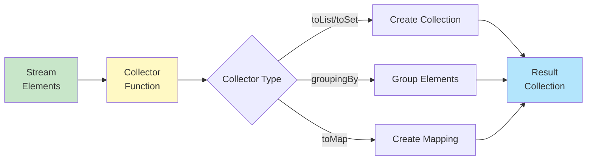

# Collectors - Comprehensive Guide

## 📚 Table of Contents
- [Learning Objectives](#learning-objectives)
- [Theory Checkpoints](#theory-checkpoints)
- [Run Steps](#run-steps)
- [Verification Steps](#verification-steps)
- [Expected Outcome](#expected-outcome)
- [Hands-on Lab](#hands-on-lab)
- [Introduction](#introduction)
- [Basic Collectors](#basic-collectors)
- [Grouping and Partitioning](#grouping-and-partitioning)
- [Advanced Collectors](#advanced-collectors)
- [Custom Collectors](#custom-collectors)
- [Quick Reference Card](#quick-reference-card)


## 🎯 Learning Objectives

After completing this module, you will:
## 📋 Prerequisites & Next Topics

### Prerequisites (Core)
- **[Module 04 - Streams API](../04-StreamsAPI/README.md)** ⭐ — Collectors are terminal stream operations
- **[Module 02 - Functional Interfaces](../02-FunctionalInterfaces/README.md)** — Understand Collectors as functional patterns

### Next Topics
After mastering Collectors, proceed to:
1. **[Module 09 - Parallel Streams](../09-ParallelStreams/README.md)** — Use collectors with parallel processing
2. **[Module 10 - CompletableFuture](../10-CompletableFuture/README.md)** — Async operations with collectors
3. **[Module 11 - Functional Interfaces Deep Dive](../11-FunctionalInterfacesDeepDive/README.md)** — Advanced patterns

---

## 🎯 Learning Objectives

After completing this module, you will:

- [ ] Understand the purpose of Collectors and how they create collections from streams
- [ ] Master basic collectors: toList(), toSet(), toCollection(), toMap()
- [ ] Learn advanced collectors: groupingBy(), partitioningBy(), joining()
- [ ] Understand reduction operations: reduce(), collect() with custom logic
- [ ] Distinguish between immutable and mutable collectors
- [ ] Create custom collectors using Collector.of()
- [ ] Apply collectors effectively in real-world stream pipelines

---

## ✅ Theory Checkpoints

**Q1: What's the purpose of Collectors in streams?**

A: Collectors are terminal operations that accumulate stream elements into containers (List, Set, Map) or perform reductions. They provide convenience methods instead of manually iterating and building collections.

**Q2: What's the difference between toList() and toCollection()?**

A: toList() always creates an ArrayList. toCollection() accepts a supplier (constructor reference) allowing you to specify the exact collection type (LinkedList, TreeSet, etc.).

**Q3: When would you use groupingBy() vs partitioningBy()?**

A: groupingBy() categorizes into multiple groups based on a classifier function. partitioningBy() splits into exactly two groups (true/false) based on a predicate.

**Q4: How does joining() work with streams?**

A: joining() concatenates stream elements into a single String with optional delimiter, prefix, and suffix. Example: `stream.collect(Collectors.joining(", "))` joins with commas.

**Q5: Why is counting() a collector instead of just count()?**

A: count() is a terminal operation that returns a long. counting() is a collector that can be used with groupingBy() or partitioningBy() for counting within groups.

---

## 🚀 Run Steps

### Compile and Run the Demo

**Step 1:** Navigate to the module directory
```bash
cd 08-Collectors
```

**Step 2:** Compile the Java file
```bash
javac CollectorsAndReduction.java
```

**Step 3:** Run the demo
```bash
java CollectorsAndReduction
```

### Alternative: Using IDE

If using an IDE (IntelliJ, Eclipse, VS Code):
1. Open `CollectorsAndReduction.java`
2. Click the "Run" button
3. Output appears in the console

---

## ✅ Verification Steps

**Expected behavior:**
1. Program compiles without errors
2. Output shows various collection results
3. All collector types produce output (toList, toSet, groupingBy, etc.)
4. No exceptions thrown
5. Results are clearly labeled by collector type

**Troubleshooting:**
- **Error: "Collectors not found"**
  - Solution: Ensure import: `import java.util.stream.Collectors;`
- **ClassCastException with toMap()**
  - Solution: Verify your key extractor returns unique values
- **No output for groupingBy()**
  - Solution: Check that your classifier function correctly groups elements

---

## 📊 Expected Outcome

When you run `CollectorsAndReduction.java`:

```
=== COLLECTORS AND REDUCTION DEMO ===

--- Basic Collectors ---
[toList, toSet, toCollection output]

--- Map Collectors ---
[toMap, groupingBy output]

--- Joining Collectors ---
[Concatenated strings]

--- Advanced Collectors ---
[Partitioning, custom collector examples]

--- Reduction Examples ---
[reduce() and collect() patterns]
```

---

## 📚 Hands-on Lab

### Exercise 1: Guided — Collect to Basic Collections [Beginner]

**Task:** Use toList(), toSet(), and toMap().

```java
List<String> fruits = Arrays.asList("apple", "banana", "apple", "cherry");

// toList
List<String> list = fruits.stream().collect(Collectors.toList());

// toSet (removes duplicates)
Set<String> set = fruits.stream().collect(Collectors.toSet());

// toMap
Map<Integer, String> map = fruits.stream()
    .distinct()
    .collect(Collectors.toMap(String::length, s -> s));
```

**Your Task:** Collect to LinkedHashSet:
```java
List<Integer> numbers = Arrays.asList(5, 2, 8, 2, 9);

LinkedHashSet<Integer> result = numbers.stream()
    .collect(Collectors.toCollection(LinkedHashSet::new));
// Expected: LinkedHashSet with duplicates removed, insertion order preserved
```

---

### Exercise 2: Semi-Guided — Group and Partition [Intermediate]

**Task:** Use groupingBy() and partitioningBy().

```java
List<String> words = Arrays.asList("cat", "dog", "bat", "elephant");

// Group by length
Map<Integer, List<String>> byLength = words.stream()
    .collect(Collectors.groupingBy(String::length));
// Result: {3=[cat, dog, bat], 8=[elephant]}

// Partition into even/odd length
Map<Boolean, List<String>> partition = words.stream()
    .collect(Collectors.partitioningBy(s -> s.length() % 2 == 0));
```

**Your Task:** Count occurrences using groupingBy with counting():
```java
List<String> names = Arrays.asList("Alice", "Bob", "Alice", "Charlie", "Bob", "Bob");

Map<String, Long> counts = names.stream()
    .collect(Collectors.groupingBy(
        Function.identity(),
        Collectors.counting()
    ));
// Expected: {Alice=2, Bob=3, Charlie=1}
```

---

### Exercise 3: Challenge — Complex Collector Pipeline [Advanced]

**Task:** Build complex grouping with nested collectors.

```java
List<Person> people = getPeople();

// Group by department, then count by salary range
Map<String, Map<String, Long>> result = people.stream()
    .collect(Collectors.groupingBy(
        Person::getDepartment,
        Collectors.groupingBy(
            p -> p.getSalary() > 50000 ? "high" : "low",
            Collectors.counting()
        )
    ));
```

**Your Challenge:** Group elements and find max/min in each group:

---

## 🎨 Architecture Diagram

**Collector Pipeline Flow:**



---

## 🎯 Introduction

**Collectors** are powerful tools for accumulating stream elements into collections, aggregating values, and transforming data. They are terminal operations used with the `collect()` method.

### Basic Concept

```
┌────────────────────────────────────────────────┐
│         COLLECTOR FLOW                         │
├────────────────────────────────────────────────┤
│                                                │
│  Stream Elements → Collector → Result          │
│                                                │
│  Example:                                      │
│  [1,2,3,4,5] → toList() → List[1,2,3,4,5]     │
│                                                │
└────────────────────────────────────────────────┘
```

---

## 📦 Basic Collectors

### toList() - Collect to List

```java
List<String> list = stream.collect(Collectors.toList());

// Example
List<String> names = people.stream()
    .map(Person::getName)
    .collect(Collectors.toList());
```

### toSet() - Collect to Set

```java
Set<String> set = stream.collect(Collectors.toSet());

// Remove duplicates
Set<Integer> uniqueAges = people.stream()
    .map(Person::getAge)
    .collect(Collectors.toSet());
```

### toCollection() - Specific Collection

```java
// ArrayList
ArrayList<String> arrayList = stream
    .collect(Collectors.toCollection(ArrayList::new));

// TreeSet (sorted)
TreeSet<String> treeSet = stream
    .collect(Collectors.toCollection(TreeSet::new));

// LinkedList
LinkedList<String> linkedList = stream
    .collect(Collectors.toCollection(LinkedList::new));
```

### toMap() - Collect to Map

```java
// Key and value extractors
Map<Integer, String> map = people.stream()
    .collect(Collectors.toMap(
        Person::getId,      // Key
        Person::getName     // Value
    ));

// With merge function (handle duplicates)
Map<String, Person> byName = people.stream()
    .collect(Collectors.toMap(
        Person::getName,
        person -> person,
        (existing, replacement) -> existing  // Keep first
    ));

// With specific Map implementation
TreeMap<Integer, String> treeMap = people.stream()
    .collect(Collectors.toMap(
        Person::getId,
        Person::getName,
        (a, b) -> a,
        TreeMap::new
    ));
```

### joining() - String Concatenation

```java
// Simple join
String joined = strings.stream()
    .collect(Collectors.joining());
// "abcdef"

// With delimiter
String csv = strings.stream()
    .collect(Collectors.joining(", "));
// "a, b, c, d, e, f"

// With prefix and suffix
String bracketed = strings.stream()
    .collect(Collectors.joining(", ", "[", "]"));
// "[a, b, c, d, e, f]"

// Practical example
String names = people.stream()
    .map(Person::getName)
    .collect(Collectors.joining(", ", "Names: ", "."));
// "Names: Alice, Bob, Charlie."
```

---

## 📊 Grouping and Partitioning

### groupingBy() - Group by Classifier

```java
// Simple grouping
Map<Integer, List<Person>> byAge = people.stream()
    .collect(Collectors.groupingBy(Person::getAge));
// {25=[Person(Alice,25)], 30=[Person(Bob,30), Person(Charlie,30)]}

// Group by condition
Map<String, List<Person>> byAgeGroup = people.stream()
    .collect(Collectors.groupingBy(p -> 
        p.getAge() < 18 ? "Minor" : "Adult"
    ));

// Nested grouping
Map<String, Map<Integer, List<Person>>> byCountryThenAge = people.stream()
    .collect(Collectors.groupingBy(
        Person::getCountry,
        Collectors.groupingBy(Person::getAge)
    ));

// Group and count
Map<Integer, Long> ageCount = people.stream()
    .collect(Collectors.groupingBy(
        Person::getAge,
        Collectors.counting()
    ));

// Group and sum
Map<String, Integer> totalAgeByCity = people.stream()
    .collect(Collectors.groupingBy(
        Person::getCity,
        Collectors.summingInt(Person::getAge)
    ));

// Group and collect names
Map<Integer, List<String>> namesByAge = people.stream()
    .collect(Collectors.groupingBy(
        Person::getAge,
        Collectors.mapping(
            Person::getName,
            Collectors.toList()
        )
    ));
```

### partitioningBy() - Binary Classification

```java
// Split into two groups
Map<Boolean, List<Person>> partitioned = people.stream()
    .collect(Collectors.partitioningBy(
        p -> p.getAge() >= 18
    ));
// {true=[adults...], false=[minors...]}

List<Person> adults = partitioned.get(true);
List<Person> minors = partitioned.get(false);

// Partition and count
Map<Boolean, Long> count = people.stream()
    .collect(Collectors.partitioningBy(
        p -> p.getAge() >= 18,
        Collectors.counting()
    ));
// {true=150, false=50}
```

---

## 🔥 Advanced Collectors

### counting()

```java
long count = stream.collect(Collectors.counting());
// Same as: stream.count()

// With grouping
Map<String, Long> countByCity = people.stream()
    .collect(Collectors.groupingBy(
        Person::getCity,
        Collectors.counting()
    ));
```

### summingInt/Long/Double()

```java
int totalAge = people.stream()
    .collect(Collectors.summingInt(Person::getAge));

double totalSalary = employees.stream()
    .collect(Collectors.summingDouble(Employee::getSalary));
```

### averagingInt/Long/Double()

```java
double avgAge = people.stream()
    .collect(Collectors.averagingInt(Person::getAge));

double avgSalary = employees.stream()
    .collect(Collectors.averagingDouble(Employee::getSalary));
```

### summarizingInt/Long/Double()

```java
IntSummaryStatistics stats = people.stream()
    .collect(Collectors.summarizingInt(Person::getAge));

long count = stats.getCount();
int sum = stats.getSum();
double avg = stats.getAverage();
int min = stats.getMin();
int max = stats.getMax();

System.out.println(stats);
// IntSummaryStatistics{count=5, sum=125, min=20, average=25.0, max=35}
```

### maxBy() and minBy()

```java
Optional<Person> oldest = people.stream()
    .collect(Collectors.maxBy(
        Comparator.comparing(Person::getAge)
    ));

Optional<Person> youngest = people.stream()
    .collect(Collectors.minBy(
        Comparator.comparing(Person::getAge)
    ));
```

### mapping()

```java
// Extract and collect
List<String> names = people.stream()
    .collect(Collectors.mapping(
        Person::getName,
        Collectors.toList()
    ));

// With grouping
Map<Integer, Set<String>> namesByAge = people.stream()
    .collect(Collectors.groupingBy(
        Person::getAge,
        Collectors.mapping(
            Person::getName,
            Collectors.toSet()
        )
    ));
```

### reducing()

```java
// Sum with reduce
Optional<Integer> sum = numbers.stream()
    .collect(Collectors.reducing(Integer::sum));

// With identity
Integer sum2 = numbers.stream()
    .collect(Collectors.reducing(0, Integer::sum));

// With mapper and reducer
Integer totalAge = people.stream()
    .collect(Collectors.reducing(
        0,                    // Identity
        Person::getAge,       // Mapper
        Integer::sum          // Reducer
    ));
```

---

## 🎯 Quick Reference Card

```java
// To Collections
Collectors.toList()
Collectors.toSet()
Collectors.toCollection(TreeSet::new)
Collectors.toMap(keyMapper, valueMapper)

// Strings
Collectors.joining()
Collectors.joining(", ")
Collectors.joining(", ", "[", "]")

// Grouping
Collectors.groupingBy(classifier)
Collectors.partitioningBy(predicate)

// Statistics
Collectors.counting()
Collectors.summingInt(mapper)
Collectors.averagingDouble(mapper)
Collectors.summarizingInt(mapper)

// Min/Max
Collectors.maxBy(comparator)
Collectors.minBy(comparator)

// Transformation
Collectors.mapping(mapper, downstream)
Collectors.reducing(identity, reducer)
```

---

**Previous Module**: [← Date Time API](../07-DateTimeAPI/)  
**Next Module**: [Parallel Streams →](../09-ParallelStreams/)
