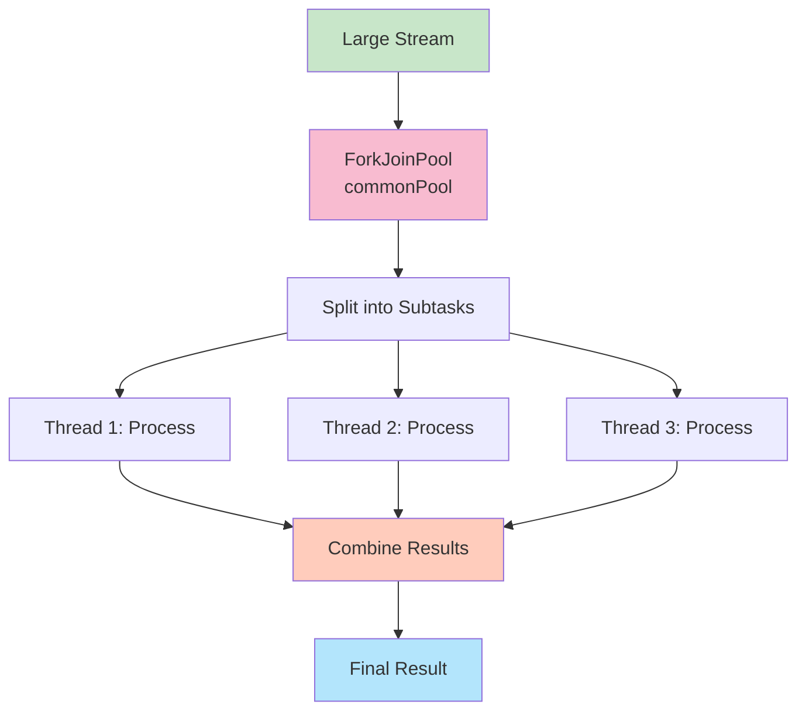

# Parallel Streams - Comprehensive Guide

## 📚 Table of Contents
- [Learning Objectives](#learning-objectives)
- [Theory Checkpoints](#theory-checkpoints)
- [Run Steps](#run-steps)
- [Verification Steps](#verification-steps)
- [Expected Outcome](#expected-outcome)
- [Hands-on Lab](#hands-on-lab)
- [Introduction](#introduction)
- [Creating Parallel Streams](#creating-parallel-streams)
- [How Parallel Streams Work](#how-parallel-streams-work)
- [When to Use Parallel Streams](#when-to-use-parallel-streams)
- [Common Pitfalls](#common-pitfalls)
- [Quick Reference Card](#quick-reference-card)


## 🎯 Learning Objectives

After completing this module, you will:
## 📋 Prerequisites & Next Topics

### Prerequisites (Core)
- **[Module 04 - Streams API](../04-StreamsAPI/README.md)** ⭐ — Sequential streams first, then parallel
- **[Module 08 - Collectors](../08-Collectors/README.md)** — Use collectors with parallel streams

### Next Topics
After mastering Parallel Streams, proceed to:
1. **[Module 10 - CompletableFuture](../10-CompletableFuture/README.md)** — Full async/parallel programming
2. **[Module 13 - Java 8 Revision](../13-Java8Revision/README.md)** — Capstone: integrate all concepts

---

## 🎯 Learning Objectives

After completing this module, you will:

- [ ] Understand the Fork-Join framework that powers parallel streams
- [ ] Learn when parallel streams help (large datasets, CPU-bound operations)
- [ ] Master parallelStream() vs stream().parallel() syntax
- [ ] Recognize when parallel streams HURT performance (small datasets, I/O)
- [ ] Understand thread-safety considerations in parallel streams
- [ ] Avoid mutable shared state in parallel operations
- [ ] Write correct, efficient parallel stream code

---

## ✅ Theory Checkpoints

**Q1: When should you use parallel streams instead of sequential?**

A: For large datasets (1000+ elements) with CPU-bound operations (not I/O). Parallel has overhead; for small datasets it's slower. I/O-bound ops don't benefit from parallelization.

**Q2: What's the Fork-Join framework?**

A: It's the underlying mechanism for parallel streams. It splits work into subtasks (fork), processes in parallel on available threads, then combines results (join). Uses ForkJoinPool.commonPool().

**Q3: Why are stateless operations safer in parallel streams?**

A: Stateless ops (filter, map) don't depend on order or other elements. Stateful ops (sorted, distinct) need synchronization across threads, reducing parallelization benefits and risk race conditions.

**Q4: What's the gotcha with mutable shared state in parallel streams?**

A: Race conditions. If multiple threads modify the same collection, results are unpredictable. Use collect() with thread-safe collectors instead of forEach() modifying lists.

**Q5: When does parallel stream performance degrade?**

A: Small datasets (overhead > benefit), I/O-bound operations (threads blocked waiting), boxing/unboxing overhead (use IntStream not Stream<Integer>), highly stateful operations.

---

## 🚀 Run Steps

### Compile and Run the Demo

**Step 1:** Navigate to the module directory
```bash
cd 09-ParallelStreams
```

**Step 2:** Compile the Java file
```bash
javac ParallelStreams.java
```

**Step 3:** Run the demo
```bash
java ParallelStreams
```

### Alternative: Using IDE

If using an IDE:
1. Open `ParallelStreams.java`
2. Click "Run"
3. Output appears in console

---

## ✅ Verification Steps

**Expected behavior:**
1. Program compiles without errors
2. Output shows sequential and parallel results
3. Results are identical (parallel doesn't change output)
4. Performance comparison visible
5. No race condition errors

**Troubleshooting:**
- **Results differ between runs**
  - Solution: Check for shared mutable state in lambdas
- **Parallel slower than sequential**
  - Solution: Expected for small datasets. Try with larger data.
- **Thread safety exceptions**
  - Solution: Use collect() instead of modifying external collections

---

## 📊 Expected Outcome

```
=== PARALLEL STREAMS DEMO ===

--- Sequential Processing ---
[Results with timing]

--- Parallel Processing ---
[Same results with timing]

--- Performance Comparison ---
[Sequential vs parallel speed]

--- Thread Behavior ---
[Thread pool usage info]

--- When NOT to Parallelize ---
[Examples showing degraded performance]
```

---

## 📚 Hands-on Lab

### Exercise 1: Guided — Basic Parallel Stream [Beginner]

```java
List<Integer> numbers = Arrays.asList(1, 2, 3, 4, 5);

// Sequential
List<Integer> seq = numbers.stream()
    .map(n -> n * 2)
    .collect(Collectors.toList());

// Parallel - same result, potentially faster
List<Integer> par = numbers.parallelStream()
    .map(n -> n * 2)
    .collect(Collectors.toList());

System.out.println(seq);  // [2, 4, 6, 8, 10]
System.out.println(par);  // [2, 4, 6, 8, 10]
```

**Your Task:** Convert a sequential stream to parallel:
```java
List<String> words = Arrays.asList("hello", "world", "java");

List<String> result = words.parallelStream()
    .map(String::toUpperCase)
    .collect(Collectors.toList());
```

---

### Exercise 2: Semi-Guided — Performance Comparison [Intermediate]

```java
List<Integer> largeList = IntStream.range(0, 1000000).boxed().collect(Collectors.toList());

// Sequential timing
long start = System.currentTimeMillis();
long seqSum = largeList.stream().reduce(0, Integer::sum);
long seqTime = System.currentTimeMillis() - start;

// Parallel timing
start = System.currentTimeMillis();
long parSum = largeList.parallelStream().reduce(0, Integer::sum);
long parTime = System.currentTimeMillis() - start;

System.out.println("Sequential: " + seqTime + "ms");
System.out.println("Parallel: " + parTime + "ms");
```

**Your Task:** Write similar comparison for filtering:

---

### Exercise 3: Challenge — Recognize When NOT to Parallelize [Advanced]

```java
// DON'T parallelize - I/O bound
List<String> lines = paths.parallelStream()  // ❌ BAD
    .map(p -> {
        try {
            return Files.readAllLines(p);  // I/O waits
        } catch (IOException e) { ... }
    })
    .collect(Collectors.toList());

// DON'T parallelize - small dataset
List<Integer> small = tiny.parallelStream()  // ❌ BAD
    .map(n -> n * 2)
    .collect(Collectors.toList());

// DON'T - shared mutable state
List<Integer> results = new ArrayList<>();  // ❌ BAD
largeList.parallelStream().forEach(results::add);  // Race condition!
```

**Your Challenge:** Identify problematic parallel streams and fix them.

---

## 🎨 Architecture Diagram

**Fork-Join Processing:**



---

## 🎯 Introduction

Parallel streams allow you to **process data in parallel** using multiple threads, potentially improving performance for large datasets.

### Sequential vs Parallel

```
┌────────────────────────────────────────────────┐
│     SEQUENTIAL STREAM                          │
├────────────────────────────────────────────────┤
│                                                │
│  [1] → [2] → [3] → [4] → [5]                   │
│   ↓     ↓     ↓     ↓     ↓                    │
│  process in order, one at a time               │
│                                                │
└────────────────────────────────────────────────┘

┌────────────────────────────────────────────────┐
│     PARALLEL STREAM                            │
├────────────────────────────────────────────────┤
│                                                │
│      Thread 1    Thread 2    Thread 3          │
│         ↓           ↓           ↓              │
│        [1,2]      [3,4]        [5]             │
│         ↓           ↓           ↓              │
│      process simultaneously                    │
│                                                │
└────────────────────────────────────────────────┘
```

---

## 🚀 Creating Parallel Streams

```java
// From collection
List<Integer> numbers = Arrays.asList(1, 2, 3, 4, 5);
Stream<Integer> parallel = numbers.parallelStream();

// Convert sequential to parallel
Stream<Integer> sequential = numbers.stream();
Stream<Integer> parallel2 = sequential.parallel();

// Check if parallel
boolean isParallel = stream.isParallel();
```

---

## ⚙️ How Parallel Streams Work

```
┌────────────────────────────────────────────────┐
│      FORK-JOIN FRAMEWORK                       │
├────────────────────────────────────────────────┤
│                                                │
│  1. Split data into chunks                     │
│  2. Process chunks in parallel (fork)          │
│  3. Combine results (join)                     │
│                                                │
│  Uses ForkJoinPool.commonPool()                │
│  Default threads: # of CPU cores               │
│                                                │
└────────────────────────────────────────────────┘
```

### Example

```java
// Sequential
long sum1 = numbers.stream()
    .mapToInt(Integer::intValue)
    .sum();

// Parallel - potentially faster for large datasets
long sum2 = numbers.parallelStream()
    .mapToInt(Integer::intValue)
    .sum();
```

---

## ✅ When to Use Parallel Streams

```
┌────────────────────────────────────────────────┐
│      USE PARALLEL WHEN:                        │
├────────────────────────────────────────────────┤
│                                                │
│  ✓ Large dataset (thousands+ elements)         │
│  ✓ CPU-intensive operations                    │
│  ✓ Independent operations (no shared state)    │
│  ✓ Stateless operations                        │
│  ✓ Measured performance benefit                │
│                                                │
└────────────────────────────────────────────────┘

┌────────────────────────────────────────────────┐
│      AVOID PARALLEL WHEN:                      │
├────────────────────────────────────────────────┤
│                                                │
│  ✗ Small dataset (overhead > benefit)          │
│  ✗ I/O operations (blocked threads)            │
│  ✗ Shared mutable state                        │
│  ✗ Order matters (use forEachOrdered)          │
│  ✗ Boxing/unboxing overhead                    │
│                                                │
└────────────────────────────────────────────────┘
```

---

## ⚠️ Common Pitfalls

### 1. Thread Safety Issues

```java
// ❌ BAD - Not thread-safe
List<Integer> list = new ArrayList<>();
IntStream.range(0, 1000).parallel()
    .forEach(list::add);  // ConcurrentModificationException!

// ✅ GOOD - Thread-safe
List<Integer> list = IntStream.range(0, 1000).parallel()
    .boxed()
    .collect(Collectors.toList());
```

### 2. Stateful Operations

```java
// ❌ BAD - Stateful lambda
int[] sum = {0};
numbers.parallelStream()
    .forEach(n -> sum[0] += n);  // Race condition!

// ✅ GOOD - Use reduce
int total = numbers.parallelStream()
    .reduce(0, Integer::sum);
```

---

## 🎯 Quick Reference Card

```java
// Create parallel stream
list.parallelStream()
stream.parallel()

// Check if parallel
stream.isParallel()

// Convert back to sequential
stream.sequential()

// Ordered operations
stream.parallel().forEachOrdered(System.out::println)
```

---

**Previous Module**: [← Collectors](../08-Collectors/)  
**Next Module**: [CompletableFuture →](../10-CompletableFuture/)
