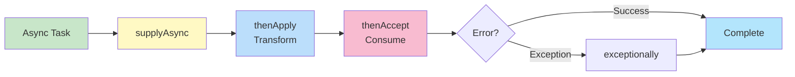

# CompletableFuture - Comprehensive Guide

## 📚 Table of Contents
- [Learning Objectives](#learning-objectives)
- [Theory Checkpoints](#theory-checkpoints)
- [Run Steps](#run-steps)
- [Verification Steps](#verification-steps)
- [Expected Outcome](#expected-outcome)
- [Hands-on Lab](#hands-on-lab)
- [Introduction](#introduction)
- [Creating CompletableFuture](#creating-completablefuture)
- [Transformation Methods](#transformation-methods)
- [Combining Futures](#combining-futures)
- [Error Handling](#error-handling)
- [Quick Reference Card](#quick-reference-card)


## 🎯 Learning Objectives

After completing this module, you will:
## 📋 Prerequisites & Next Topics

### Prerequisites
- **[Module 01 - Lambda Expressions](../01-LambdaExpressions/README.md)** — Lambdas used in callbacks
- Optional: **[Module 04 - Streams API](../04-StreamsAPI/README.md)** — For combined patterns

### Next Topics
After mastering CompletableFuture, proceed to:
1. **[Module 11 - Functional Interfaces Deep Dive](../11-FunctionalInterfacesDeepDive/README.md)** — Advanced functional patterns
2. **[Module 13 - Java 8 Revision](../13-Java8Revision/README.md)** — Capstone: integrate all concepts

---

## 🎯 Learning Objectives

After completing this module, you will:

- [ ] Understand CompletableFuture vs blocking Future (Java 5)
- [ ] Master async execution: supplyAsync(), runAsync() with custom executors
- [ ] Learn transformation: thenApply(), thenAccept(), thenRun()
- [ ] Combine futures: thenCombine(), allOf(), anyOf()
- [ ] Handle exceptions: exceptionally(), handle(), whenComplete()
- [ ] Understand composition: thenCompose() for chained async operations
- [ ] Write non-blocking asynchronous code

---

## ✅ Theory Checkpoints

**Q1: Why is CompletableFuture better than Future for async programming?**

A: Future blocks on get(). CompletableFuture uses callbacks (thenApply, thenAccept) so threads aren't blocked waiting. You can chain operations declaratively.

**Q2: What's the difference between thenApply, thenAccept, and thenRun?**

A: thenApply transforms (R apply(T)). thenAccept consumes without return (void accept(T)). thenRun executes with no input (void run()).

**Q3: When would you use thenCompose vs thenApply?**

A: thenApply for sync transformations (T -> R). thenCompose for async operations that return CompletableFuture (T -> CompletableFuture<R>). thenCompose flattens nested futures.

**Q4: How does exceptionally() handle errors?**

A: If the future completes exceptionally, exceptionally() provides a recovery value. If it succeeds, passes through. Like try-catch for async code.

**Q5: What's the gotcha with executor threads in CompletableFuture?**

A: If you don't specify an executor, it uses ForkJoinPool.commonPool(). This might be shared with streams. For I/O, provide a dedicated thread pool executor.

---

## 🚀 Run Steps

### Compile and Run the Demo

**Step 1:** Navigate to the module directory
```bash
cd 10-CompletableFuture
```

**Step 2:** Compile the Java file
```bash
javac CompletableFutureDemo.java
```

**Step 3:** Run the demo
```bash
java CompletableFutureDemo
```

### Alternative: Using IDE

If using an IDE:
1. Open `CompletableFutureDemo.java`
2. Click "Run"
3. Output in console

---

## ✅ Verification Steps

**Expected behavior:**
1. Compiles without errors
2. Shows async execution happening
3. Chaining operations produces correct results
4. Error handling works (exceptional cases complete)
5. No thread blocking (should finish quickly even with waits)

**Troubleshooting:**
- **Error: "Thread.sleep() exception"**
  - Solution: Use try-catch or wrap in async method
- **Futures blocked/hanging**
  - Solution: Ensure terminal operation calls get() or similar
- **Unexpected execution order**
  - Solution: Remember chaining is declarative; trace execution flow

---

## 📊 Expected Outcome

```
=== COMPLETABLEFUTURE DEMO ===

--- Creating Async Tasks ---
[supplyAsync, runAsync output]

--- Chaining Operations ---
[thenApply, thenAccept results]

--- Combining Futures ---
[thenCombine, allOf output]

--- Error Handling ---
[exceptionally, handle behavior]

--- Composition ---
[thenCompose nested async]

--- Real-World Patterns ---
[Async workflow examples]
```

---

## 📚 Hands-on Lab

### Exercise 1: Guided — Create Async Task [Beginner]

```java
// Run async task
CompletableFuture<String> future = CompletableFuture
    .supplyAsync(() -> {
        Thread.sleep(1000);
        return "Hello from async";
    });

// Chain transformation
CompletableFuture<String> result = future
    .thenApply(s -> s.toUpperCase());

System.out.println(result.get());  // HELLO FROM ASYNC
```

**Your Task:** Create async task that doubles a number:
```java
CompletableFuture<Integer> future = CompletableFuture
    .supplyAsync(() -> 5)
    .thenApply(n -> n * 2);

System.out.println(future.get());  // Expected: 10
```

---

### Exercise 2: Semi-Guided — Combine Futures [Intermediate]

```java
CompletableFuture<Integer> f1 = CompletableFuture.supplyAsync(() -> 5);
CompletableFuture<Integer> f2 = CompletableFuture.supplyAsync(() -> 3);

// Combine results
CompletableFuture<Integer> combined = f1.thenCombine(f2, (a, b) -> a + b);

System.out.println(combined.get());  // 8
```

**Your Task:** Combine three futures:
```java
CompletableFuture<String> f1 = CompletableFuture.supplyAsync(() -> "Hello");
CompletableFuture<String> f2 = CompletableFuture.supplyAsync(() -> " ");
CompletableFuture<String> f3 = CompletableFuture.supplyAsync(() -> "World");

// Combine all three
```

---

### Exercise 3: Challenge — Error Handling [Advanced]

```java
CompletableFuture<Integer> future = CompletableFuture
    .supplyAsync(() -> { throw new RuntimeException("Error!"); })
    .exceptionally(ex -> 0);  // Default value on error

System.out.println(future.get());  // 0
```

**Your Challenge:** Handle multiple async operations with error recovery.

---

## 🎨 Architecture Diagram

**CompletableFuture Chain:**



---

## 🎯 Introduction

**CompletableFuture** is a powerful tool for **asynchronous programming**. It represents a future result of an asynchronous computation.

### Future vs CompletableFuture

```
┌────────────────────────────────────────────────┐
│     FUTURE (Java 5)                            │
├────────────────────────────────────────────────┤
│                                                │
│  ✗ Blocking get()                              │
│  ✗ No chaining                                 │
│  ✗ No combining                                │
│  ✗ No exception handling                       │
│                                                │
└────────────────────────────────────────────────┘

┌────────────────────────────────────────────────┐
│     COMPLETABLEFUTURE (Java 8)                 │
├────────────────────────────────────────────────┤
│                                                │
│  ✓ Non-blocking callbacks                      │
│  ✓ Chaining (thenApply, thenCompose)           │
│  ✓ Combining (thenCombine, allOf)              │
│  ✓ Exception handling (exceptionally)          │
│  ✓ Manual completion                           │
│                                                │
└────────────────────────────────────────────────┘
```

---

## 🏗️ Creating CompletableFuture

```java
// Completed future
CompletableFuture<String> future = CompletableFuture.completedFuture("Hello");

// Run async (no return value)
CompletableFuture<Void> runAsync = CompletableFuture.runAsync(() -> {
    System.out.println("Running async task");
});

// Supply async (with return value)
CompletableFuture<String> supplyAsync = CompletableFuture.supplyAsync(() -> {
    return "Result";
});

// With custom executor
ExecutorService executor = Executors.newFixedThreadPool(10);
CompletableFuture<String> cf = CompletableFuture.supplyAsync(
    () -> "Result",
    executor
);
```

---

## 🔄 Transformation Methods

### thenApply() - Transform Result

```java
CompletableFuture<String> future = CompletableFuture
    .supplyAsync(() -> "Hello")
    .thenApply(s -> s + " World")
    .thenApply(String::toUpperCase);

System.out.println(future.get());  // "HELLO WORLD"
```

### thenAccept() - Consume Result

```java
CompletableFuture.supplyAsync(() -> "Hello")
    .thenAccept(System.out::println);  // Prints: Hello
```

### thenRun() - Run After Completion

```java
CompletableFuture.supplyAsync(() -> "Task")
    .thenRun(() -> System.out.println("Done!"));
```

---

## 🔗 Combining Futures

### thenCompose() - Chain Dependent Futures

```java
CompletableFuture<User> userFuture = getUserById(123);

CompletableFuture<Order> orderFuture = userFuture
    .thenCompose(user -> getOrderByUser(user));
```

### thenCombine() - Combine Independent Futures

```java
CompletableFuture<Integer> future1 = CompletableFuture.supplyAsync(() -> 10);
CompletableFuture<Integer> future2 = CompletableFuture.supplyAsync(() -> 20);

CompletableFuture<Integer> combined = future1.thenCombine(
    future2,
    (a, b) -> a + b
);

System.out.println(combined.get());  // 30
```

### allOf() - Wait for All

```java
CompletableFuture<String> f1 = CompletableFuture.supplyAsync(() -> "A");
CompletableFuture<String> f2 = CompletableFuture.supplyAsync(() -> "B");
CompletableFuture<String> f3 = CompletableFuture.supplyAsync(() -> "C");

CompletableFuture<Void> allFutures = CompletableFuture.allOf(f1, f2, f3);

allFutures.join();  // Wait for all to complete
```

### anyOf() - Wait for First

```java
CompletableFuture<Object> firstCompleted = CompletableFuture.anyOf(f1, f2, f3);

System.out.println(firstCompleted.get());  // First one to finish
```

---

## 🛡️ Error Handling

### exceptionally() - Handle Exceptions

```java
CompletableFuture<String> future = CompletableFuture
    .supplyAsync(() -> {
        if (true) throw new RuntimeException("Error!");
        return "Success";
    })
    .exceptionally(ex -> {
        System.out.println("Exception: " + ex.getMessage());
        return "Default Value";
    });
```

### handle() - Handle Both Success and Failure

```java
CompletableFuture<String> future = CompletableFuture
    .supplyAsync(() -> "Result")
    .handle((result, ex) -> {
        if (ex != null) {
            return "Error occurred";
        }
        return result;
    });
```

---

## 🎯 Quick Reference Card

```java
// Creation
CompletableFuture.completedFuture(value)
CompletableFuture.runAsync(runnable)
CompletableFuture.supplyAsync(supplier)

// Transformation
.thenApply(function)      // Transform
.thenAccept(consumer)     // Consume
.thenRun(runnable)        // Run action

// Chaining
.thenCompose(function)    // Flatten nested futures
.thenCombine(other, fn)   // Combine two futures

// Waiting
.allOf(futures...)        // Wait for all
.anyOf(futures...)        // Wait for first

// Error handling
.exceptionally(function)  // Handle error
.handle(biFunction)       // Handle success and error

// Completion
.get()                    // Blocking
.join()                   // Blocking (unchecked)
.getNow(defaultValue)     // Non-blocking
```

---

**Previous Module**: [← Parallel Streams](../09-ParallelStreams/)  
**Next Module**: [Functional Interfaces Deep Dive →](../11-FunctionalInterfacesDeepDive/)
