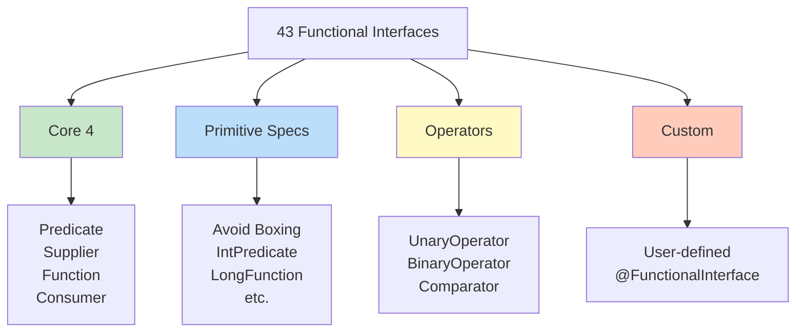

# Functional Interfaces Deep Dive - Comprehensive Guide

## 📚 Table of Contents
- [Learning Objectives](#learning-objectives)
- [Theory Checkpoints](#theory-checkpoints)
- [Run Steps](#run-steps)
- [Verification Steps](#verification-steps)
- [Expected Outcome](#expected-outcome)
- [Hands-on Lab](#hands-on-lab)
- [All 43 Built-in Functional Interfaces](#all-43-built-in-functional-interfaces)
- [Primitive Specializations](#primitive-specializations)
- [Bi-Variants](#bi-variants)
- [Operators](#operators)
- [Quick Reference Card](#quick-reference-card)


## 🎯 Learning Objectives

After completing this module, you will:
## 📋 Prerequisites & Next Topics

### Prerequisites (Core)
- **[Module 02 - Functional Interfaces](../02-FunctionalInterfaces/README.md)** ⭐ — Foundation required
- **[Module 01 - Lambda Expressions](../01-LambdaExpressions/README.md)** — How lambdas implement interfaces
- **[Module 04 - Streams API](../04-StreamsAPI/README.md)** — Functional interfaces in action

### Next Topics
After mastering Deep Dive, proceed to:
1. **[Module 12 - forEach Iteration](../12-ForEachAndIteration/README.md)** — Apply concepts to iteration
2. **[Module 13 - Java 8 Revision](../13-Java8Revision/README.md)** — Capstone: integrate all concepts

---

## 🎯 Learning Objectives

After completing this module, you will:

- [ ] Master all 43 built-in functional interfaces in java.util.function
- [ ] Understand primitive specializations (Int, Long, Double variants)
- [ ] Learn bi-variants for two-parameter operations
- [ ] Recognize operator types (Unary, Binary, comparison)
- [ ] Know when to use @FunctionalInterface and create custom interfaces
- [ ] Distinguish between Function vs Operator vs Predicate semantically
- [ ] Apply the right interface for every functional pattern

---

## ✅ Theory Checkpoints

**Q1: Why are there primitive specializations (IntPredicate, LongFunction)?**

A: To avoid boxing/unboxing overhead. Primitive specializations work directly with int/long/double, not Integer/Long/Double wrappers. Critical for performance in numerical operations.

**Q2: When should you use UnaryOperator vs Function?**

A: Both transform input. UnaryOperator is semantic (same input/output type; T -> T). Function is generic (T -> R). Use UnaryOperator for clarity when types must match.

**Q3: What's the difference between Operator types?**

A: Unary: single input. Binary: two inputs. Comparison: returns int (negative/zero/positive). All are functions with semantic naming.

**Q4: Why does groupingBy() accept a Function, not arbitrary lambda?**

A: Because the interface contract matters. Function<T, K> is clear about input/output. Custom lambdas might break. Using explicit interfaces enables better tooling.

**Q5: Which functional interface to use for a method that returns Optional?**

A: Function<T, Optional<R>>. That's still a Function from T to Optional<R>. No special wrapper needed; Optional is the return type.

---

## 🚀 Run Steps

### Compile and Run the Demo

**Step 1:** Navigate to the module directory
```bash
cd 11-FunctionalInterfacesDeepDive
```

**Step 2:** Compile the Java file
```bash
javac FunctionalInterfacesDeepDive.java
```

**Step 3:** Run the demo
```bash
java FunctionalInterfacesDeepDive
```

### Alternative: Using IDE

If using an IDE:
1. Open `FunctionalInterfacesDeepDive.java`
2. Click "Run"
3. Output in console

---

## ✅ Verification Steps

**Expected behavior:**
1. Compiles without errors
2. Demonstrates all 4 core interfaces
3. Shows primitive specializations
4. Displays bi-variants
5. Demonstrates operator types

**Troubleshooting:**
- **"Cannot find symbol" for primitive interface**
  - Solution: Ensure import: `import java.util.function.*;`
- **Type mismatch errors**
  - Solution: Verify interface input/output types match your lambdas

---

## 📊 Expected Outcome

```
=== FUNCTIONAL INTERFACES DEEP DIVE ===

--- Core 4 Interfaces ---
[Predicate, Function, Consumer, Supplier]

--- Primitive Specializations ---
[IntPredicate, LongFunction, etc.]

--- Bi-Variants ---
[BiPredicate, BiFunction, BiConsumer]

--- Operators ---
[UnaryOperator, BinaryOperator, Comparator]

--- Composition Examples ---
[Chaining multiple interface operations]
```

---

## 📚 Hands-on Lab

### Exercise 1: Guided — Choose Right Interface [Beginner]

**Task:** Match pattern to functional interface.

```java
// Input -> Output? Use Function
Function<String, Integer> length = String::length;

// Input -> boolean? Use Predicate
Predicate<String> isEmpty = String::isEmpty;

// Input -> void (side effect)? Use Consumer
Consumer<String> print = System.out::println;

// No input -> Output? Use Supplier
Supplier<Integer> random = () -> new Random().nextInt();
```

**Your Task:** Match these to interfaces:
```java
??? square = n -> n * n;              // UnaryOperator<Integer>
??? isAdult = age -> age >= 18;       // IntPredicate
??? printTwice = (s) -> sout(s); sout(s);  // Consumer<String>
```

---

### Exercise 2: Semi-Guided — Primitive Specializations [Intermediate]

```java
// Generic - has boxing overhead
Function<Integer, Integer> doubleGeneric = n -> n * 2;

// Primitive - no boxing
IntFunction<Integer> doublePrimitive = n -> n * 2;

// Direct primitive to primitive
IntUnaryOperator doubleIntDirect = n -> n * 2;
```

**Your Task:** Write versions for long values:
```java
??? isNegative = n -> n < 0;              // LongPredicate
??? sum = (a, b) -> a + b;               // LongBinaryOperator
```

---

### Exercise 3: Challenge — Custom Functional Interface [Advanced]

**Task:** Create and use custom functional interfaces:

```java
@FunctionalInterface
interface StringTransformer {
    String transform(String input);
}

StringTransformer upper = String::toUpperCase;
StringTransformer lower = String::toLowerCase;
```

**Your Challenge:** Create custom interface for validation with detailed error info.

---

## 🎨 Architecture Diagram

**Functional Interface Taxonomy:**



---

## 🎯 All 43 Built-in Functional Interfaces

Java 8 provides **43 functional interfaces** in `java.util.function` package.

### Category Overview

```
┌────────────────────────────────────────────────┐
│     FUNCTIONAL INTERFACE CATEGORIES            │
├────────────────────────────────────────────────┤
│                                                │
│  Core (4):                                     │
│    Predicate, Function, Consumer, Supplier     │
│                                                │
│  Bi-Variants (4):                              │
│    BiPredicate, BiFunction, BiConsumer,        │
│    BinaryOperator                              │
│                                                │
│  Operators (2):                                │
│    UnaryOperator, BinaryOperator               │
│                                                │
│  Primitive Specializations (33):               │
│    IntPredicate, IntFunction, IntConsumer...   │
│    LongPredicate, LongFunction...              │
│    DoublePredicate, DoubleFunction...          │
│                                                │
└────────────────────────────────────────────────┘
```

---

## 🔢 Primitive Specializations

### Why Primitive Specializations?

```
┌────────────────────────────────────────────────┐
│     AVOID BOXING OVERHEAD                      │
├────────────────────────────────────────────────┤
│                                                │
│  ❌ Generic version:                           │
│     Function<Integer, Integer>                 │
│     - Autoboxing: int → Integer                │
│     - Unboxing: Integer → int                  │
│     - Performance penalty                      │
│                                                │
│  ✅ Primitive version:                         │
│     IntUnaryOperator                           │
│     - Direct int → int                         │
│     - No boxing/unboxing                       │
│     - Better performance                       │
│                                                │
└────────────────────────────────────────────────┘
```

### Int Variants

```java
// IntPredicate: int → boolean
IntPredicate isEven = n -> n % 2 == 0;

// IntFunction<R>: int → R
IntFunction<String> toString = i -> String.valueOf(i);

// IntConsumer: int → void
IntConsumer printer = System.out::println;

// IntSupplier: () → int
IntSupplier random = () -> (int)(Math.random() * 100);

// IntUnaryOperator: int → int
IntUnaryOperator square = n -> n * n;

// IntBinaryOperator: (int, int) → int
IntBinaryOperator sum = (a, b) -> a + b;

// ToIntFunction<T>: T → int
ToIntFunction<String> length = String::length;

// ToIntBiFunction<T,U>: (T, U) → int
ToIntBiFunction<String, String> compare = String::compareTo;
```

### Long and Double Variants

```java
// Long variants
LongPredicate, LongFunction<R>, LongConsumer, LongSupplier
LongUnaryOperator, LongBinaryOperator
ToLongFunction<T>, ToLongBiFunction<T,U>

// Double variants
DoublePredicate, DoubleFunction<R>, DoubleConsumer, DoubleSupplier
DoubleUnaryOperator, DoubleBinaryOperator
ToDoubleFunction<T>, ToDoubleBiFunction<T,U>
```

---

## 👥 Bi-Variants

### BiPredicate<T, U>

```java
BiPredicate<String, Integer> lengthGreaterThan = 
    (str, len) -> str.length() > len;

boolean result = lengthGreaterThan.test("Hello", 3);  // true
```

### BiFunction<T, U, R>

```java
BiFunction<Integer, Integer, Integer> add = (a, b) -> a + b;

int sum = add.apply(5, 3);  // 8

// Map merge example
Map<String, Integer> map = new HashMap<>();
map.merge("key", 1, (oldVal, newVal) -> oldVal + newVal);
```

### BiConsumer<T, U>

```java
BiConsumer<String, Integer> printer = 
    (name, age) -> System.out.println(name + " is " + age);

printer.accept("Alice", 30);  // Alice is 30

// Map forEach
Map<String, Integer> map = new HashMap<>();
map.forEach((key, value) -> 
    System.out.println(key + ": " + value)
);
```

---

## ⚙️ Operators

### UnaryOperator<T> extends Function<T, T>

```java
// T → T (same type input and output)
UnaryOperator<String> toUpper = String::toUpperCase;
UnaryOperator<Integer> square = n -> n * n;

String result = toUpper.apply("hello");  // "HELLO"
```

### BinaryOperator<T> extends BiFunction<T, T, T>

```java
// (T, T) → T (same type for both inputs and output)
BinaryOperator<Integer> max = Math::max;
BinaryOperator<String> concat = (a, b) -> a + b;

int maximum = max.apply(10, 20);  // 20

// In reduce
Optional<Integer> sum = numbers.stream()
    .reduce((a, b) -> a + b);

// Static methods
BinaryOperator<Integer> maxOp = BinaryOperator.maxBy(Integer::compareTo);
BinaryOperator<Integer> minOp = BinaryOperator.minBy(Integer::compareTo);
```

---

## 🎯 Quick Reference Card

### Complete List of 43 Interfaces

```java
// CORE (4)
Predicate<T>, Function<T,R>, Consumer<T>, Supplier<T>

// BI-VARIANTS (4)
BiPredicate<T,U>, BiFunction<T,U,R>, BiConsumer<T,U>, BinaryOperator<T>

// OPERATORS (2)
UnaryOperator<T>, BinaryOperator<T>

// INT VARIANTS (9)
IntPredicate, IntFunction<R>, IntConsumer, IntSupplier
IntUnaryOperator, IntBinaryOperator
ToIntFunction<T>, ToIntBiFunction<T,U>, ObjIntConsumer<T>

// LONG VARIANTS (9)
LongPredicate, LongFunction<R>, LongConsumer, LongSupplier
LongUnaryOperator, LongBinaryOperator
ToLongFunction<T>, ToLongBiFunction<T,U>, ObjLongConsumer<T>

// DOUBLE VARIANTS (9)
DoublePredicate, DoubleFunction<R>, DoubleConsumer, DoubleSupplier
DoubleUnaryOperator, DoubleBinaryOperator
ToDoubleFunction<T>, ToDoubleBiFunction<T,U>, ObjDoubleConsumer<T>

// CONVERSION (6)
IntToLongFunction, IntToDoubleFunction
LongToIntFunction, LongToDoubleFunction
DoubleToIntFunction, DoubleToLongFunction
```

### Usage Decision Tree

```
Need to test? → Predicate
Need to transform? → Function
Need to consume? → Consumer
Need to supply? → Supplier

Two parameters? → Add "Bi" prefix
Same input/output type? → Use Operator
Primitive types? → Use primitive variant
```

---

**Previous Module**: [← CompletableFuture](../10-CompletableFuture/)  
**Next Module**: [forEach and Iteration →](../12-ForEachIteration/)
