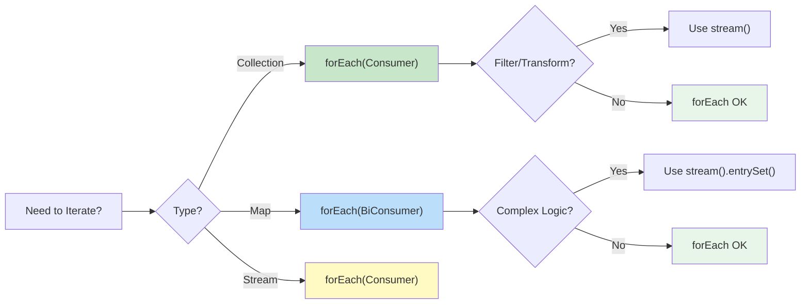

# forEach and Iteration Enhancements - Comprehensive Guide

## 📚 Table of Contents
- [Learning Objectives](#learning-objectives)
- [Theory Checkpoints](#theory-checkpoints)
- [Run Steps](#run-steps)
- [Verification Steps](#verification-steps)
- [Expected Outcome](#expected-outcome)
- [Hands-on Lab](#hands-on-lab)
- [Introduction](#introduction)
- [Iterable.forEach()](#iterableforeach)
- [Map.forEach()](#mapforeach)
- [Stream.forEach()](#streamforeach)
- [forEach vs for-loop](#foreach-vs-for-loop)
- [Quick Reference Card](#quick-reference-card)


## 🎯 Learning Objectives

After completing this module, you will:
## 📋 Prerequisites & Next Topics

### Prerequisites
- **[Module 01 - Lambda Expressions](../01-LambdaExpressions/README.md)** — forEach uses lambdas
- **[Module 04 - Streams API](../04-StreamsAPI/README.md)** — Modern iteration with streams

### Next Topics
After mastering forEach Iteration, proceed to:
1. **[Module 13 - Java 8 Revision](../13-Java8Revision/README.md)** — Capstone: integrate all concepts

---

## 🎯 Learning Objectives

After completing this module, you will:

- [ ] Understand the 3 forEach() variants: Iterable, Map, Stream
- [ ] Master forEach() syntax for different collection types
- [ ] Learn when forEach() helps readability vs traditional loops
- [ ] Apply method references and lambdas in forEach()
- [ ] Know the performance characteristics of forEach()
- [ ] Understand why forEach() can't modify collections during iteration
- [ ] Choose the right iteration pattern for each scenario

---

## ✅ Theory Checkpoints

**Q1: What's the difference between Iterable.forEach(), Map.forEach(), and Stream.forEach()?**

A: Iterable.forEach(Consumer<T>) iterates collections. Map.forEach(BiConsumer<K,V>) for key-value pairs. Stream.forEach() is terminal operation for stream elements.

**Q2: Why can't you remove elements during forEach()?**

A: forEach() uses an iterator internally. Modifying the collection during iteration causes ConcurrentModificationException. Use removeIf() or stream().filter() instead.

**Q3: When is lambda in forEach() better than a for-loop?**

A: Lambda is clearer for simple operations (printing, counting). For-loop is better when you need index access or complex control flow (break, continue).

**Q4: What's the performance difference forEach() vs for-loop?**

A: Minimal; JIT compilation makes them equivalent. forEach() can't parallelize. Traditional for-loop can't parallelize either. Use streams for parallelization.

**Q5: How does Map.forEach() differ from stream().forEach()?**

A: Map.forEach(BiConsumer) is simpler, more readable for maps. stream().entrySet().forEach() is more flexible for chaining operations.

---

## 🚀 Run Steps

### Compile and Run the Demo

**Step 1:** Navigate to the module directory
```bash
cd 12-ForEachIteration
```

**Step 2:** Compile the Java file
```bash
javac ForEachAndIteration.java
```

**Step 3:** Run the demo
```bash
java ForEachAndIteration
```

### Alternative: Using IDE

If using an IDE:
1. Open `ForEachAndIteration.java`
2. Click "Run"
3. Output in console

---

## ✅ Verification Steps

**Expected behavior:**
1. Compiles without errors
2. Shows all three forEach() types
3. All output sections produce results
4. No ConcurrentModificationExceptions
5. Comparison shows different iteration patterns

**Troubleshooting:**
- **ConcurrentModificationException**
  - Solution: Use removeIf() instead of remove() inside forEach()
- **forEach() not compiling**
  - Solution: Ensure collection implements Iterable
- **No output for Stream.forEach()**
  - Solution: Check stream has elements and forEach() is a terminal op

---

## 📊 Expected Outcome

```
=== FOREACH AND ITERATION DEMO ===

--- Iterable.forEach() ---
[List iteration with Consumer]

--- Map.forEach() ---
[Key-value pair iteration]

--- Stream.forEach() ---
[Stream element iteration]

--- Comparison: Traditional vs forEach ---
[for-loop vs forEach vs stream comparison]

--- Real-World Patterns ---
[Common iteration use cases]
```

---

## 📚 Hands-on Lab

### Exercise 1: Guided — Basic forEach()[Beginner]

```java
List<String> fruits = Arrays.asList("apple", "banana", "cherry");

// Traditional for-loop
for (String fruit : fruits) {
    System.out.println(fruit);
}

// forEach with lambda
fruits.forEach(fruit -> System.out.println(fruit));

// forEach with method reference
fruits.forEach(System.out::println);
```

**Your Task:** Use forEach on a Set:
```java
Set<Integer> numbers = new HashSet<>(Arrays.asList(5, 2, 8, 1));

numbers.forEach(???);
// Expected: Print each number
```

---

### Exercise 2: Semi-Guided — Map.forEach() [Intermediate]

```java
Map<String, Integer> ages = new HashMap<>();
ages.put("Alice", 30);
ages.put("Bob", 25);

// forEach with BiConsumer
ages.forEach((name, age) -> System.out.println(name + " is " + age));

// vs stream
ages.entrySet().forEach(entry -> System.out.println(...));
```

**Your Task:** Iterate over a map and filter by value:
```java
Map<String, Integer> scores = new HashMap<>();
scores.put("Math", 95);
scores.put("English", 87);
scores.put("Science", 92);

// Print only subjects with score > 90
scores.forEach((subject, score) -> {
    if (score > 90) {
        System.out.println(subject + ": " + score);
    }
});
```

---

### Exercise 3: Challenge — Choose Best Iteration Pattern [Advanced]

**Task:** Identify the best iteration approach:

```java
// Pattern 1: Simple print
people.forEach(System.out::println);
// ✓ forEach is clear and concise

// Pattern 2: With filter
people.stream()
    .filter(p -> p.getAge() > 18)
    .forEach(System.out::println);
// ✓ Stream for complex logic

// Pattern 3: Need index
for (int i = 0; i < list.size(); i++) {
    System.out.println(i + ": " + list.get(i));
}
// ✓ Traditional loop needed for index
```

**Your Challenge:** Choose the best pattern for each scenario.

---

## 🎨 Architecture Diagram

**Iteration Methods Comparison:**



---

## 🎯 Introduction

Java 8 added the **forEach()** method to `Iterable`, `Map`, and `Stream` interfaces, providing a functional way to iterate over collections.

### Evolution of Iteration

```java
// Traditional for-loop (Java 1.0)
for (int i = 0; i < list.size(); i++) {
    System.out.println(list.get(i));
}

// Enhanced for-loop (Java 5)
for (String item : list) {
    System.out.println(item);
}

// forEach (Java 8)
list.forEach(System.out::println);

// Stream forEach (Java 8)
list.stream().forEach(System.out::println);
```

---

## 📋 Iterable.forEach()

All collections implement `Iterable`, so they all have `forEach()`.

```java
// List
List<String> list = Arrays.asList("A", "B", "C");
list.forEach(System.out::println);

// Set
Set<Integer> set = new HashSet<>(Arrays.asList(1, 2, 3));
set.forEach(n -> System.out.println(n * 2));

// With lambda
list.forEach(item -> {
    String upper = item.toUpperCase();
    System.out.println(upper);
});

// With method reference
list.forEach(System.out::println);

// Custom action
List<Person> people = getPeople();
people.forEach(person -> {
    person.setProcessed(true);
    save(person);
});
```

---

## 🗺️ Map.forEach()

Maps have special `forEach()` that accepts `BiConsumer<K, V>`.

```java
Map<String, Integer> map = new HashMap<>();
map.put("Alice", 30);
map.put("Bob", 25);
map.put("Charlie", 35);

// Iterate over entries
map.forEach((key, value) -> 
    System.out.println(key + " is " + value + " years old")
);

// Modify values
map.forEach((key, value) -> 
    map.put(key, value + 1)  // Increment all ages
);

// Complex operations
map.forEach((name, age) -> {
    if (age > 30) {
        System.out.println(name + " is senior");
    }
});
```

---

## 🌊 Stream.forEach()

```java
// Stream forEach
list.stream()
    .filter(s -> s.length() > 3)
    .forEach(System.out::println);

// forEachOrdered - maintains order in parallel streams
list.parallelStream()
    .filter(s -> s.length() > 3)
    .forEachOrdered(System.out::println);  // Ordered output

// Regular forEach in parallel stream - order not guaranteed
list.parallelStream()
    .forEach(System.out::println);  // May print in random order
```

---

## ⚖️ forEach vs for-loop

```
┌────────────────────────────────────────────────┐
│     forEach vs for-loop                        │
├────────────────────────────────────────────────┤
│                                                │
│  forEach:                                      │
│    ✓ More concise                              │
│    ✓ Functional style                          │
│    ✓ Cannot use break/continue                 │
│    ✓ Cannot modify iteration index             │
│    ✗ Harder to debug                           │
│                                                │
│  for-loop:                                     │
│    ✓ Can use break/continue                    │
│    ✓ Can access index                          │
│    ✓ Easier to debug                           │
│    ✗ More verbose                              │
│                                                │
└────────────────────────────────────────────────┘
```

### When to Use What

```java
// ✅ Use forEach for simple iteration
list.forEach(System.out::println);

// ✅ Use for-loop when you need to break early
for (String item : list) {
    if (item.equals("STOP")) break;
    System.out.println(item);
}

// ✅ Use for-loop when you need index
for (int i = 0; i < list.size(); i++) {
    System.out.println(i + ": " + list.get(i));
}

// ✅ Use forEach with streams for complex operations
list.stream()
    .filter(s -> s.length() > 3)
    .map(String::toUpperCase)
    .forEach(System.out::println);
```

---

## 🎯 Quick Reference Card

```java
// Iterable forEach
list.forEach(System.out::println)
list.forEach(item -> process(item))

// Map forEach
map.forEach((k, v) -> System.out.println(k + ": " + v))

// Stream forEach
stream.forEach(System.out::println)
parallelStream.forEachOrdered(System.out::println)

// Common patterns
list.forEach(item -> {
    // multiple statements
});

map.forEach((key, value) -> {
    // process key-value pair
});

list.stream()
    .filter(predicate)
    .map(function)
    .forEach(consumer);
```

---

**Previous Module**: [← Functional Interfaces Deep Dive](../11-FunctionalInterfacesDeepDive/)  
**Main Project**: [← Back to Main README](../README.md)
