# Java 8 Complete Revision Guide

**Master All Java 8 Features in One Place**

---

## Table of Contents
1. [Lambda Expressions](#1-lambda-expressions)
2. [Functional Interfaces](#2-functional-interfaces)
3. [Method References](#3-method-references)
4. [Streams API](#4-streams-api)
5. [Optional Class](#5-optional-class)
6. [Default & Static Methods](#6-default--static-methods)
7. [Date Time API](#7-date-time-api)
8. [Collectors](#8-collectors)
9. [Parallel Streams](#9-parallel-streams)
10. [CompletableFuture](#10-completablefuture)
11. [Functional Interfaces Deep Dive](#11-functional-interfaces-deep-dive)
12. [forEach Iteration](#12-foreach-iteration)

---

## 1. Lambda Expressions

### 🎯 What are Lambdas?
Anonymous functions that enable functional programming in Java. They provide a clear and concise way to represent one method interface using an expression.

### Syntax
```java
// Traditional anonymous class
Runnable r1 = new Runnable() {
    @Override
    public void run() {
        System.out.println("Hello");
    }
};
// Lambda expression
Runnable r2 = () -> System.out.println("Hello");
```

## 📋 Prerequisites & Next Topics

### Prerequisites (All Modules)
This capstone module builds on ALL previous modules. You should have completed:
- **[Module 01 - Lambda Expressions](../01-LambdaExpressions/README.md)**
- **[Module 02 - Functional Interfaces](../02-FunctionalInterfaces/README.md)**
- **[Module 03 - Method References](../03-MethodReferences/README.md)**
- **[Module 04 - Streams API](../04-StreamsAPI/README.md)** ⭐ Core
- **[Module 05 - Optional Class](../05-OptionalClass/README.md)**
- **[Module 06 - Default & Static Methods](../06-DefaultStaticMethods/README.md)**
- **[Module 07 - Date & Time API](../07-DateTimeAPI/README.md)**
- **[Module 08 - Collectors](../08-Collectors/README.md)**
- **[Module 09 - Parallel Streams](../09-ParallelStreams/README.md)**
- **[Module 10 - CompletableFuture](../10-CompletableFuture/README.md)**
- **[Module 11 - Functional Interfaces Deep Dive](../11-FunctionalInterfacesDeepDive/README.md)**
- **[Module 12 - forEach Iteration](../12-ForEachIteration/README.md)**

### What's Next?
You've completed the Java 8 learning path! Next steps:
- Apply these concepts in production projects
- Explore Java 9+ features (modules, var, records, etc.)
- Master reactive programming with Project Reactor or RxJava

---

## 🎯 Learning Objectives

After completing this module, you will:
### Lambda Syntax Variations
```java
// No parameters
() -> expression

// One parameter (parentheses optional)
x -> expression
(x) -> expression

// Multiple parameters
(x, y) -> expression

// Block body
(x, y) -> {
    // statements
    return result;
}
```

### Key Concepts
- **Target Type**: Lambda must match functional interface signature
- **Type Inference**: Compiler infers parameter types
- **Effectively Final**: Can only use final or effectively final variables
- **No State**: Lambdas are stateless (no instance variables)

### Architecture Diagram
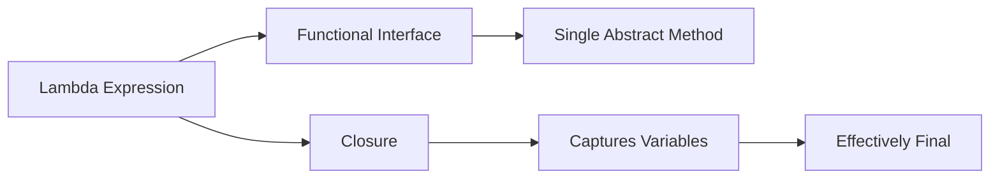

---

## 2. Functional Interfaces

### 🎯 Definition
Interface with **exactly one abstract method** (SAM - Single Abstract Method). Can have multiple default/static methods.

### Built-in Functional Interfaces

| Interface | Method | Description | Example |
|-----------|--------|-------------|---------|
| `Predicate<T>` | `boolean test(T t)` | Tests condition | `x -> x > 0` |
| `Function<T,R>` | `R apply(T t)` | Transforms input | `x -> x * 2` |
| `Consumer<T>` | `void accept(T t)` | Consumes input | `x -> System.out.println(x)` |
| `Supplier<T>` | `T get()` | Supplies value | `() -> Math.random()` |

### Creating Custom Functional Interface
```java
@FunctionalInterface
public interface Calculator {
    int calculate(int a, int b);
    
    // Default/static methods allowed
    default int square(int x) {
        return x * x;
    }
}

// Usage
Calculator add = (a, b) -> a + b;
```

### Interface Hierarchy
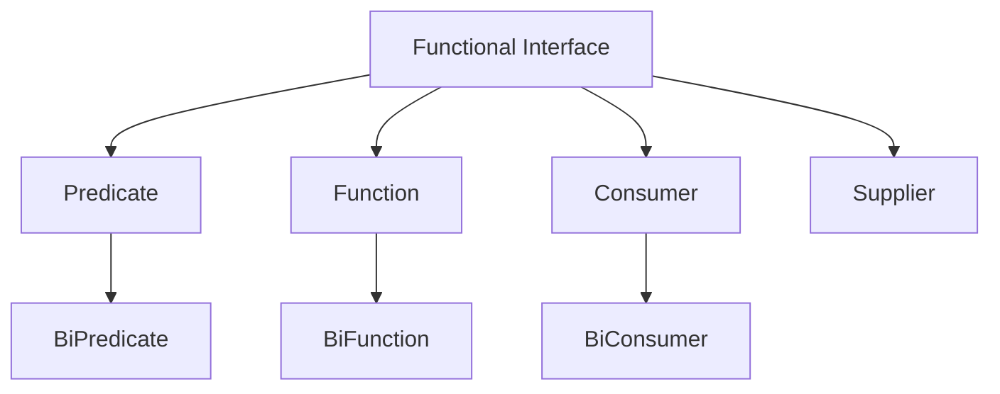

---

## 3. Method References

### 🎯 Purpose
Shorthand notation for lambdas that call a single method.

### Four Types

#### 1. Static Method Reference
```java
// Lambda: x -> ClassName.staticMethod(x)
Function<String, Integer> f = Integer::parseInt;
```

#### 2. Instance Method Reference (on particular object)
```java
// Lambda: x -> obj.instanceMethod(x)
String str = "Hello";
Supplier<Integer> s = str::length;
```

#### 3. Instance Method Reference (on arbitrary object)
```java
// Lambda: (obj, args) -> obj.instanceMethod(args)
Function<String, String> f = String::toUpperCase;
```

#### 4. Constructor Reference
```java
// Lambda: () -> new ClassName()
Supplier<List<String>> s = ArrayList::new;
```

### Method Reference Decision Tree
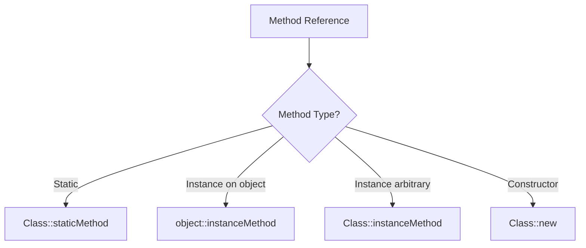

---

## 4. Streams API

### 🎯 What is a Stream?
Sequence of elements supporting sequential and parallel aggregate operations. **Not a data structure**, but a pipeline of operations.

### Stream Pipeline
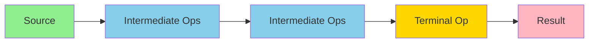

### Stream Operations Categories

#### Intermediate Operations (Lazy)
- `filter()` - Filter elements
- `map()` - Transform elements
- `flatMap()` - Flatten nested structures
- `distinct()` - Remove duplicates
- `sorted()` - Sort elements
- `peek()` - Debug without modifying
- `limit()` - Limit size
- `skip()` - Skip elements

#### Terminal Operations (Eager)
- `forEach()` - Iterate
- `collect()` - Collect to collection
- `reduce()` - Reduce to single value
- `count()` - Count elements
- `anyMatch()` - Check if any match
- `allMatch()` - Check if all match
- `noneMatch()` - Check if none match
- `findFirst()` - Get first element
- `findAny()` - Get any element

### Example Pipeline
```java
List<String> result = items.stream()           // Source
    .filter(s -> s.length() > 3)               // Intermediate
    .map(String::toUpperCase)                   // Intermediate
    .sorted()                                   // Intermediate
    .collect(Collectors.toList());             // Terminal
```

### Key Characteristics
- **Lazy Evaluation**: Intermediate operations not executed until terminal operation
- **Short-circuiting**: Some operations can complete without processing all elements
- **Stateless vs Stateful**: Most operations are stateless (filter, map), some are stateful (sorted, distinct)
- **Non-interfering**: Should not modify source
- **No Storage**: Streams don't store data

---

## 5. Optional Class

### 🎯 Purpose
Container object that may or may not contain a non-null value. **Eliminates NullPointerException**.

### Creating Optional
```java
Optional<String> empty = Optional.empty();
Optional<String> of = Optional.of("value");              // NPE if null
Optional<String> nullable = Optional.ofNullable(value);  // Safe
```

### Using Optional
```java
// Bad - defeats the purpose
if (optional.isPresent()) {
    String value = optional.get();
}

// Good - functional style
optional.ifPresent(value -> System.out.println(value));
optional.orElse("default");
optional.orElseGet(() -> computeDefault());
optional.orElseThrow(() -> new Exception());
```

### Optional Flow
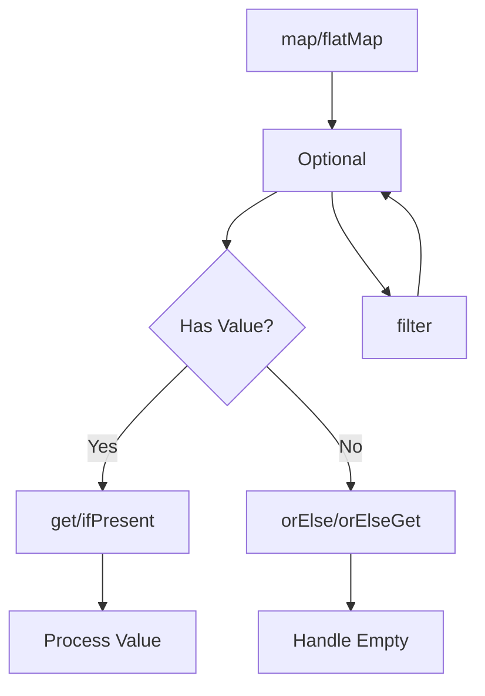

### Transformations
```java
Optional<String> name = Optional.of("john");

// map - transforms value
Optional<String> upper = name.map(String::toUpperCase);

// flatMap - for nested Optionals
Optional<String> result = name.flatMap(n -> findAddress(n));

// filter - conditional filtering
Optional<String> filtered = name.filter(n -> n.length() > 3);
```

### Best Practices
✅ **DO**: Use as return type for methods that might not return a value  
✅ **DO**: Chain operations functionally  
❌ **DON'T**: Use as field or parameter  
❌ **DON'T**: Call `get()` without checking  
❌ **DON'T**: Use `isPresent()` + `get()` pattern

---

## 6. Default & Static Methods

### 🎯 Purpose
Enable interface evolution without breaking existing implementations.

### Default Methods
```java
interface Vehicle {
    void start();  // Abstract
    
    // Default implementation
    default void stop() {
        System.out.println("Vehicle stopped");
    }
}

class Car implements Vehicle {
    @Override
    public void start() {
        System.out.println("Car starting");
    }
    // stop() inherited automatically
}
```

### Static Methods
```java
interface MathUtils {
    static int add(int a, int b) {
        return a + b;
    }
}

// Call: MathUtils.add(5, 3)
```

### Diamond Problem Resolution
```java
interface A {
    default void method() { System.out.println("A"); }
}

interface B {
    default void method() { System.out.println("B"); }
}

class C implements A, B {
    @Override
    public void method() {
        A.super.method();  // Explicitly choose
        // Or provide own implementation
    }
}
```

### Resolution Hierarchy
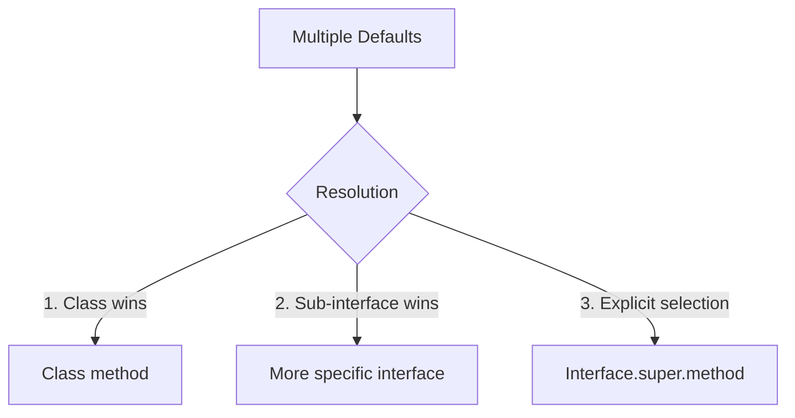

---

## 7. Date Time API

### 🎯 Problem with Old API
- **Not thread-safe** (Date, Calendar)
- **Poor design** (months 0-indexed)
- **Mutable** objects

### New API (java.time)

#### Core Classes
```java
LocalDate date = LocalDate.now();              // 2024-03-30
LocalTime time = LocalTime.now();              // 14:30:15
LocalDateTime dateTime = LocalDateTime.now();  // 2024-03-30T14:30:15
ZonedDateTime zoned = ZonedDateTime.now();     // With timezone
```

#### Class Hierarchy
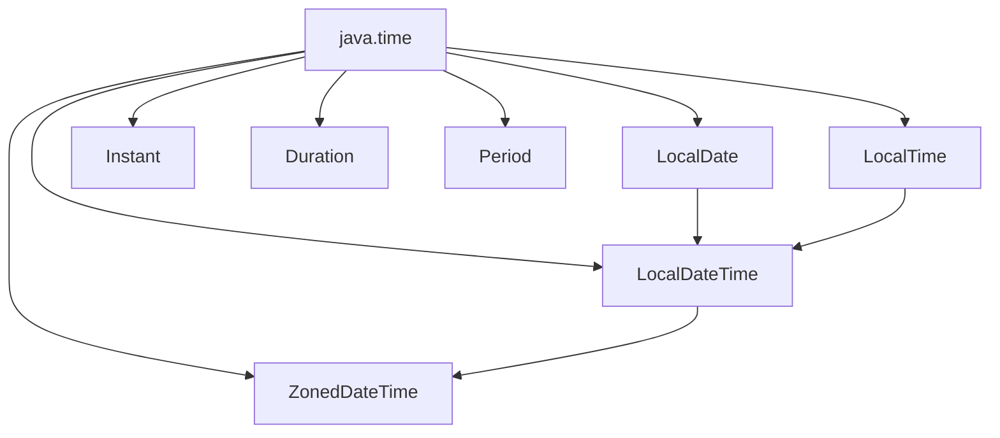

#### Common Operations
```java
// Creation
LocalDate date = LocalDate.of(2024, 3, 30);
LocalDate parsed = LocalDate.parse("2024-03-30");

// Manipulation (immutable - returns new object)
LocalDate tomorrow = date.plusDays(1);
LocalDate nextMonth = date.plusMonths(1);

// Comparison
boolean isBefore = date.isBefore(tomorrow);

// Formatting
String formatted = date.format(DateTimeFormatter.ISO_DATE);
```

#### Duration vs Period
```java
// Duration - time-based (hours, minutes, seconds)
Duration duration = Duration.between(time1, time2);

// Period - date-based (years, months, days)
Period period = Period.between(date1, date2);
```

---

## 8. Collectors

### 🎯 Purpose
Mutable reduction operations - accumulate elements into collections or other results.

### Common Collectors

```java
// To Collection
.collect(Collectors.toList())
.collect(Collectors.toSet())
.collect(Collectors.toCollection(ArrayList::new))

// To Map
.collect(Collectors.toMap(keyMapper, valueMapper))

// Joining
.collect(Collectors.joining(", "))

// Grouping
.collect(Collectors.groupingBy(classifier))

// Partitioning
.collect(Collectors.partitioningBy(predicate))

// Statistics
.collect(Collectors.summarizingInt(mapper))
```

### Collector Categories
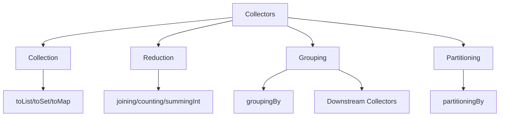

### Advanced Examples
```java
// Multi-level grouping
Map<String, Map<Integer, List<Employee>>> grouped = 
    employees.stream()
        .collect(Collectors.groupingBy(
            Employee::getDepartment,
            Collectors.groupingBy(Employee::getAge)
        ));

// Collecting and then transforming
List<String> result = stream
    .collect(Collectors.collectingAndThen(
        Collectors.toList(),
        Collections::unmodifiableList
    ));
```

---

## 9. Parallel Streams

### 🎯 Purpose
Leverage multi-core processors for parallel data processing.

### Creating Parallel Streams
```java
// From collection
list.parallelStream()

// From stream
stream.parallel()

// Check if parallel
boolean isParallel = stream.isParallel();
```

### How It Works
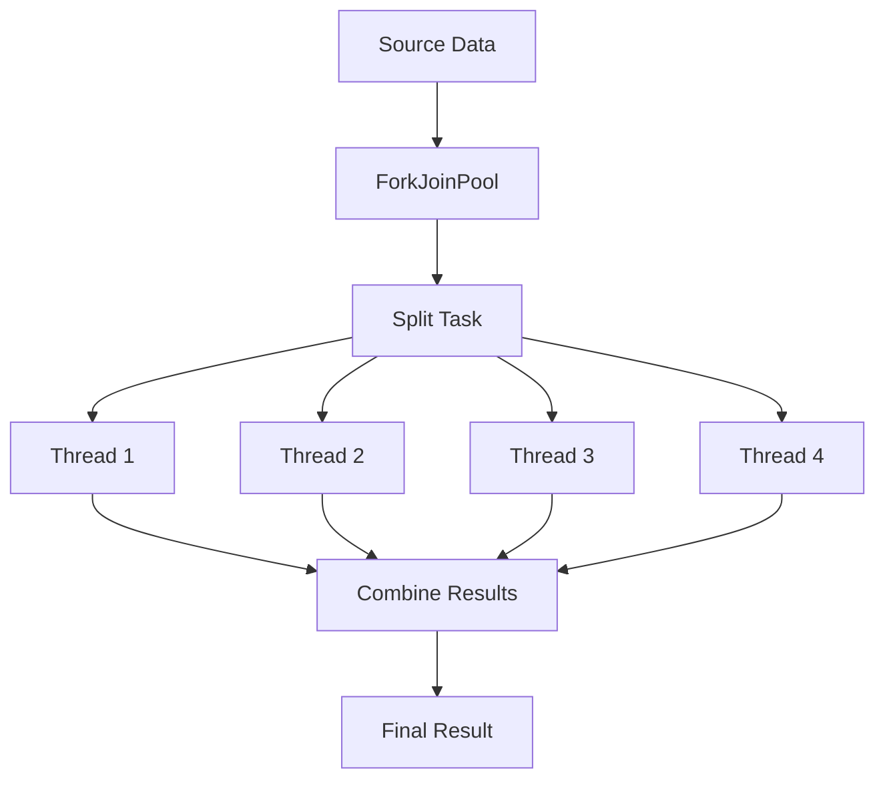

### When to Use Parallel Streams

#### ✅ Good Candidates
- Large datasets (> 10,000 elements)
- CPU-intensive operations
- Stateless operations
- ArrayList, arrays, IntStream (good for splitting)

#### ❌ Avoid When
- Small datasets (overhead > benefit)
- I/O operations
- Stateful operations
- LinkedList, Streams from I/O (poor splitting)
- Thread-safety concerns

### Performance Comparison
```java
// Sequential
long count = list.stream()
    .filter(predicate)
    .count();

// Parallel
long count = list.parallelStream()
    .filter(predicate)
    .count();
```

### Thread Safety
```java
// Bad - not thread-safe
List<Integer> results = new ArrayList<>();
stream.parallel().forEach(i -> results.add(i));  // Race condition!

// Good - use concurrent collection or collect
List<Integer> results = stream.parallel()
    .collect(Collectors.toList());
```

---

## 10. CompletableFuture

### 🎯 Purpose
Asynchronous programming - execute tasks asynchronously and compose multiple async operations.

### Creating CompletableFuture
```java
// Already completed
CompletableFuture<String> cf = CompletableFuture.completedFuture("value");

// Async execution
CompletableFuture<String> cf = CompletableFuture.supplyAsync(() -> {
    // Long running task
    return "result";
});

// Async without return
CompletableFuture<Void> cf = CompletableFuture.runAsync(() -> {
    // Side effect
});
```

### Transformation Methods
```java
// thenApply - transform result
cf.thenApply(s -> s.toUpperCase())

// thenAccept - consume result (void)
cf.thenAccept(s -> System.out.println(s))

// thenRun - run after completion (void)
cf.thenRun(() -> System.out.println("Done"))
```

### Combining Futures
```java
// Combine two independent futures
CompletableFuture<String> combined = cf1.thenCombine(cf2, 
    (result1, result2) -> result1 + result2);

// Chain dependent futures
CompletableFuture<String> chained = cf.thenCompose(
    result -> fetchMoreData(result));

// Wait for all
CompletableFuture.allOf(cf1, cf2, cf3).join();

// Wait for any
CompletableFuture.anyOf(cf1, cf2, cf3).join();
```

### CompletableFuture Flow
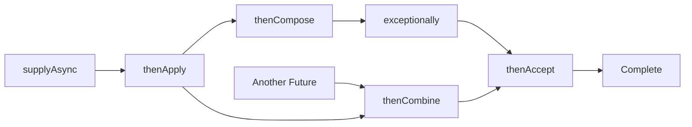

### Error Handling
```java
cf.exceptionally(ex -> {
    System.err.println("Error: " + ex);
    return "default";
})
.handle((result, ex) -> {
    if (ex != null) return "error";
    return result;
})
.whenComplete((result, ex) -> {
    // Cleanup
});
```

---

## 11. Functional Interfaces Deep Dive

### 🎯 All 43 Built-in Interfaces

#### Core 4
- `Predicate<T>` - test condition
- `Function<T,R>` - transform
- `Consumer<T>` - side effect
- `Supplier<T>` - provide value

#### Bi-Variants (accept 2 arguments)
- `BiPredicate<T,U>`
- `BiFunction<T,U,R>`
- `BiConsumer<T,U>`

#### Operators (same type in/out)
- `UnaryOperator<T>` extends `Function<T,T>`
- `BinaryOperator<T>` extends `BiFunction<T,T,T>`

#### Primitive Specializations (avoid boxing)
```java
// Int variants
IntPredicate, IntFunction<R>, IntConsumer, IntSupplier
IntUnaryOperator, IntBinaryOperator
ToIntFunction<T>, ToIntBiFunction<T,U>

// Long variants
LongPredicate, LongFunction<R>, LongConsumer, LongSupplier
LongUnaryOperator, LongBinaryOperator
ToLongFunction<T>, ToLongBiFunction<T,U>

// Double variants
DoublePredicate, DoubleFunction<R>, DoubleConsumer, DoubleSupplier
DoubleUnaryOperator, DoubleBinaryOperator
ToDoubleFunction<T>, ToDoubleBiFunction<T,U>
```

### Interface Relationship Map
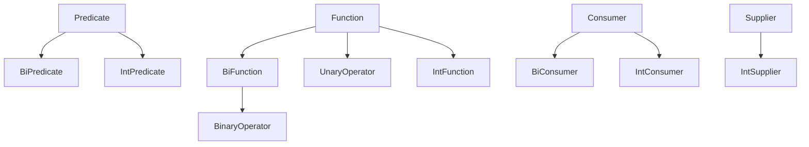

### Composition
```java
// Predicate
Predicate<String> p1 = s -> s.length() > 3;
Predicate<String> p2 = s -> s.startsWith("A");
Predicate<String> combined = p1.and(p2).or(p3).negate();

// Function
Function<String, Integer> f1 = String::length;
Function<Integer, Integer> f2 = i -> i * 2;
Function<String, Integer> composed = f1.andThen(f2);
Function<String, Integer> composed2 = f2.compose(f1);

// Consumer
Consumer<String> c1 = s -> System.out.println(s);
Consumer<String> c2 = s -> logger.log(s);
Consumer<String> both = c1.andThen(c2);
```

---

## 12. forEach Iteration

### 🎯 Purpose
Internal iteration - collection controls the iteration, not the developer.

### forEach Variants

#### Collection forEach
```java
list.forEach(item -> System.out.println(item));
map.forEach((k, v) -> System.out.println(k + "=" + v));
```

#### Stream forEach
```java
// Order not guaranteed in parallel
stream.parallel().forEach(System.out::println);

// Order guaranteed
stream.parallel().forEachOrdered(System.out::println);
```

### Iteration Comparison
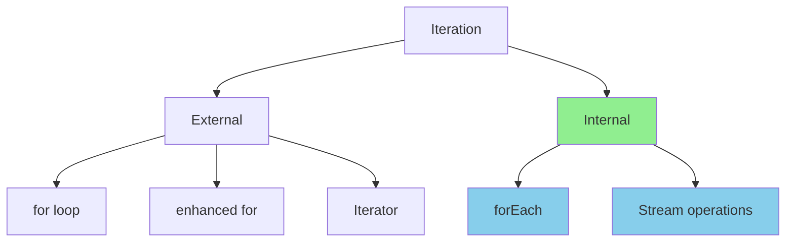

### Collection Modification Methods

#### replaceAll
```java
List<String> list = new ArrayList<>(Arrays.asList("a", "b", "c"));
list.replaceAll(String::toUpperCase);  // [A, B, C]
```

#### removeIf
```java
List<Integer> list = new ArrayList<>(Arrays.asList(1, 2, 3, 4, 5));
list.removeIf(n -> n % 2 == 0);  // [1, 3, 5]
```

### Performance Characteristics
```java
// Fastest for simple operations
for (int i = 0; i < list.size(); i++) { }

// Good readability, similar performance
for (String item : list) { }

// Functional, good for chaining
list.forEach(item -> { });

// Best for transformations/filtering
list.stream().filter(...).map(...).forEach(...);
```

---

## Quick Reference Cheat Sheet

### Lambda Syntax
```java
(params) -> expression
(params) -> { statements; }
```

### Stream Pipeline
```java
source.stream()
    .filter(predicate)
    .map(function)
    .collect(collector);
```

### Optional Pattern
```java
optional
    .filter(predicate)
    .map(function)
    .orElse(default);
```

### CompletableFuture Chain
```java
CompletableFuture.supplyAsync(supplier)
    .thenApply(function)
    .thenAccept(consumer)
    .exceptionally(handler);
```

---

## Common Patterns

### 1. Filter-Map-Collect
```java
List<String> result = items.stream()
    .filter(predicate)
    .map(transformer)
    .collect(Collectors.toList());
```

### 2. Group By
```java
Map<K, List<V>> grouped = items.stream()
    .collect(Collectors.groupingBy(classifier));
```

### 3. Optional Chaining
```java
return Optional.ofNullable(value)
    .map(transformer)
    .filter(predicate)
    .orElseThrow(exception);
```

### 4. Async Composition
```java
CompletableFuture.supplyAsync(() -> fetch())
    .thenCompose(result -> processAsync(result))
    .thenAccept(finalResult -> save(finalResult));
```

---

## Best Practices Summary

### ✅ DO
- Use method references when possible
- Use streams for data processing pipelines
- Use Optional as return type
- Use parallel streams for large datasets with CPU-intensive operations
- Use CompletableFuture for async operations
- Use primitive specializations to avoid boxing

### ❌ DON'T
- Don't use `Optional.get()` without checking
- Don't modify external state in lambdas
- Don't use parallel streams for small datasets
- Don't use streams for simple iterations
- Don't catch checked exceptions in lambdas without handling
- Don't use Optional as fields or parameters

---

## Performance Tips

1. **Use primitive streams** when working with primitives
   ```java
   IntStream.range(0, 100).sum()  // Better than Stream<Integer>
   ```

2. **Consider ArrayList over LinkedList** for parallel processing

3. **Use `anyMatch`/`findFirst`** for short-circuiting

4. **Avoid unnecessary boxing/unboxing**

5. **Use method references** - more optimizable than lambdas

6. **Be cautious with parallel streams** - measure before using

---

## Interview Quick Prep

### Key Differences
- **Stream vs Collection**: Stream doesn't store, Collection does
- **map vs flatMap**: map transforms 1:1, flatMap transforms 1:many
- **Optional.of vs ofNullable**: of throws NPE if null
- **forEach vs forEachOrdered**: forEachOrdered maintains order in parallel
- **Predicate vs Function**: Predicate returns boolean, Function transforms

### Common Interview Questions
1. What is a functional interface?
2. Difference between map and flatMap?
3. When to use parallel streams?
4. How Optional prevents NullPointerException?
5. Difference between intermediate and terminal operations?
6. What is method reference?
7. How CompletableFuture differs from Future?

---

## Conclusion

Java 8 introduced **functional programming** capabilities to Java:
- **Lambdas** enable concise function definitions
- **Streams** provide declarative data processing
- **Optional** eliminates null checks
- **CompletableFuture** enables reactive programming
- **New Date API** fixes old API problems

**Key Philosophy**: Write **what** to do, not **how** to do it (declarative vs imperative).

---

**Next Steps**: Practice with the comprehensive examples in [Java8Recap.java](Java8Recap.java)

**Run All Examples**: 
```bash
javac Java8Recap.java
java Java8Recap
```
