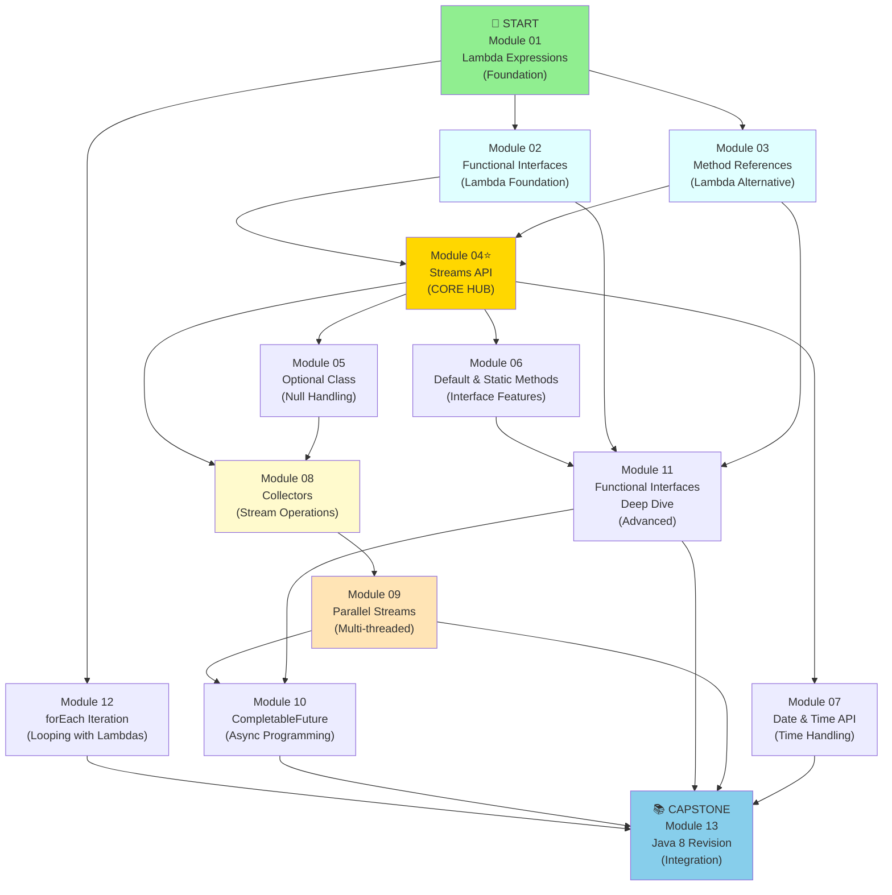

# Java 8 Learning Roadmap

## 🎯 Complete Learning Path Visualization

## ⚙️ Runtime Note

- Learning focus: **Java 8 concepts** across all modules.
- Execution baseline (current codebase): **JDK 17**.
- Reason: some demos use post-Java-8 APIs (for example `String.repeat`, `Stream.toList`, `Optional.ifPresentOrElse`, `Map.of`).

This diagram shows the recommended learning sequence and dependencies between all 13 Java 8 modules:



## 📋 Learning Path Recommendations

### 🟢 Foundation Phase (Modules 01-03)
Master the fundamentals of functional programming in Java:
1. **Module 01 - Lambda Expressions** - Start here! Learn the syntax and why lambdas matter
2. **Module 02 - Functional Interfaces** - Understand what lambdas implement
3. **Module 03 - Method References** - Alternative syntax for lambdas

### 🔵 Core Processing Phase (Modules 04-08) 
Build mastery of stream processing and data transformation:
4. **Module 04 - Streams API** ⭐ **CORE** - The foundation of modern Java data processing
5. **Module 05 - Optional Class** - Handle missing values elegantly
6. **Module 06 - Default & Static Methods** - Modern interface patterns
7. **Module 07 - Date & Time API** - Work with dates and times (independent branch)
8. **Module 08 - Collectors** - Advanced stream terminal operations

### 🟠 Advanced Processing Phase (Modules 09-11)
Explore advanced patterns and optimizations:
9. **Module 09 - Parallel Streams** - Multi-threaded stream processing for performance
10. **Module 10 - CompletableFuture** - Asynchronous and non-blocking operations
11. **Module 11 - Functional Interfaces Deep Dive** - Master advanced functional patterns

### 🟡 Utils Phase (Module 12)
12. **Module 12 - forEach Iteration** - Modern looping with lambdas and streams

### 🟦 Capstone (Module 13)
13. **Module 13 - Java 8 Revision** - Integrate all concepts, real-world scenarios, comprehensive review

## ⏱️ Estimated Timeline

| Phase | Modules | Duration | Difficulty |
|-------|---------|----------|------------|
| Foundation | 01-03 | 1-2 days | Beginner |
| Core Processing | 04-08 | 2-3 days | Intermediate |
| Advanced | 09-11 | 2-3 days | Advanced |
| Utils + Capstone | 12-13 | 1-2 days | Review |
| **Total** | **13 modules** | **6-10 days** | - |

## 🔄 Module Dependencies Summary

```
01 Lambda Expressions (Foundation)
  ├─→ 02 Functional Interfaces
  │     └─→ 04 Streams API (CORE)
  ├─→ 03 Method References
  │     └─→ 04 Streams API (CORE)
  └─→ 12 forEach Iteration

04 Streams API (CORE)
  ├─→ 05 Optional Class
  ├─→ 06 Default & Static Methods
  ├─→ 07 Date & Time API
  └─→ 08 Collectors
       ├─→ 09 Parallel Streams
       │     └─→ 10 CompletableFuture
       └─→ 11 Functional Deep Dive
            └─→ 13 Java 8 Revision (Capstone)

02, 03, 11 also contribute to Module 13 (Capstone)
```

## 🎓 Quick Decision Guide

**I want to learn:**

- **"Just the basics"** → Modules 01, 02, 04 (~2 days)
- **"Practical streams"** → Modules 01-05, 08 (~3 days)
- **"Everything modern"** → All 13 modules (~7 days)
- **"Async programming"** → Modules 01, 02, 10 + optional 09 (~2 days)
- **"Performance optimization"** → Modules 04, 08, 09 (~2 days)

## 📖 How to Use This Guide

1. **Start at Module 01** - The foundation is essential
2. **Follow the arrows** - Modules are sequenced for optimal learning
3. **Core topics first** - Complete Module 04 (Streams) before specialized topics
4. **Side tracks OK** - Module 07 (Date/Time) can be skipped if not needed
5. **End with Module 13** - Brings it all together

---

Each module includes:
- ✅ Learning objectives
- ✅ Theory checkpoints (Q&A)
- ✅ Runnable demos with theory-mapping comments
- ✅ Hands-on exercises (3 levels: Guided, Semi-Guided, Challenge)
- ✅ Architecture diagrams
- ✅ Prerequisites and next steps

**Happy Learning! 🚀**
